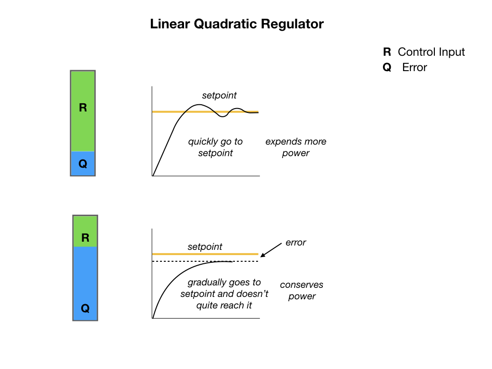

## Linear Quadractic Regulator LQR
Linear Quadratic Regulators work by finding trade-off that drives our system to its desired setpoint while using the minumum control effort. For example, a spaceship might want to minimize the fuel it expends to reach a given reference, while a high-speed robotic arm might need to react quickly to disturbances and reach the setpoint quickly.

Watch this [LQR](https://www.youtube.com/watch?v=E_RDCFOlJx4&t=55s) video for a good explaination of the **Linear Quadratic Regulators**.

## References
- FRC Documentation [Linear Quadratic Regulator](https://docs.wpilib.org/en/stable/docs/software/advanced-controls/state-space/state-space-intro.html#the-linear-quadratic-regulator)

- Tyler Veness [Controls Engineering in the
FIRST Robotics Competition](https://file.tavsys.net/control/controls-engineering-in-frc.pdf) Chapter 6.9.

- Christopher Lum [Introduction to Linear Quadratic Regulator (LQR) Control](https://www.youtube.com/watch?v=wEevt2a4SKI&t=7s)

<h3>
<a href="systemId">Previous</a>

<a href="pathsTrajectories">Next</a></h3>
