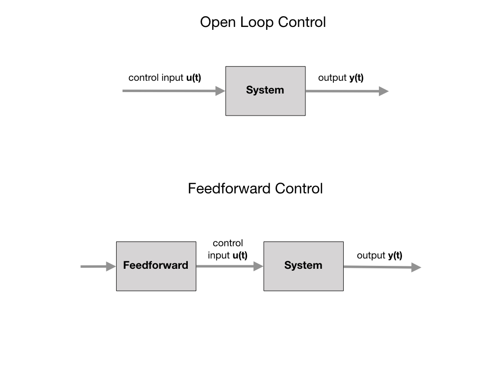

# Classical Control
<!-- Generic controller block diagram and explaination...
Alonzo Kelly [Mobile Robotics](https://www.cambridge.org/core/books/mobile-robotics/5BF238489F9BC337C0736432C87B3091) Chapter 7.1 -->

[Control Systems](https://docs.wpilib.org/en/stable/docs/software/advanced-controls/introduction/control-system-basics.html)

In the [Geometry](geometry) section we descibed the Pose of an object in 2D and 3D space.  Now we look at how the Pose changes as a function of time.  For robotic systems we are concerned with how we can ensure a smooth transition from one pose to another, which we call **Motion Profiling**.  Our primary mechanism for doing that is the PID Controller that is explained in the [Advanced Controls](https://docs.wpilib.org/en/stable/docs/software/advanced-controls/introduction/index.html) section of the FRC Documentation.

## Feedback Control - PID
Before looking at the PID controller supplied by the WPI library, it would be useful to get an overview by watching the [PID Introduction Video by WPI](https://docs.wpilib.org/en/stable/docs/software/advanced-controls/introduction/pid-video.html).  The [Introduction to PID](https://docs.wpilib.org/en/stable/docs/software/advanced-controls/introduction/introduction-to-pid.html) section of the FRC documentation provides more details.

The key method for the PID controller is the `calculate()` method. Let's examine that method and see how it implements what we know about PID control.

    public double calculate(double measurement) {
      m_measurement = measurement;
      m_prevError = m_positionError;

      if (m_continuous) {
        m_positionError =
            MathUtil.inputModulus(m_setpoint - measurement, m_minimumInput, m_maximumInput);
      } else {
        m_positionError = m_setpoint - measurement;
      }

      m_velocityError = (m_positionError - m_prevError) / m_period;

      if (m_ki != 0) {
        m_totalError =
            MathUtil.clamp(
                m_totalError + m_positionError * m_period,
                m_minimumIntegral / m_ki,
                m_maximumIntegral / m_ki);
      }

      return m_kp * m_positionError + m_ki * m_totalError + m_kd * m_velocityError;
    }

Testing for when we've reached the setpoint is the other key piece of code.  That code is listed below.

    public boolean atSetpoint() {
      double positionError;
      if (m_continuous) {
        positionError =
            MathUtil.inputModulus(m_setpoint - m_measurement, m_minimumInput, m_maximumInput);
      } else {
        positionError = m_setpoint - m_measurement;
      }

      double velocityError = (positionError - m_prevError) / m_period;

      return Math.abs(positionError) < m_positionTolerance
          && Math.abs(velocityError) < m_velocityTolerance;
    }

## Feedforward
<!-- Kelly 7.1.4.... -->
*Feedforward* is used to generate the control that would drive the robot to its reference setpoint if executed in *Open Loop*.  Compare this to *Feedback*, that is used to compensate for disturbances and is more of a reactionary measure.  With purely Feedback control the system won’t start applying control effort until the system is already behind. Feedforward tells the controller about the desired movement and required input beforehand, which makes the system react quicker and allows the Feedback controller to do less work. A controller that feeds information forward into the plant like this is called a feedforward controller. 

There are two types of Feedforwards, *model-based* feedforward and feedforward for *unmodeled dynamics*. 

- Model-based feedforward solves a mathematical model of the system for the inputs required to meet desired velocities and accelerations.

- Unmodeled dynamics compensates for unmodeled forces or behaviors directly so the feedback controller doesn’t have to.

You may have noticed that we rarely use the *Integral* part of the PID controller.  The Integral part, which uses past information, can be replaced with FeedForward control.  Review the [Feedforward Control in WPILib](https://docs.wpilib.org/en/stable/docs/software/advanced-controls/controllers/feedforward.html#feedforward-control-in-wpilib) documentation for how to use Feedforward in you code. 

## Classical Control Lab

## References
- FRC Documentation - [Control Systems](https://docs.wpilib.org/en/stable/docs/software/advanced-controls/introduction/control-system-basics.html)

- FRC Documentation - [PID Basics](https://docs.wpilib.org/en/stable/docs/software/advanced-controls/introduction/index.html)

- FRC Documentation - [PID Control through PIDSubsystems and PIDCommands](https://docs.wpilib.org/en/latest/docs/software/commandbased/pid-subsystems-commands.html#)

- Tyler Veness [Controls Engineering in the
FIRST Robotics Competition](https://file.tavsys.net/control/controls-engineering-in-frc.pdf) Chapter 6

- Alonzo Kelly [Mobile Robotics](https://www.cambridge.org/core/books/mobile-robotics/5BF238489F9BC337C0736432C87B3091) Chapter 7.1

<h3>
<a href="controlIndex">Previous</a>

<a href="pathsTrajectories">Next</a></h3>