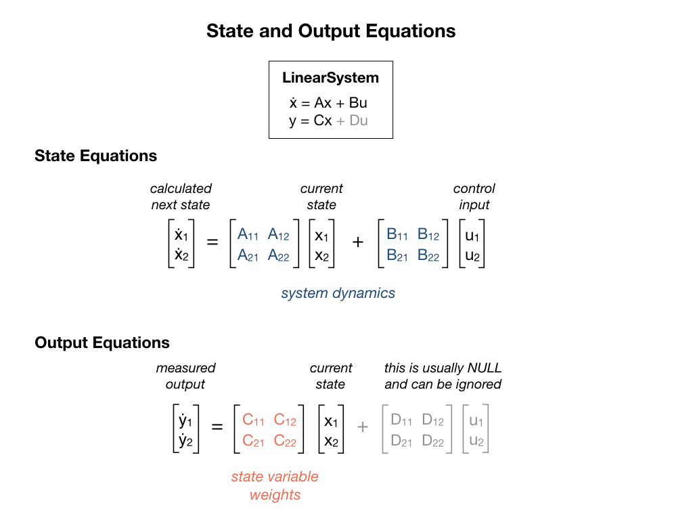

# State Space Control
**State Space** control is based on the idea that if you know the internal physics of your system and can predict how it’ll react to a given input then you can tune the system in a way that’s similar to tuning PID controllers. State Space Control tries to control the system by developing an accurate model of the system that we are trying to control.  State Space control can be an alternative to PID control and is more flexible.  PID control does not use any knowledge of the internal physics of the system and therefore allows only limited control.  The advantage of PID is that you do not need an initial condition, which as you will is required for State Space control.

The concept of the state of a dynamic system refers to a minimum set of variables, known as state variables, that fully describe the system and its response to any given set of inputs. In particular a state-determined system model has the characteristic that:

    A mathematical description of the system in terms of a minimum set of variables *xi(t)*, *i* = 1,..., *n*, together with knowledge of those variables at an initial time t0 and the system inputs for time *t ≥ t0*, are sufficient to predict the future system state and outputs for all time *t>t0*.

This definition asserts that the dynamic behavior of a state-determined system is completely characterized by the response of the set of n variables *xi(t)*, where the number *n* is defined to be the order of the system.

Refer to the references below for a more in-depth explaination of the topic.  The following brief overview should be enough to get you started on writing programs based on State Space.

## State and Output Equations
State equations are represented in a vector form, in which the set of *n* state variables is written as a state vector *x* , and the set of inputs is written as an input vector *u* . Each state variable is a time varying component of the column vector *x*.  The system dynamics are described by the **A** and **B** matricies.  The **A** matrix descibes how the system will act if no force is applied. The **B** matrix describes how our input will change the state.

A system output is defined to be any system variable of interest. A description of a physical system in terms of a set of state variables does not necessarily include all of the variables of direct engineering interest. In the output equation *y* is a column vector of the output variables, **C** is a matrix of the constant coefficients that weight the state variables, and **D** is a matrix of the constant coefficients that weight the system inputs. For many physical systems the matrix D is a null matrix, and the output equation reduces to just *y = Cx*.

An important property of the linear state equation description is that all system variables may be represented by a linear combination of the state variables **x** and the system inputs **u**.

## State Space Control Lab
Add a LinearSystem for the Drivetrain to the *Constants* file. 

    public static final LinearSystem<N2, N2, N2> kDrivetrainPlant =
            LinearSystemId.identifyDrivetrainSystem(kvVoltSecondsPerMeter, 
                                                    kaVoltSecondsSquaredPerMeter, 
                                                    kvVoltSecondsPerRadian, 
                                                    kaVoltSecondsSquaredPerRadian);

## References
- FRC Documentation [State Space Controllers](https://docs.wpilib.org/en/stable/docs/software/advanced-controls/state-space/state-space-intro.html)

- Tyler Veness [Controls Engineering in the
FIRST Robotics Competition](https://file.tavsys.net/control/controls-engineering-in-frc.pdf) Chapter 6.

- MIT [State-Space Representation of LTI Systems](http://web.mit.edu/2.14/www/Handouts/StateSpace.pdf)

- MATLAB [State Space Control](https://www.youtube.com/playlist?list=PLn8PRpmsu08podBgFw66-IavqU2SqPg_w)

- MATLAB [Robust Control](https://www.youtube.com/playlist?list=PLn8PRpmsu08qFLMfgTEzR8DxOPE7fBiin)

- FRC Documentation - [State-Space and Model Based Control with WPILib](https://docs.wpilib.org/en/stable/docs/software/advanced-controls/state-space/index.html)

- Alonzo Kelly [Mobile Robotics](https://www.cambridge.org/core/books/mobile-robotics/5BF238489F9BC337C0736432C87B3091) Chapter 7.2

<h3>
<a href="classicalControl">Previous</a>

<a href="LQR">Next</a></h3>