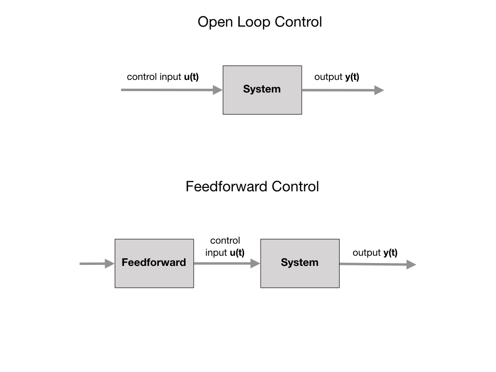

# Dynamical Systems
Descibes the change in the state of a system over time. More formally, it describes the evolution of the state of a system.

## Linear Time-Invariant System
Many systems behave in a way described by *Linear Time-Invariant (LTI)* systems.  It consists of a *control input* that is going to force a change in the state of the system, and a *measured output* that represents the current state of the system.  The control input is sometimes called a *forcing input*. We presume that we would have some control over the system and that the control input would be able to change its state over time. A system that changes over time is called a *dynamical system*.

A Linear Time-Invariant system, as the name suggests, has two parts to it:

**Linear**
- If we apply an input **a** and then an input **b**, it's the same as applying the input **b** and then the input *a*.

- If we apply an input **a** and get a response **r**, applying an input **2Xa** will give the response **2Xr**.

**Time Invariant**
- This means that applying an input right now has the same effect as applying an input 5 seconds from now.

## Non-Linear Systems

<!-- Data-driven dynamical systems makes non-linear systems amenable to linear analysis. -->

## References

<h3>
<a href="geometry">Previous</a>

<a href="systemId">Next</a></h3>
