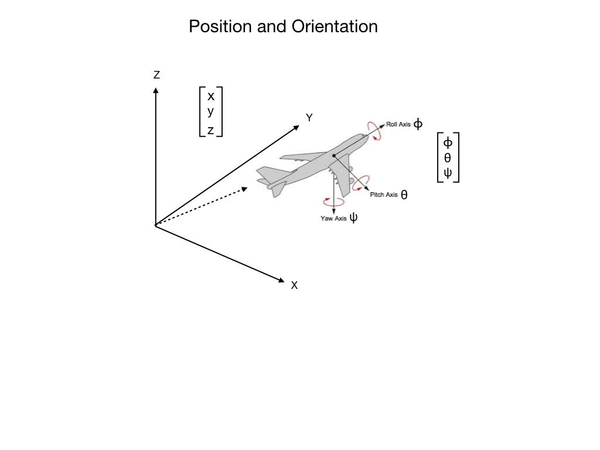
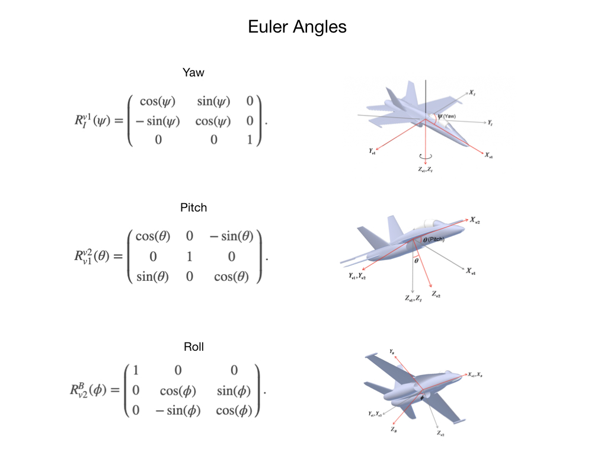
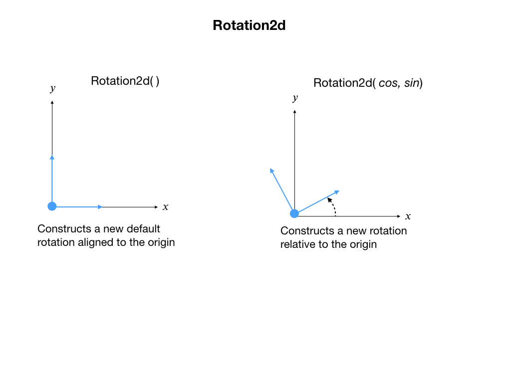
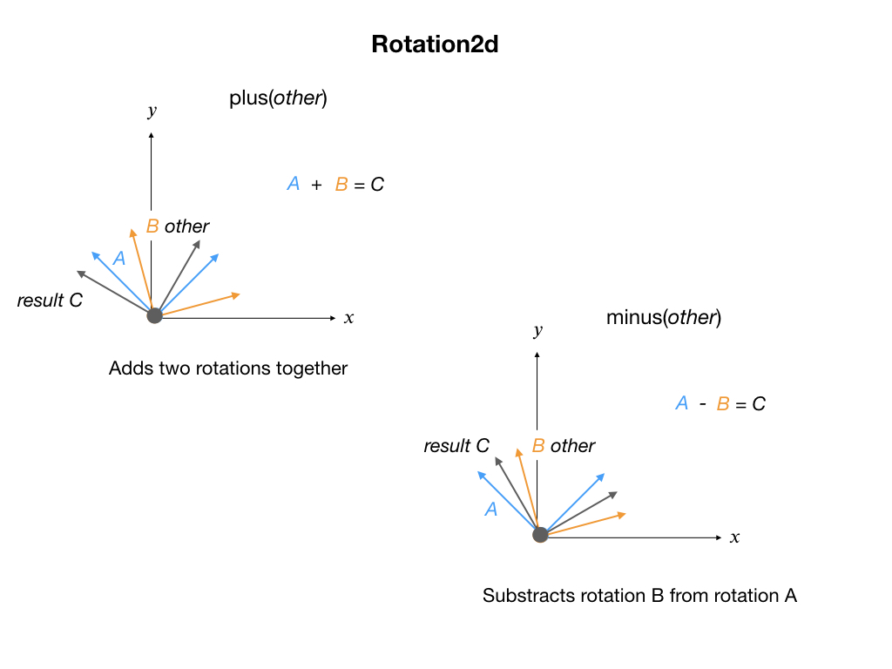
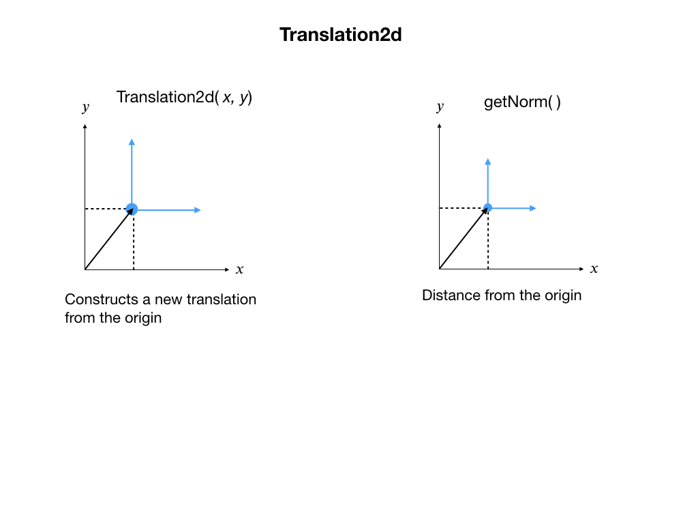
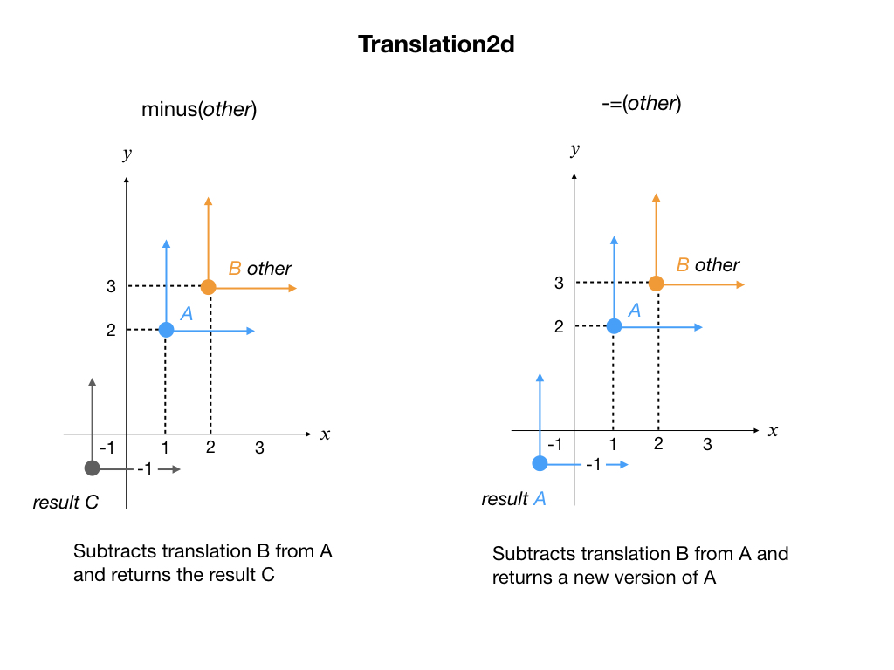
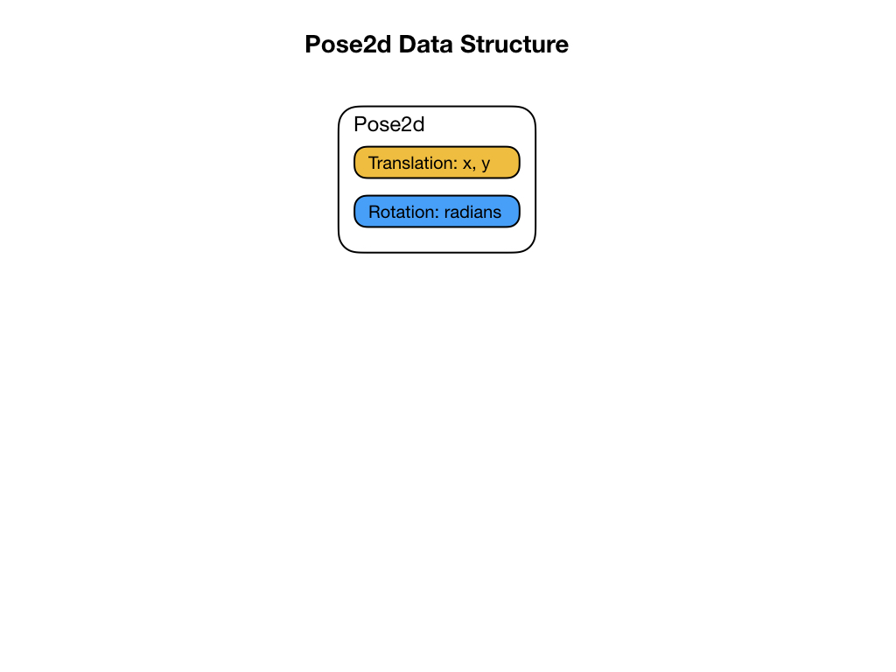
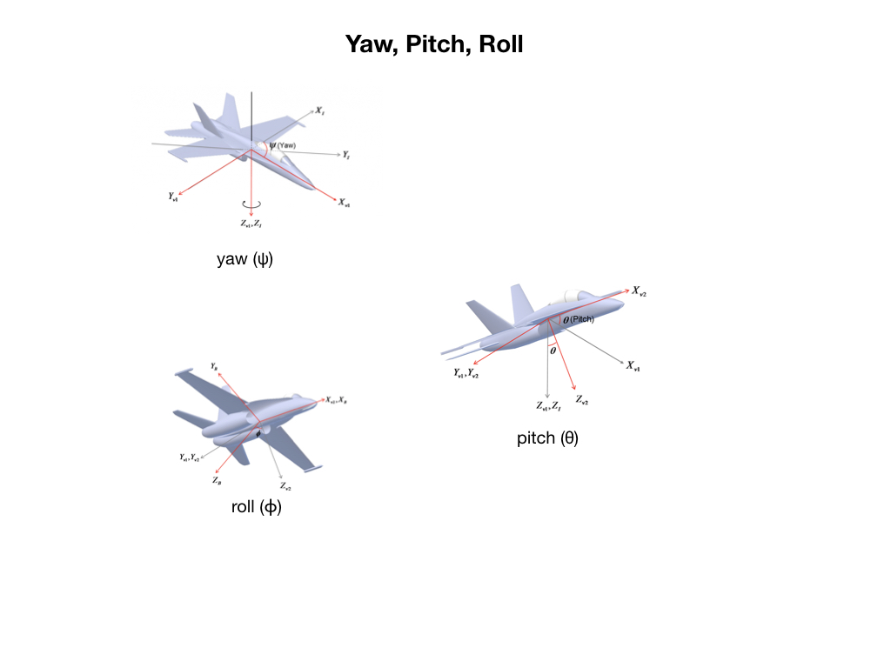

## Robot Geometry

In order to control a robot it’s necessary to know its position and orientation — where it is at any particular time.  Its position in 3-D space is defined using the set of coordinates X, Y, and Z.  This coordinate system is called the Cartesian coordinate system.  When the robot moves from one position to another it’s referred to as a translation.  When it rotates about its center point then it has changed orientation. 

For the mobile robots that we use for competition we are mostly concerned 2D space so most of this section will focus on that. There will however be times when we would need to know our pose on 3D space so that will be covered later.

Moreover, the position needs to be specifed relative to a suitable reference frame.  When we are navigating in a car using a GPS system our reference frame is the Earth.  In the case of FRC, a suitable reference frame is the competition field.

## 2D Geometry

Let's start by examining the orientation or rotation of the robot.  This is commonly done by using <i>Euler Angles</i>.

In <i>First Robotics</i> we don't use flying robots so we usually don't need to keep track of objects in 3D space.  The <i>WPI Library</i> therefore has a set of data structures that keeps track of things in 2D space. Since we're looking at Euler Angles let's first examine the <i>Rotation2d</i> class that keeps track of rotations in 2D space.  When creating an object from this class you can pass it a starting angle that describes a rotation offset from the (𝑥, 𝑦) orientation of the game field. This offset represents the orientation at which you placed the robot down on the field.  If no starting angle is passed then it's assumed that you aligned the robot with the fields' (𝑥, 𝑦) orientation.

Once you have a <i>Rotation2d</i> object you can continuously track the robots' orientation by adding or subtracting changes that are sensed from the gyro. This is done using the rotation matrixes shown in a previous diagram. 

## Translation - Change in Position
Translation is the change in position of an object. It's also referred to as <i>displacment</i> - how far has the object moved from the last position relative to a fixed frame of reference.  In our case, the fixed reference frame would be the competition field.  In order to represent how a robot changes its position we use the <i>Translation2d</i> data structure. When creating an object from this class you can pass in a starting position for the robot, which represents its (𝑥, 𝑦) displacement from the origin.  If no starting position is defined then it's assumed that the robot starts at the origin (0, 0).  Note that the origin of the reference frame can be different in various cases.  For the FRC field it's placed at the top left corner as you look down on the field.

When the robot moves from one position to another you can update the <i>Translation2d</i> data structure by sending it the change in position since the last update. The change is added to the current position to represent the robots' new location.

## Robot Pose
The common way to keep track of the position and orientation of a robot is to create a class called a <i>Pose</i>.  This class comprises the two subclasses described previously, namely <i>Translation2d</i> and <i>Rotation2d</i>.  The translation class keeps track of the robot’s position whereas the rotation keeps track of its orientation.  Why use translation and rotation instead of position and orientation?  We want to know where the robot is as it travels from one position to another.  We also want to know the robot’s heading as is rotates from one orientation to another.

## 3D Geometry
Describe...
The orientation of a robot is described in terms of Roll, Pitch, Yaw.  

### Euler Angles and Rotation
The Euler angles are three angles introduced by Leonhard Euler to describe the orientation of an object with respect to a fixed coordinate system. The order in which you specify a change in orientation is <i>Yaw, Pitch, Roll</i>.  One way to remember this is to think of plane about to take off from an airport.  While it’s on the ground it can only change its heading, which is done by a Yaw rotation.  At take-off the pilot will pull up the nose, changing its Pitch.  Finally, once the plane is in the air it’s free to execute a Roll.  Moving from one orientation to another is called a <i>Rotation</i>.  

A robot that can move in all three dimensions of space and can orient itself about all three axis would have 6-degrees-of-freedom (6-DOF).  An object in space can have at most only 6-degrees-of-freedom.  An example of such a robot would be a drone or aircraft. 

Each Yaw, Pitch, Roll maneuver can be represented by a rotation matrix that uses sines and cosines to describe the offset from the previous orientation.

## Geometry Lab
Add a class to show the position of the robot on the field.  This is defined in the Drivetrain class

    private final Field2d m_field2d = new Field2d();

and initialized in the Drivetrain's constructor. We'll also use the Odometry class, which was setup in the [Odometry](../OptimalEstimation/odometry) module of this training guide.

    public Drivetrain() {
      ...
      m_odometry = new DifferentialDriveOdometry(m_gyro.getRotation2d());
      SmartDashboard.putData("field", m_field2d);
    }

In order for the field information to update in the simulator we need to update it in the `periodic()` method of the Drivetrain.

    public void periodic() {
      // Update the odometry in the periodic block
      m_odometry.update(m_gyro.getRotation2d(), m_leftEncoder.getDistance(), m_rightEncoder.getDistance());
      
      // Also update the Field2D object (so that we can visualize this in sim)
      m_field2d.setRobotPose(getPose());
    }

There needs to be a method to reset the odometry back to the starting point.  This method will also reset the encoders.

    public void resetOdometry(Pose2d pose) {
      resetEncoders();
      m_odometry.resetPosition(pose, m_gyro.getRotation2d());
    }

## References
- FRC Documentation [Geometry](https://docs.wpilib.org/en/latest/docs/software/advanced-controls/geometry/index.html)

- QUT Robot Academy [2D Geometry](https://robotacademy.net.au/masterclass/2d-geometry/)

- QUT Robot Academy [3D Geometry](https://robotacademy.net.au/masterclass/3d-geometry/)

- FRC Documentation - [A Video Walkthrough of Model Based Validation of Autonomous in FRC](https://docs.wpilib.org/en/stable/docs/software/advanced-controls/video-walkthrough.html)

- Angela Sodemann - [Rotation Matrix Video](https://www.youtube.com/watch?v=lVjFhNv2N8o)

<h3>
<a href="kinematics">Previous</a>

<a href="dynamicalSystems">Next</a></h3>