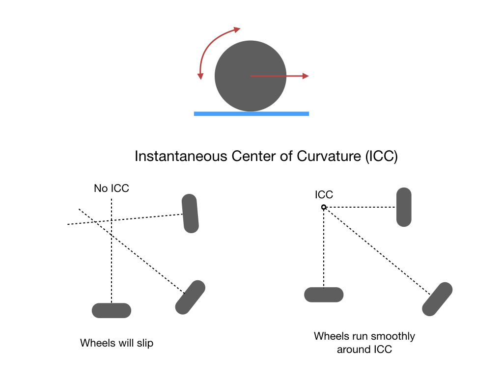
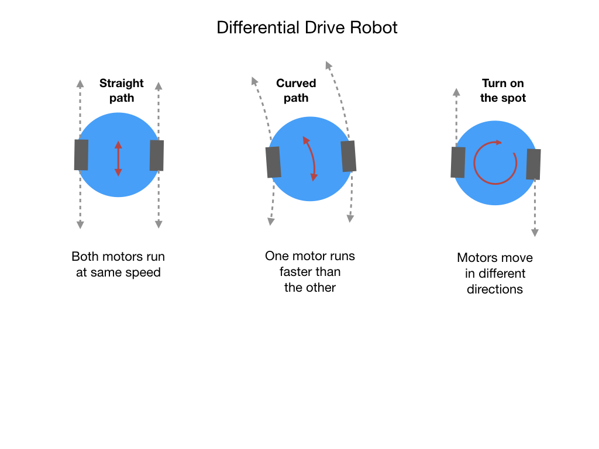
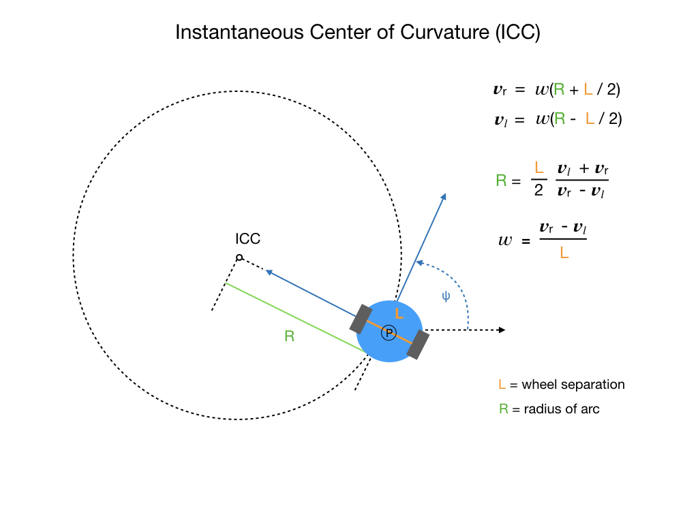
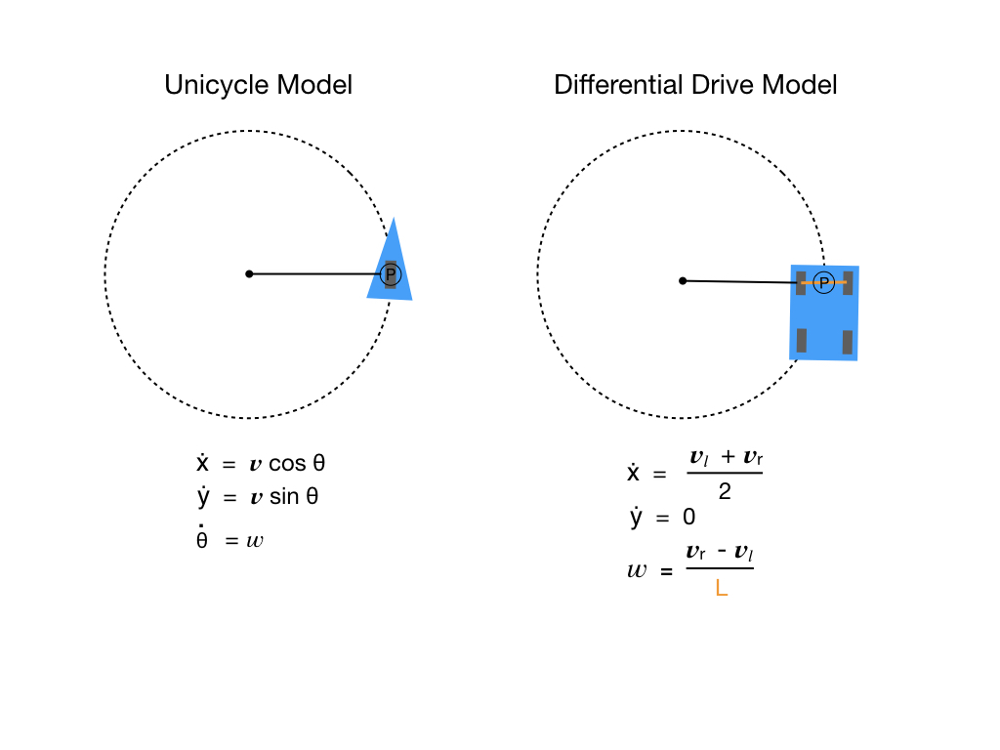
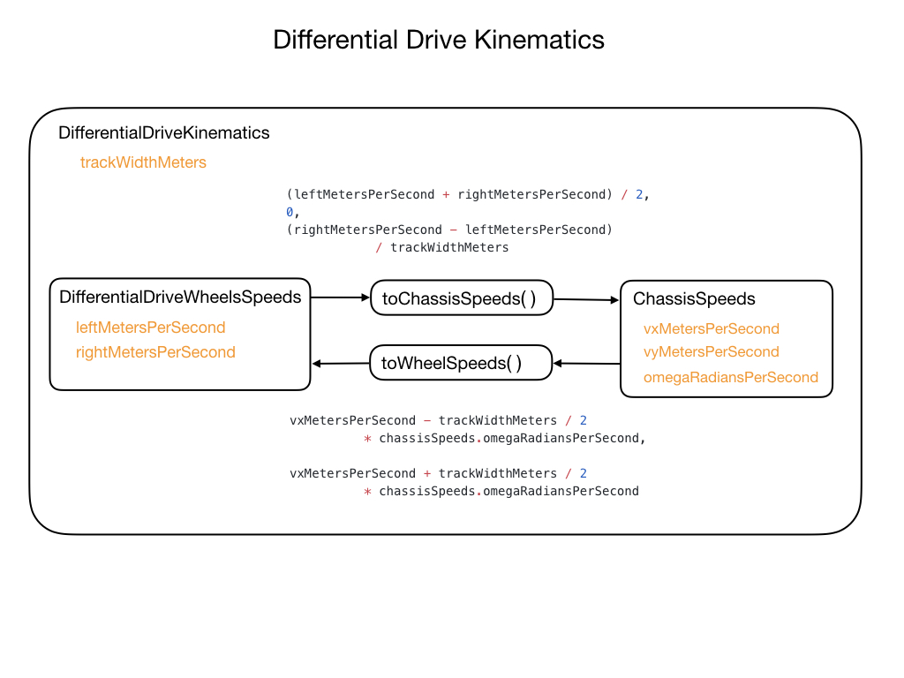

## Robot Kinematics

Kinematics is the study of the geometry of motion. Kinematics is the branch of classical mechanics that describes various aspects of motion such as velocity, acceleration, displacement, time, and trajectory.  There is no description of the forces that cause the motion to happen. The word “kinematics” comes from a Greek word “kinesis” meaning motion, and is related to other English words such as “cinema” (movies) and “kinesiology” (the study of human motion).

In robotics we are mostly interested in the motion of groups of objects that are connected, or jointed, together into a system.  When objects are connected together they can be subject to certain constraints that restrict their movement.  For wheeled robots we are interested in determining how the robot can move with reference to the constraints imposed by the motion of the wheels. So that's where we'll start.

We want to examine the constraints that exist by the connection of the wheels to the robot.  A wheel is connected to an axel which is typically driven by a motor.  The motor causes the wheel to rotate which produces forward, or backward, motion of the robot.  Nothing too suprising there!  What is of note though, is that the wheel cannot move sideways to its direction of motion, so here's where we find our first constraint. 

Our next constraint comes in when we have more than one wheel on the robot, which is of course the common configuration.  When we have multiple wheels we must ensure that they have a common <i>Instantaineous Center of Curvature (ICC)</i>.  This means that the wheels must be connected in a way that they are all aligned towards the same point.  If this is not the case then the wheels will slip in a sideways direction making it extremely difficult to control the motion of the robot.  This is illustrated below.  Typically, there are two wheels on the same axel which causes them to be aligned towards the same center point.  However, with a 4-wheeled robot there are two sets of wheels and two axels which means that the back wheels will always slip.  These are called skid drive robots.

## Differential Drive Robots

The most common robot configuration is the <i>Differential Drive</i> robot, so let's look at its kinematics.  This robot will have two wheels each connected to a motor.  The wheels will be aligned on a common axis.  If both motors rotate forward or backward at the same speed then the robot will move in a straight line.  If one motor rotates faster than the other then the robot will take a curved path. One very useful feature of this robot is its ability to rotate on the spot which enables it to move in tight spaces.  This is acheived by rotating each motor in a different direction.

Let's look at some of the mathematics behind differential drive robot kinematics.  While we can vary the velocity of each wheel, for the robot to perform rolling motion, the robot must rotate about a point that lies along its common left and right wheel axis. The point that the robot rotates about is known as the ICC - Instantaneous Center of Curvature.

By varying the velocities of the two wheels, we can vary the trajectories that the robot takes. Because the rate of rotation **ω** about the ICC must be the same for both wheels, we can write the equations shown at the top right of the diagram, where <bold>L</bold> is the distance between the centers of the two wheels, **𝒗r**, **𝒗𝑙** are the right and left wheel velocities along the ground , and <bold>R</bold> is the distance from the ICR to the midpoint between the wheels.

At any instance in time we can compute the distance to the ICC <bold>R</bold>, and the radians per/second that the chassis is moving **ω**.  These two calculations are also shown in the diagram.

These formulars are used in the <i>DifferentialDriveKinematics</i> class of the WPI library.

## References

- FRC Documentation - [Kinematics and Odometry](https://docs.wpilib.org/en/latest/docs/software/kinematics-and-odometry/index.html)

<h3>
<a href="geometry">Previous</a>

<a href="linearSystems">Next</a></h3>