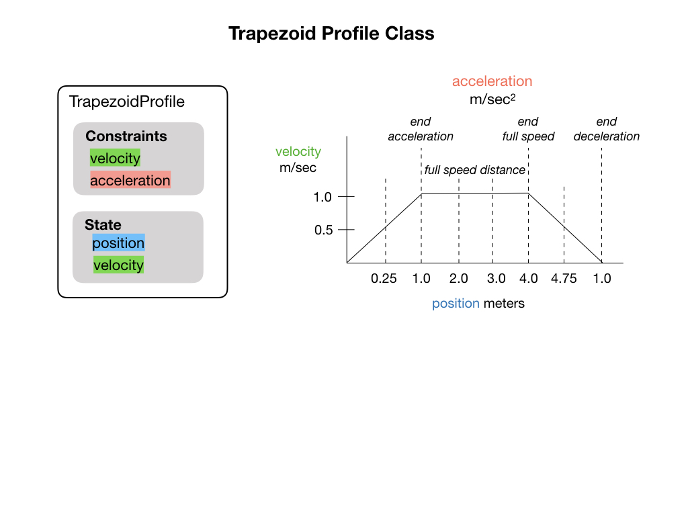

# Paths and Trajectories

## Trapezoid Motion Profile
<!-- Controller Hierarchy Kelly Ch 7.1.1.3 create diagram... -->

The [Trapezoidal Trajectory](https://robotacademy.net.au/masterclass/paths-and-trajectories/?lesson=112) video gives a good introduction to this section.

Initial and final values are specified, and usually set to zero.

Velocity and acceleration are continuous.

To improve the handling of our mechanisms, we often wish to command mechanisms to a sequence of setpoints that smoothly interpolate between its current state, and its desired goal state.

See [Trapezoidal Motion Profiles in WPILib](https://docs.wpilib.org/en/stable/docs/software/advanced-controls/controllers/trapezoidal-profiles.html) in the FRC documentation.

## Multi-Dimensional Trajectories

## Paths and Trajectories Lab
The code to create the trajectory configuration constraint:

    public static final TrajectoryConfig config =
      new TrajectoryConfig(kMaxSpeedMetersPerSecond, 
                            kMaxAccelMetersPerSecondSquared)
          .setKinematics(kDriveKinematics)
          .addConstraint(kAutoVoltageConstraint);

## References
- FRC Documentation [Trajectory Generation and Following with WPILib](https://docs.wpilib.org/en/latest/docs/software/advanced-controls/trajectories/index.html)

- FRC Documentation [Trajectory Constraints](https://docs.wpilib.org/en/latest/docs/software/advanced-controls/trajectories/constraints.html)

- QUT Robot Academy [Paths & Trajectories](https://robotacademy.net.au/masterclass/paths-and-trajectories/)

<h3>
<a href="LQR">Previous</a>

<a href="controlIndex">Back</a></h3>