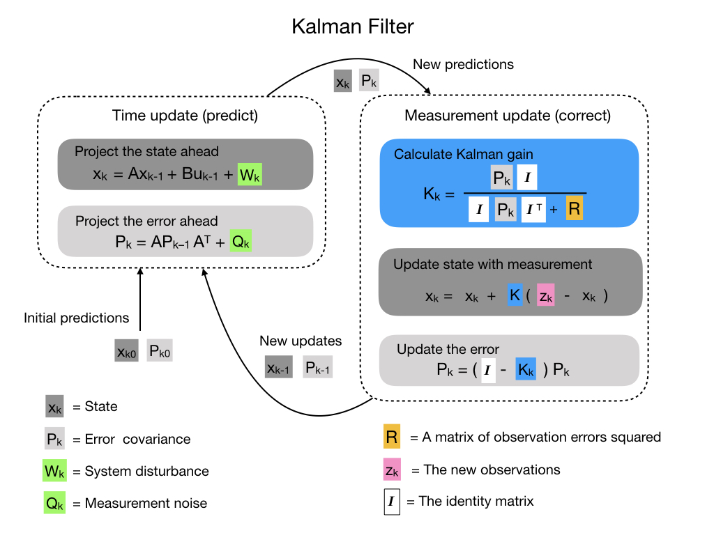
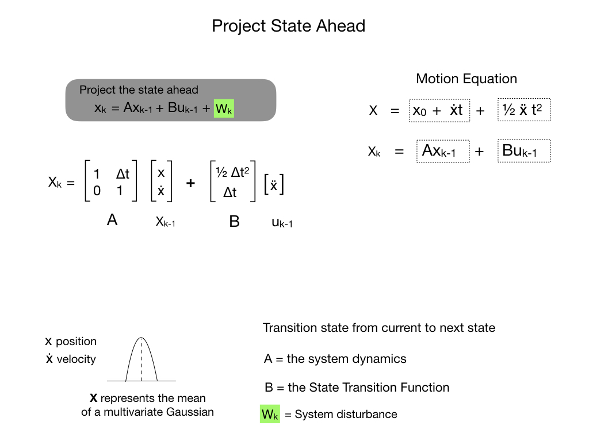
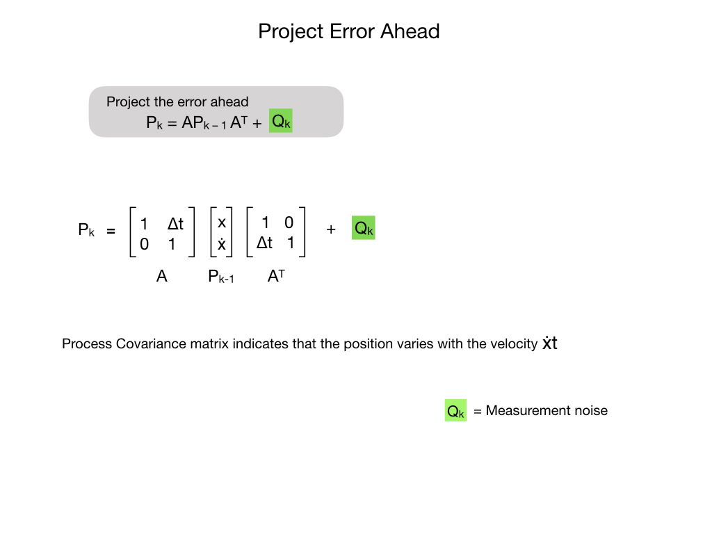
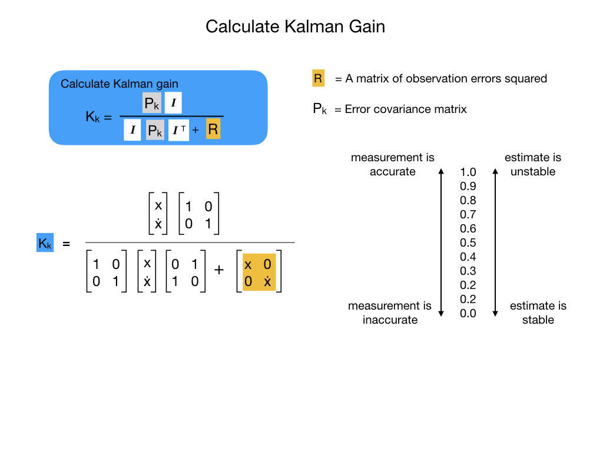
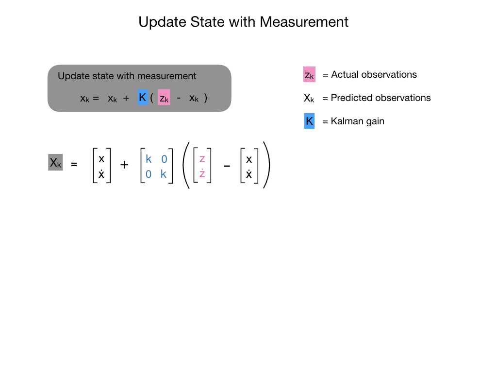
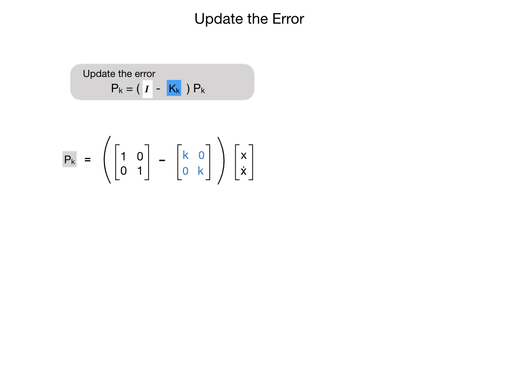

# Kalman Filters
*Kalman Filters* fuse measurements from one or more sensors with a State Space model of the system to optimally estimate a system’s state. Kalman filters have two parts: prediction and correction. Prediction projects our state estimate forward in time according to our system’s dynamics, and correct steers the estimated state towards the measured state.  

If you think all that sounds confusing then you're not alone.  Kalman Filters can be difficult to understand and explain, however the site  [KalmanFilters.net](https://www.kalmanfilter.net/default.aspx) by Alex Becker does an excelent job of it, so you should go there first.  The following diagrams will serve as a quick reference for later use.

Here's all five steps of the Kalman Filter.

In prediction, our state estimate is updated according to the linear system dynamics.

## Unscented Kalman Filters

## References
- FRC Documentation [State Observers and Kalman Filters](https://docs.wpilib.org/en/stable/docs/software/advanced-controls/state-space/state-space-observers.html)

- Tyler Veness [Controls Engineering in the
FIRST Robotics Competition](https://file.tavsys.net/control/controls-engineering-in-frc.pdf) Chapter 10.

- Alonzo Kelly [Mobile Robotics](https://www.cambridge.org/core/books/mobile-robotics/5BF238489F9BC337C0736432C87B3091) Chapter 5.3

- Roger Labbe [Kalman and Bayesian Filters in Python](https://github.com/rlabbe/Kalman-and-Bayesian-Filters-in-Python)

- Alex Becker [Kalman Filters](https://www.kalmanfilter.net/default.aspx)

<h3>
<a href="stateEstimation">Previous</a>

<a href="optimalEstimationIndex">Back</a></h3>