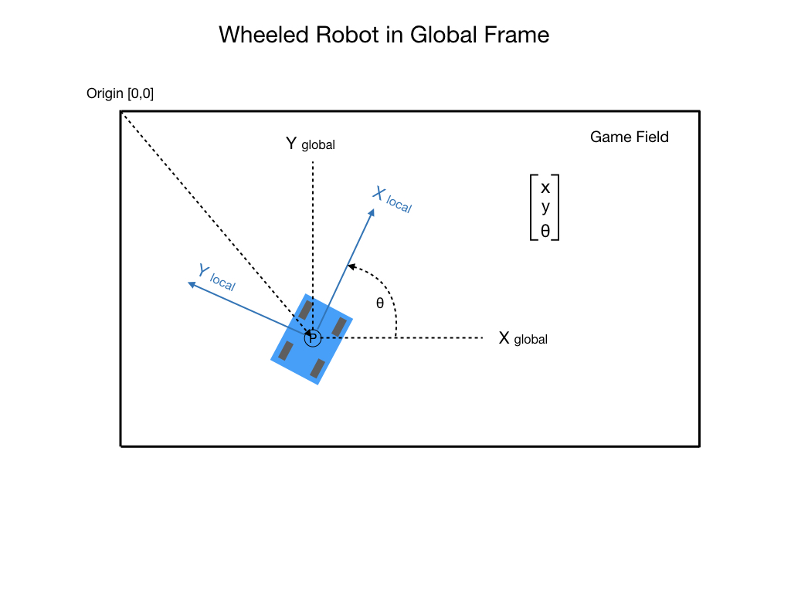
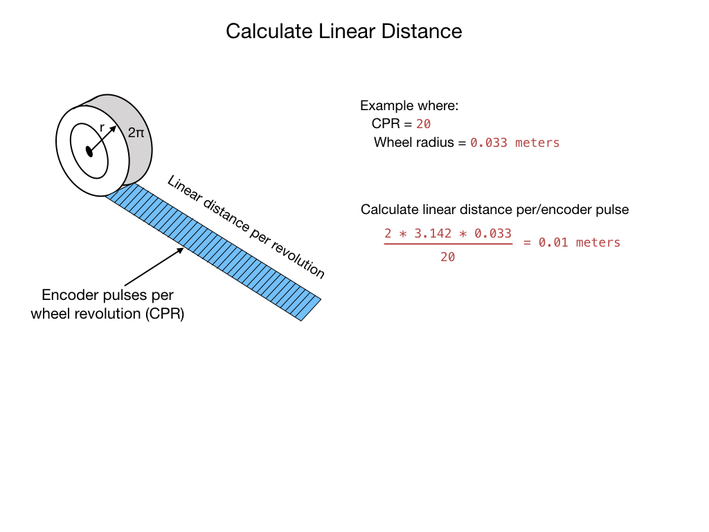
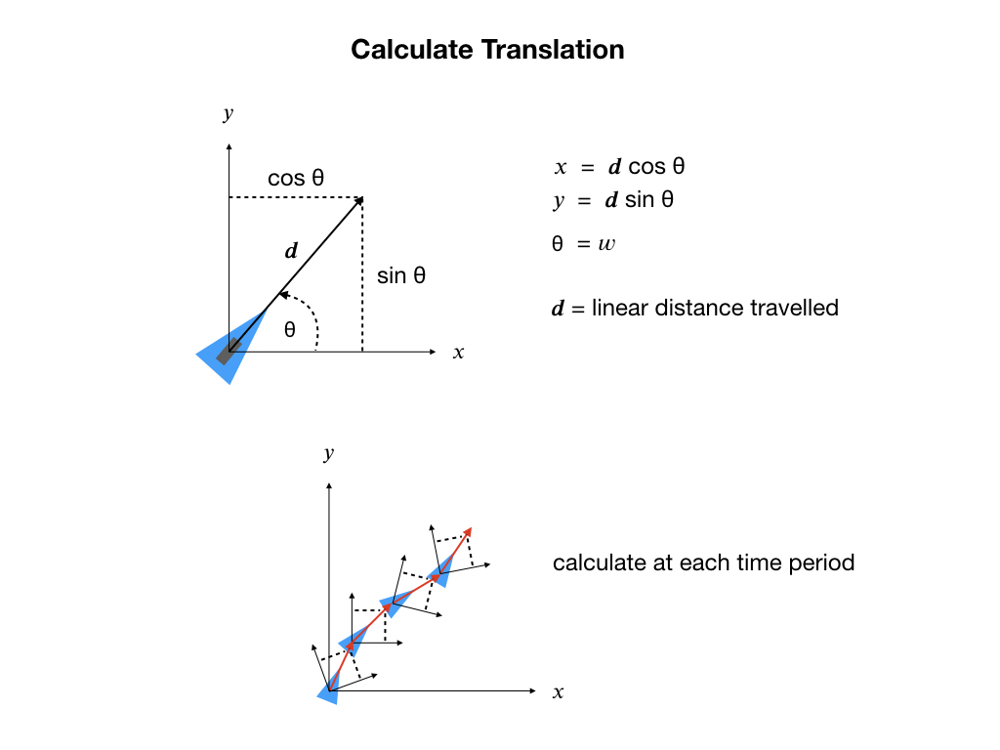

# Pose Estimation
A basic requirement for a mobile robot is to measure its own motion. This allows a robot to determine which way to go and if it ever got there. It'll use its *Pose* which is defined as its [Position and Orientation](../Dynamics/geometry) from some reference frame. 

This module will explore two methods for determining the robot's pose, Odometry and Pose Estimation.  The WPILib classes *DifferentialDriveOdometry* and *DifferentialDrivePoseEstimator* are used for this purpose.

## Robot Odometry

Odometry involves using sensors on the robot to create an estimate of the position of the robot on the field. In FRC, these sensors are typically encoders to measure position together with a gyro to measure robots' heading. It's important to understand the difference between odometry and kinematics; kinematics deals with movement so we are concerned with speeds, odometry deals with position so we are looking at distance.  

The following diagram shows our objective.  The FRC field is our <i>Global Frame</i>.  We want to know what our **X** and **Y** position is relative to the global frame where the **X** position is represented by the length of the field and the **Y** position is represented by its width.  What we're using here is the <i>Cartesian Coordinate System</i> that you may be familiar with from Algebra.

We also need to know what our heading is, which is represented by the angle between the 𝒙 axis of our coordinate system and the current heading angle of the robot.

So what algorithm is required to compute the robots' odometry?  We can implement this by the following three steps that will require input from the encoders and the gyro (IMU). Remember that our robot code runs in a loop which means that these three steps will execute over and over at about 20 times per second. Each iteration of the loop we will call a <i>time step</i>.

The encoders will send the total linear distance that has been covered by each wheel since the was robot started, or the wheel encoders were reset.  The linear distance is calculated as shown in the following diagram.  **Step 1** of our algorithm will take the total distance covered by the left and right wheel and compute the <i>delta distance</i> travelled by each wheel since the last <i>time step</i>.

In **step 2** we calculate the distance travelled by the chassis of the robot since the last time step.  This is done by simply taking the delta distance travelled by each wheel and averaging them.  

**Step 3** is where the real work is done to compute our odometry.  From the internal reference frame of the robot it can only travel in the direction parallel to its wheels.  It cannot travel instantainously sideways so in effect the robot has only one direction, which we'll call 𝒙.  However, within the global frame, the FRC field, it can assume a position in both the **X** and **Y** directions.  In order to calculate this we make use of the trigonomic <i>Sine</i> and <i>Cosine</i> functions.  To compute the **X** position we multiple the distance travelled by the <i>Sin</i> of the current heading angle.  The **Y** position is computed using the <i>Cos</i> of the current heading angle.

It's important that this calculation is done based on the change in heading since the last time step. That's why we go to the trouble of computing the delta distance travelled instead of using the total distance.  Consider that the heading will most likely be changing continuouly during our journey.  If we computed the position based solely on our current heading then the calculation would be way off.

## The Pose Estimator
Pose estimators are designed to be drop-in replacements for odometry classes, and can behave identically to their corresponding odometry classes if only update is called on these estimators.  Pose estimators utilize an [Unscented Kalman Filter](kalmanFilters#UKF) to fuse latency-compensated robot pose estimates with encoder and gyro measurements. These estimators can account for encoder drift and noisy vision data. 

## Pose Estimation Lab
We're going to setup the robot with two methods of esitmating its Pose.  The first uses the *DifferentialDriveOdometry* class and the second uses the *DifferentialDrivePoseEstimator*.  

### Odometry Class
Setup the Odometry class.

    private final DifferentialDriveOdometry m_odometry;

This is initialized in the Drivetrain's constructor:

    public Drivetrain() {
      ...
      m_odometry = new DifferentialDriveOdometry(m_gyro.getRotation2d());
      
    }

Update the odometry in the `periodic()` block, and populate the Field2D object so that we can visualize this in the Simulator.

    m_odometry.update(m_gyro.getRotation2d(), 
                      m_leftEncoder.getDistance(), 
                      m_rightEncoder.getDistance());
               
    m_field2d.setRobotPose(getPose());    

### Pose Estimator Class
Pose estimator State Space way for tracking the robot pose
- State measurement standard deviations. X, Y, theta.
- Local measurement standard deviations. Left encoder, right encoder, gyro.
- Global measurement standard deviations. X, Y, and theta.

      private DifferentialDrivePoseEstimator m_estimator = new DifferentialDrivePoseEstimator(new Rotation2d(), new Pose2d(),
            new MatBuilder<>(Nat.N5(), Nat.N1()).fill(0.02, 0.02, 0.01, 0.02, 0.02), 
            new MatBuilder<>(Nat.N3(), Nat.N1()).fill(0.02, 0.02, 0.01), 
            new MatBuilder<>(Nat.N3(), Nat.N1()).fill(0.1, 0.1, 0.01)); 

Update the estimator in the `periodic()` block, and populate the Field2D object so that we can visualize this in the Simulator.

      m_estimator.update(m_gyro.getRotation2d(), 
                          getWheelSpeeds(), 
                          m_leftEncoder.getDistance(), 
                          m_rightEncoder.getDistance());

      m_estimatedField2d.setRobotPose(getEstimatedPose());

## References
- FRC Documentation [Odometry](https://docs.wpilib.org/en/stable/docs/software/kinematics-and-odometry/differential-drive-odometry.html)

- FRC Documentation [WPILib Pose Estimators](https://docs.wpilib.org/en/stable/docs/software/advanced-controls/state-space/state-space-pose_state-estimators.html)

- QUT Robot Academy [Measuring Motion](https://robotacademy.net.au/masterclass/measuring-motion/)

- Tyler Veness [Controls Engineering in the
FIRST Robotics Competition](https://file.tavsys.net/control/controls-engineering-in-frc.pdf) Chapter 6.

- Alonzo Kelly [Mobile Robotics](https://www.cambridge.org/core/books/mobile-robotics/5BF238489F9BC337C0736432C87B3091) Chapter 6

<h3>
<a href="optimalEstimationIndex">Previous</a>

<a href="stateEstimation">Next</a></h3>