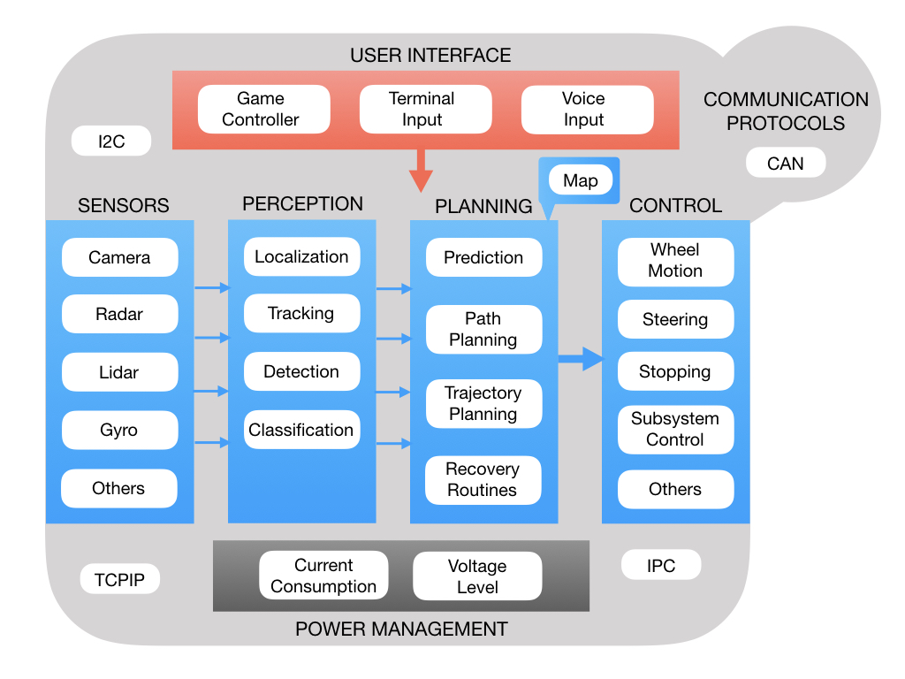
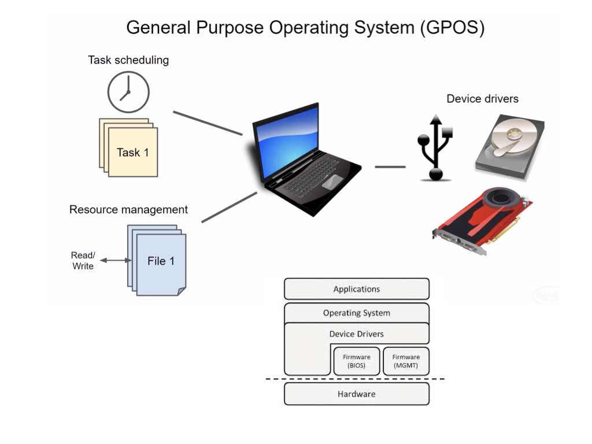
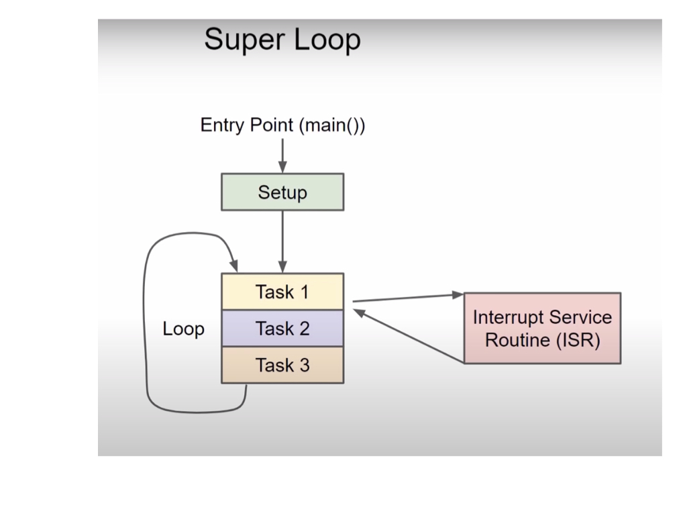
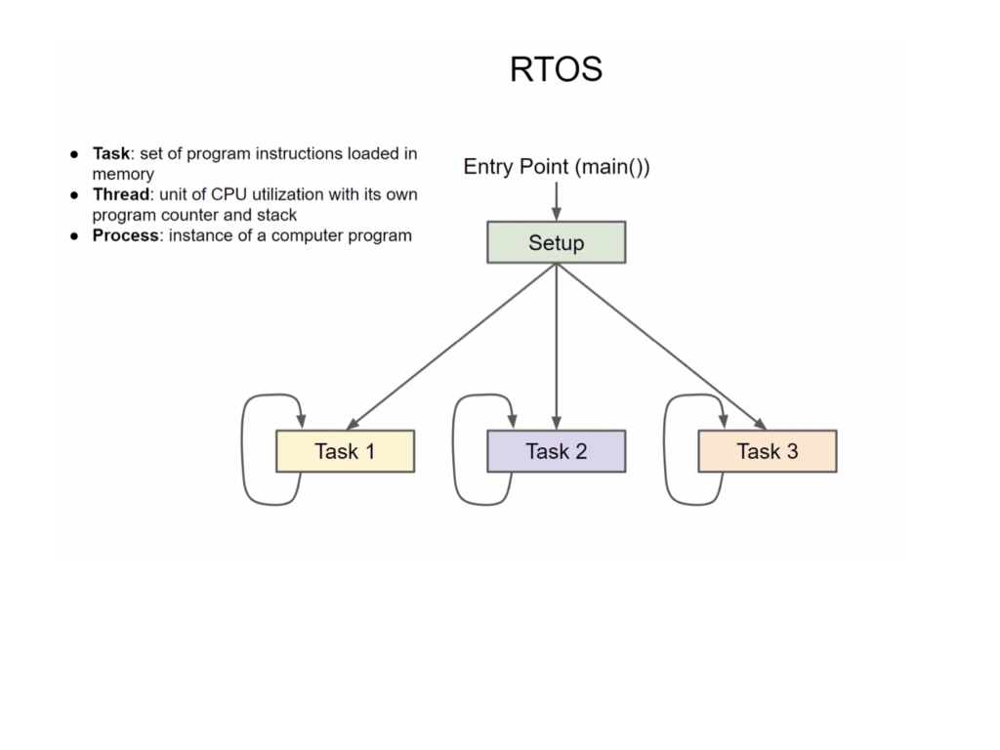

# Control Algorithms
Members of the programming team are primarily tasked with writing algorithms that control the robot.  This is the most heavily researched areas of robotics with a high demand of skilled programmers, especially those who understand robotic systems. To get an understanding of robot programming it's helpfull to try and categorize the algorithms into their functional areas.

A robot receives input from two sources; a **user interface** that sends it commands, and the **sensors** that perceive the environment around it.  Once the input is received the robot has to plan an action to perform and send **control** signals to it's actuators to carry out that action.  Input coming in from sensors must first be passed through the **perception** stack before it goes onto the **planning** algorithms. This is because sensors produce very large amounts of raw data that is coming in at a fast rate.  The robot has to make sense of that data in order to determine its state.  The **power management** stack monitors the battery status and current draw of the system.

A critical piece of information that a robot would get from its sensors is <i>"Where am I?"</i> and <i>"What is my orientation?"</i> the representation of this in robotics is called a <i>Pose</i>.  The process of determining the robots' <i>Pose</i> is called <i>**Localization**</i>. As the robot moves is needs to ensure that is <i>**Tracking**</i> on its intended path. Localization and tracking are the primary components that represent the robots' state.  

The perception algorithms can get vast amounts of raw data coming in from its sensors much of which may not be useful for determining its state.  The raw sensor data may need to be passed through **Filtering** routines to extract the pertinent information. Filtering is used to remove noise from the system and limit the rate of the data flow among other things. Another critical component of the perception stack is to **detect** objects and **classify** them in a meaningful way. 

**Prediction** takes in past and current information and predicts what will happen in the future.  This is done using <i>Kalman Filters</i>, which is a large subject area. There is more infomation about Kalman Filters and filters in general in the [WPI Documentation](https://docs.wpilib.org/en/latest/docs/software/advanced-controls/filters/introduction.html). **Path Planning** and **Trajectory Planning** is concerned with getting the robot from where it is now to where it needs to be.  A path is a set of waypoints from one location to another whereas a trajectory indicates the time at which the robot should reach each waypoint and the velocity at which it should be travelling. Similar to the real world, the robot may use a map to assist the path planning process. There may also be a set of **Recovery Routines** in order to account for unexpected situations that the robot may encounter on the way to its goal.

Finally, in order for the robot to communicate with a User Interface, and for the onboard devices to communicate with each other, there are a number of **Networking Protocols** that programmers will need to understand.  In <i>First Robotics</i>, the primary networking protocol between devices is <i>CAN</i>.

## Real Time Operating Systems (RTOS)
Explain a general purpose operating system...

Explain a typical micro processor operating system...

Explain a real time operating system...

<h3>
<a href="intro">Previous</a>
