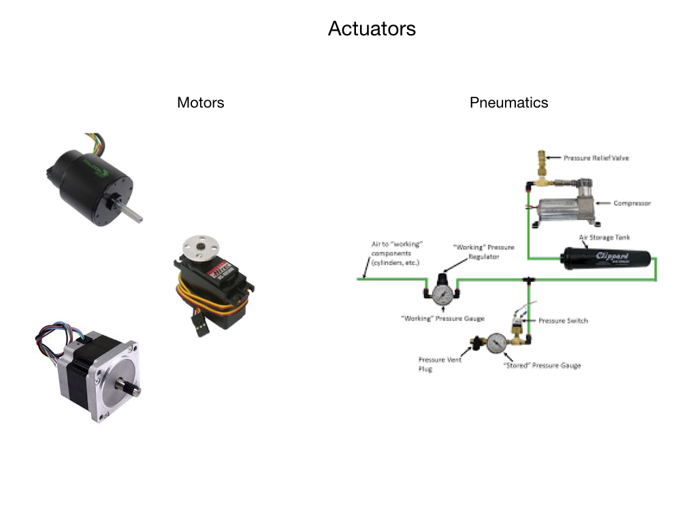

# Robot System

## Mechanical Structure

## Sensors

One of the most important tasks of robots is to acquire knowledge about its environment. This is done by taking measurements using various kinds of sensors and then extracting meaningful information from those measurements. This information is used to decide what actions the robot should take and how those actions should be carried out.  For some actions it may be necessary to take and process measurements multiple times per second.

There are two broad categories of sensors used in robotics:

- **Proprioceptive** sensors measure values internal to the robot; e.g. motor speed, acceleration, direction, battery voltage.

- **Exteroceptive** sensors acquire information from the robot’s environment; e g. distance measurements, light intensity, sound amplitude. Exteroceptive sensor measurements are interpreted by the robot in order to extract meaningful features from its surroundings.

### Sensor Interaction
There are two main ways in which sensors interact with the surrounding world:

- **Passive** sensors measure ambient environmental energy entering the sensor. Examples of passive sensors include temperature probes, microphones, contact switches, compasses, and cameras.

- **Active** sensors emit energy into the environment, then measure the environmental reaction.  Examples would be ultrasonic sensors, laser rangefinders, and optical encoders.

### Sensor Performance
Sensor vary widely in their performance.  When examining sensor performance the following terminology can be used:

- **Range** 

- **Resolution**

- **Linearity**

- **Frequency**

### Active Ranging and Time-of-Flight
Robots rely heavily on <i>Active Ranging</i> for obstacle detection and avoidance.  Common active ranging sensors are ultrasonic sensors and laser rangefinders. Active ranging sensors are also used extensively for mapping and localization.  The physics behind these types of sensors is <i>Time-of-Flight</i>.

# Actuators

# Motion Control

<h3>
<a href="../../index">Previous</a>

<a href="../Geometry/intro">Next</a></h3>