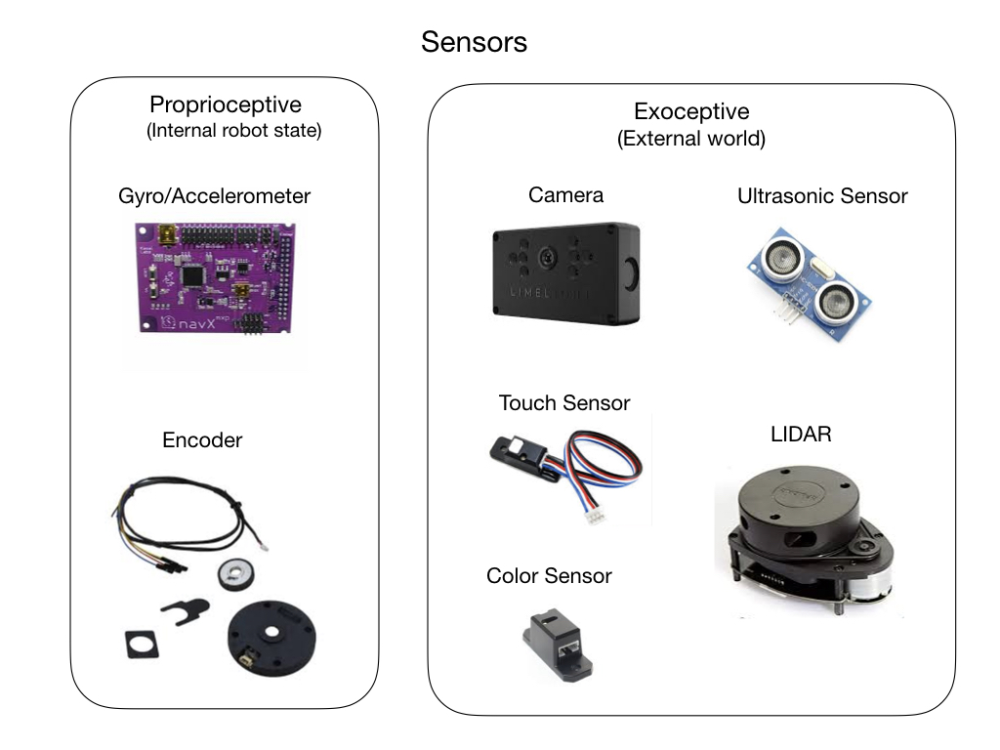
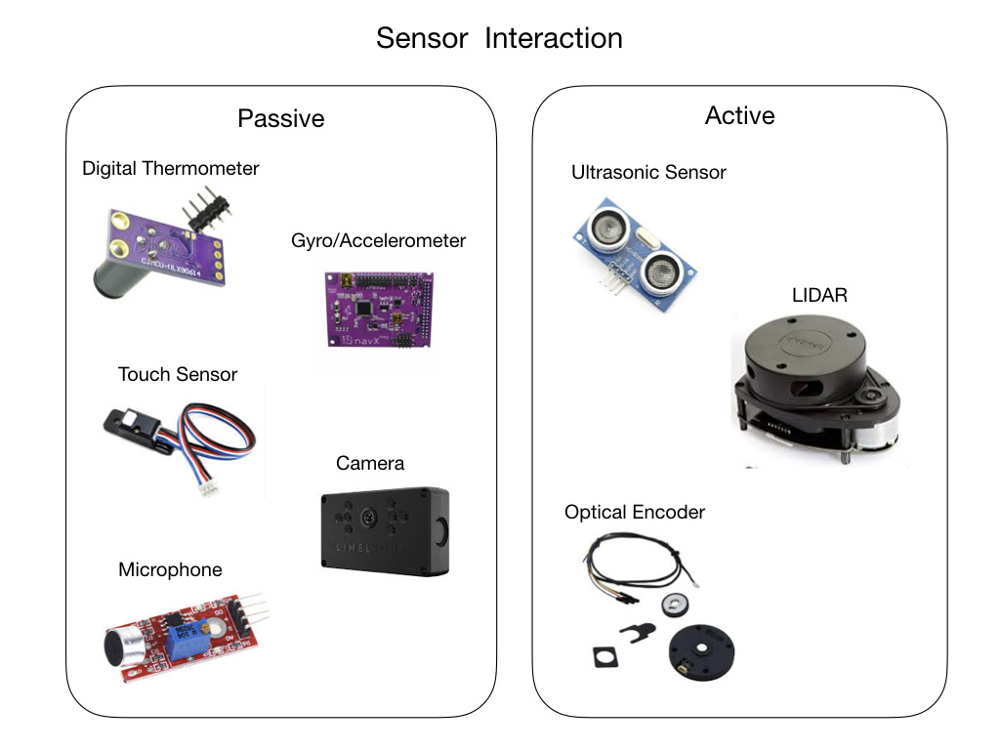
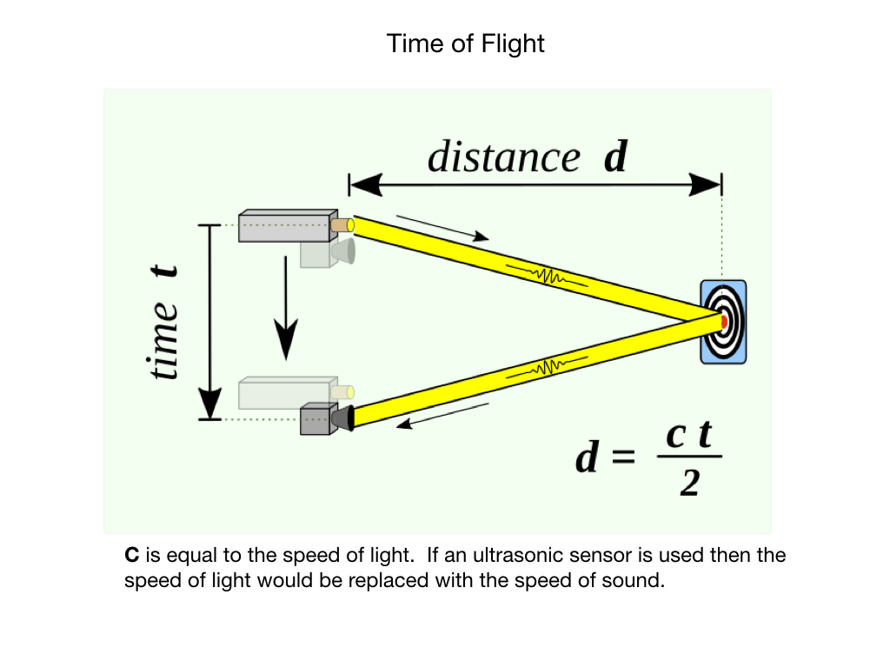
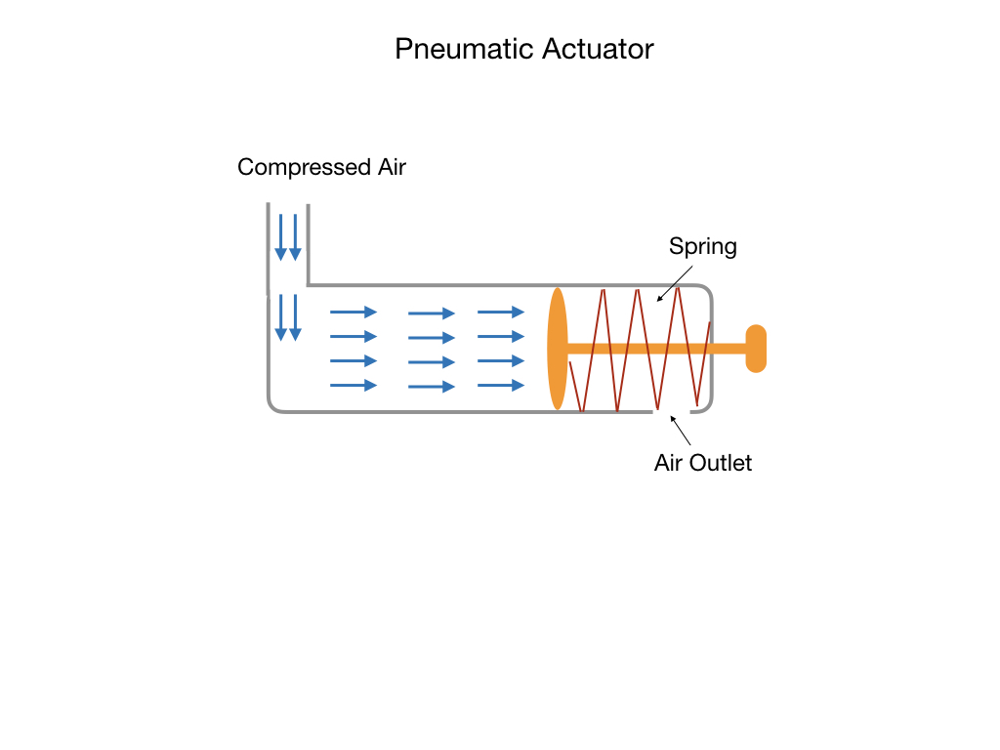

# Robot System

The actuators, sensors, and control systems work together to carry out the robots' mission.  The control system will accept the mission commands and calculate a path and trajectory from it's current location to the target location.  It will the determine the control signals it needs to send to the actuators.  The sensors will feed back raw data that the control system will interpret to determine where it is in the path.

## Mechanical Structure

## Sensors

One of the most important tasks of robots is to acquire knowledge about its environment. This is done by taking measurements using various kinds of sensors and then extracting meaningful information from those measurements. This information is used to decide what actions the robot should take and how those actions should be carried out.  For some actions it may be necessary to take and process measurements multiple times per second.

There are two broad categories of sensors used in robotics:

- **Proprioceptive** sensors measure values internal to the robot; e.g. motor speed, acceleration, direction, battery voltage.

- **Exteroceptive** sensors acquire information from the robot’s environment; e g. distance measurements, light intensity, sound amplitude. Exteroceptive sensor measurements are interpreted by the robot in order to extract meaningful features from its surroundings.

### Sensor Interaction
There are two main ways in which sensors interact with the surrounding world:

- **Passive** sensors measure ambient environmental energy entering the sensor. Examples of passive sensors include temperature probes, microphones, contact switches, compasses, and cameras.

- **Active** sensors emit energy into the environment, then measure the environmental reaction.  Examples would be ultrasonic sensors, laser rangefinders, and optical encoders.

### Active Ranging and Time-of-Flight
Robots rely heavily on <i>Active Ranging</i> for obstacle detection and avoidance.  Common active ranging sensors are ultrasonic sensors and laser rangefinders. Active ranging sensors are also used extensively for mapping and localization.  The physics behind these types of sensors is <i>Time of Flight</i>. Time of Flight is a measurement of the time it takes for a sound or light wave to travel from a emitter and back to a receiver after bouncing off of an object. The time taken is used to calculate the distance, or range, to the object.

# Actuators
An actuator is a device that takes energy and converts it into mechanical form. For example, a DC motor will convert electrical energy into angular motion, and a pneumatic device will take compressed air and covert it into linear motion.  The command signal for the actuator will come from the controller.  Actuators are the muscles of the robot allowing it to interact with the world around it.

### Motors
There are three main types of motor:
- **Servo Motor**
      Based on feedback control.  Fast, high torque, very accurate rotation within a limited angle. Suited for robotic arms/legs etc. Servos use a feedback mechanism and other circuitry for positioning.

- **Stepper Motor**
        Precise angular motion in small steps. Quite slow but easy to control. They have high holding torque. Stepper motors are suited for robot arms, 3D printers and other devices where precise position is critical.

- **DC Motor**
      Use direct current.  Fast, continuous rotation. Used for anything that needs to spin at a high RPM e.g. car wheels, fans, drills etc.

      

### Pneumatic Actuators
Pneumatic actuators work on compressed air.  Used for fast on/off tasks with a high amount of force applied.  No oil leaks as might be the case with hydraulic devices.

# Motion Control
- Path and Action Planners
- Controllers
- State Estimators
- Recovery Algorithms

<h3>
<a href="../../index">Previous</a>

<a href="../Geometry/intro">Next</a></h3>