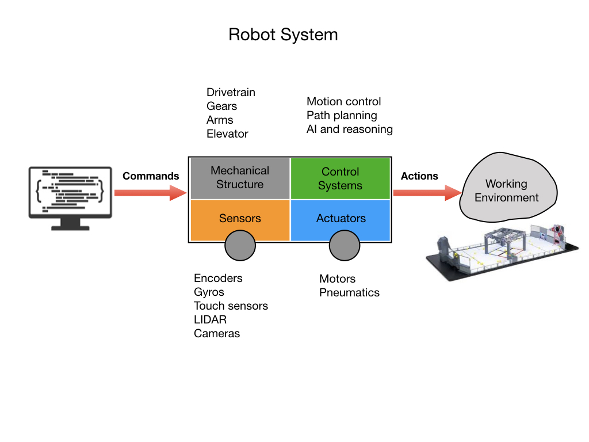
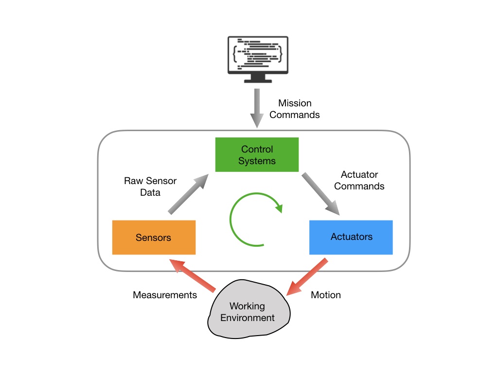
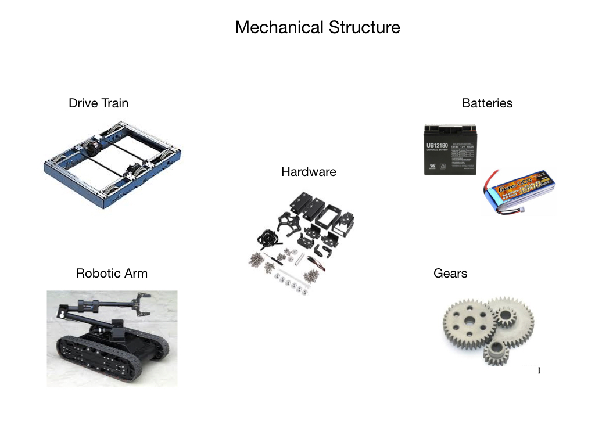

# Robot Systems
We can define a robot as <i>a goal oriented machine that can sense, plan, and act</i>.  A robot is largely classified into hardware and software. Mechanical components, motors, gears, circuits, sensors are categorized as hardware. The processes that perceive the environment from sensor data, makes plans, and drives or controls the robot’s hardware to act is the software.

The actuators, sensors, and control systems work together to carry out the robots' mission.  The control system will accept the mission commands and calculate a path and trajectory from it's current location to the target location.  It will the determine the control signals it needs to send to the actuators.  The sensors will feed back raw data that the control system will interpret to determine where it is in the path.

## Mechanical Structure
The mechanical structure enables the robot to physically interact with the world. It provides an appropriate framework, or skeleton, to traverse the environment in which it's suppose to operate, ground, air, water, smooth or rough terrain.  It enables it to interact with the world using actuators.  And provides sensors to perceive where it is and plan its actions.

## Sensors

One of the most important tasks of robots is to acquire knowledge about its environment. This is done by taking measurements using various kinds of sensors and then extracting meaningful information from those measurements. This information is used to decide what actions the robot should take and how those actions should be carried out.  For some actions it may be necessary to take and process measurements multiple times per second.

There are two broad categories of sensors used in robotics:

- **Proprioceptive** sensors measure values internal to the robot; e.g. motor speed, acceleration, direction, battery voltage.

- **Exteroceptive** sensors acquire information from the robot’s environment; e g. distance measurements, light intensity, sound amplitude. Exteroceptive sensor measurements are interpreted by the robot in order to extract meaningful features from its surroundings.

### Sensor Interaction
There are two main ways in which sensors interact with the surrounding world:

- **Passive** sensors measure ambient environmental energy entering the sensor. Examples of passive sensors include temperature probes, microphones, contact switches, compasses, and cameras.

- **Active** sensors emit energy into the environment, then measure the environmental reaction.  Examples would be ultrasonic sensors, laser rangefinders, and optical encoders.

# Actuators
An actuator is a device that takes energy and converts it into mechanical form. For example, a DC motor will convert electrical energy into angular motion, and a pneumatic device will take compressed air and covert it into linear motion.  The command signal for the actuator will come from the controller.  Actuators are the muscles of the robot allowing it to interact with the world around it.

### Motors
There are three main types of motor:
- **Servo Motor**
      Based on feedback control.  Fast, high torque, very accurate rotation within a limited angle. Suited for robotic arms/legs etc. Servos use a feedback mechanism and other circuitry for positioning.

- **Stepper Motor**
        Precise angular motion in small steps. Quite slow but easy to control. They have high holding torque. Stepper motors are suited for robot arms, 3D printers and other devices where precise position is critical.

- **DC Motor**
      Use direct current.  Fast, continuous rotation. Used for anything that needs to spin at a high RPM e.g. car wheels, fans, drills etc.

      

### Pneumatic Actuators
Pneumatic actuators work on compressed air.  Used for fast on/off tasks with a high amount of force applied.  No oil leaks as might be the case with hydraulic devices.

# Robot Control
The programming team is primarily tasked with controlling the robot.  Robot control can be grouped into a few broad categories some of which are explained below.

- **Motion Control** 
            In order to ensure a smooth transition from one physical state to the next it's important to ensure that the robot does not undergo any sudden accelerations and decelerations.  Severe sudden movements of the robot will over time require more maintenance and could cause damage.

- **PID Control**
            PID control is at the core of many control algorithms.  PID control ensures that the robot arrives at its target state in the most efficient manner while observing all of its physical contraints.  PID stands for <i>Proportional, Integral, Devirative</i>.

- **Localization**
            In order to control a robot we always need to know what its position and orientation in space is at all times. Localization routines deal with this task and are also referred to as <i>State Estimation</i>. 

<!-- - **Projectile Motion**
            Projectile motion is concerned with firing some kind of projectile with the goal of hitting a target.  Calculations used in these motion algorithms are taken directly from the study on Newtonian physics. -->

- **Mapping**
            Mapping is a process that a robot might undertake in order to know what its working environment is.  Mapping is done using laser range finders and/or cameras.  The resulting map is stored in memory for contiuous use.

- **Path Planning**
            In order for a robot to get from its current physical state to its target state it needs to plan a path. This path may not nessicarily be a straight line since it may need to route around objects as described in a map of its environment.      

- **Recovery Routines** 
            At some point the robot is going to be confronted with an unexpected situation that gets in the way of completing its mission.  For instance, some obstical like a person might step into its planned path.  In this situation a recovery algorithm might kick in to route around the person.                           

## References 
- QUT Robotics Academy [Introduction to Robotics](https://robotacademy.net.au/masterclass/introduction-to-robotics/)

<h3>
<a href="index">Home</a>

<a href="../geometry">Next</a></h3>