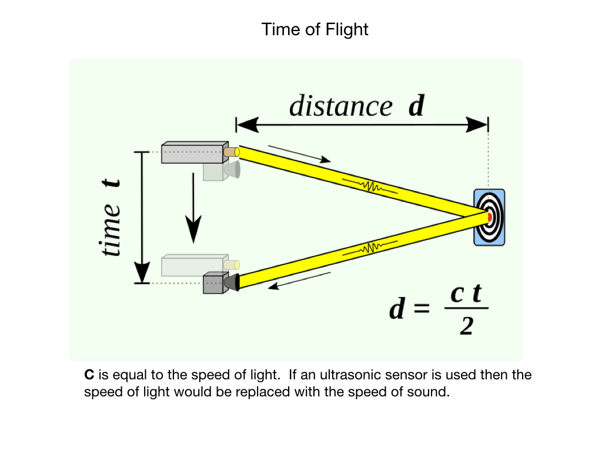

# Sensors
Sensors extract data...

We're mostly concerned with [Sensor Software](https://docs.wpilib.org/en/stable/docs/software/sensors/sensor-overview-software.html)

## Encoders
FRC Documentation - [Encoders](https://docs.wpilib.org/en/latest/docs/software/hardware-apis/sensors/encoders-software.html)

## Gyros
FRC Documentation - [Gyros](https://docs.wpilib.org/en/latest/docs/software/hardware-apis/sensors/gyros-software.html)

Also QUT Robot Academy [Measuring Motion](https://robotacademy.net.au/masterclass/measuring-motion/)

## Accelerometers
FRC Documentation - [Accelerometers](https://docs.wpilib.org/en/latest/docs/software/hardware-apis/sensors/accelerometers-software.html)

## Cameras
The camera corresponds to the eye in the robot. The images obtained from the camera are very useful for recognizing the environment around the robot. For example, object recognition using a camera image, facial recognition, a distance value obtained from the difference between two different images using two cameras (stereo camera), mono camera visual SLAM, color recognition using information obtained from an image and object tracking are very useful.

### Active Ranging and Time-of-Flight
Robots rely heavily on <i>Active Ranging</i> for obstacle detection and avoidance.  Common active ranging sensors are ultrasonic sensors and laser rangefinders. Active ranging sensors are also used extensively for mapping and localization.  The physics behind these types of sensors is <i>Time of Flight</i>. Time of Flight is a measurement of the time it takes for a sound or light wave to travel from a emitter and back to a receiver after bouncing off of an object. The time taken is used to calculate the distance, or range, to the object.

## Laser Distance Sensors (LDS)
Edit all of this....
Laser Distance Sensors (LDS) are referred to various names such as Light Detection And Ranging (LiDAR), Laser Range Finder (LRF) and Laser Scanner. LDS is a sensor used to measure the distance to an object using a laser as its source. The LDS sensor has the advantage of high performance, high speed, real time data acquisition, so it has a wide range of applications in relation to distance measurement. This is a sensor widely used in the field of robots for recognition of objects and people, and distance sensor based SLAM (distance-based sensor), and also widely used in unmanned vehicles due to its real time data acquisition.

The LDS sensor calculates the difference of the wavelength when the laser source is reflected by the object. A typical LDS consists of a single laser source, a reflective mirror, and a motor. When you drive the LDS, you can hear the sound of the rotating motor, because it rotates the inner mirror and scans the laser in a horizontal plane. Typically measures from 180 to 360 degrees, depending on the product.

Because it measures the return of the laser source, therefore, is useless if nothing is reflected. In other words, transparent glass, plastic bottles, glass cups are tend to reflect or scatter the laser source in many directions. And for mirrors, lights are reflected back to the mirror making it inaccurate measurement. 

Also, because the horizontal plane is scanned, only objects on the horizontal plane are detected by the sensor. In other words, you need to know that it is 2D data.

There are infinite usages of LDS, and SLAM (Simultaneous Localization And Mapping) is one of the most well known examples of using LDS. SLAM creates a map by recognizing obstacles around the robot and estimates current position of the robot within a map. As another example of using LDS, the robot is able to detect various objects in the surroundings and react based on the current environment. 

## References
- FRC Documentation - [Sensors](https://docs.wpilib.org/en/latest/docs/software/hardware-apis/sensors/index.html)

- Alonzo Kelly [Mobile Robotics](https://www.cambridge.org/core/books/mobile-robotics/5BF238489F9BC337C0736432C87B3091) Chapter 6.2

<h3>
<a href="intro">Previous</a>

<a href="actuators">Next</a></h3>