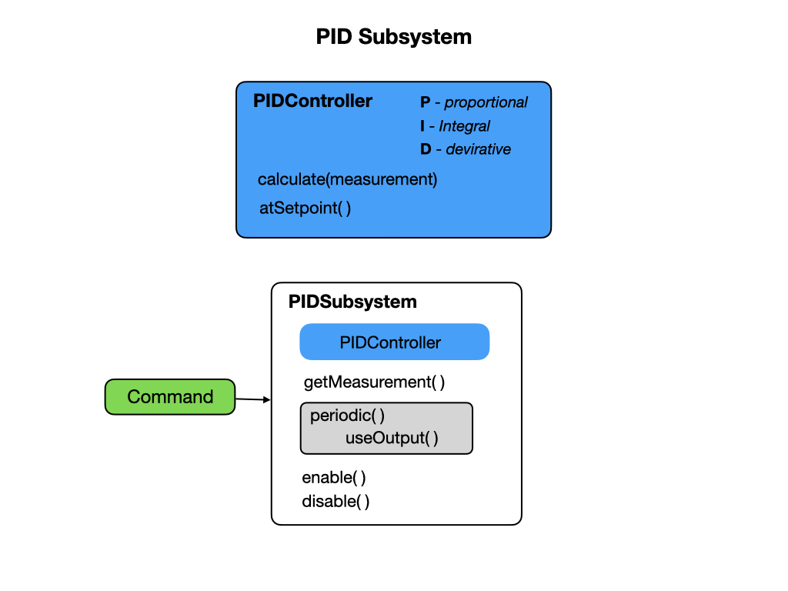

## Time and Motion
In the [Geometry](geometry) section we descibed the Pose of an object in 2D and 3D space.  Now we look at how the Pose changes as a function of time.  For robotic systems we are concerned with how we can ensure a smooth transition from one pose to another, which we call **Motion Profiling**.  Our primary mechanism for doing that is the PID Controller that is explained in the [Advanced Controls](https://docs.wpilib.org/en/stable/docs/software/advanced-controls/introduction/index.html) section of the FRC Documentation.

## Time Varying Pose
Paths and Trajectories

## Accelerating Bodies and Reference Frames

## PID Controller
Before looking at the PID controller supplied by the WPI library, it would be useful to get an overview by watching the [PID Introduction Video by WPI](https://docs.wpilib.org/en/stable/docs/software/advanced-controls/introduction/pid-video.html).  The [Introduction to PID](https://docs.wpilib.org/en/stable/docs/software/advanced-controls/introduction/introduction-to-pid.html) section of the FRC documentation provides more details.

The key method for the PID controller is the `calculate()` method. Let's examine that method and see how it implements what we know about PID control.

    public double calculate(double measurement) {
      m_measurement = measurement;
      m_prevError = m_positionError;

      if (m_continuous) {
        m_positionError =
            MathUtil.inputModulus(m_setpoint - measurement, m_minimumInput, m_maximumInput);
      } else {
        m_positionError = m_setpoint - measurement;
      }

      m_velocityError = (m_positionError - m_prevError) / m_period;

      if (m_ki != 0) {
        m_totalError =
            MathUtil.clamp(
                m_totalError + m_positionError * m_period,
                m_minimumIntegral / m_ki,
                m_maximumIntegral / m_ki);
      }

      return m_kp * m_positionError + m_ki * m_totalError + m_kd * m_velocityError;
    }

Testing for when we've reached the setpoint is the other key piece of code.  That code is listed below.

    public boolean atSetpoint() {
      double positionError;
      if (m_continuous) {
        positionError =
            MathUtil.inputModulus(m_setpoint - m_measurement, m_minimumInput, m_maximumInput);
      } else {
        positionError = m_setpoint - m_measurement;
      }

      double velocityError = (positionError - m_prevError) / m_period;

      return Math.abs(positionError) < m_positionTolerance
          && Math.abs(velocityError) < m_velocityTolerance;
    }

## Trapezoid Motion Profile
Initial and final values are specified, and usually set to zero.

Velocity and acceleration are continuous.

To improve the handling of our mechanisms, we often wish to command mechanisms to a sequence of setpoints that smoothly interpolate between its current state, and its desired goal state.

See [Trapezoidal Motion Profiles in WPILib](https://docs.wpilib.org/en/stable/docs/software/advanced-controls/controllers/trapezoidal-profiles.html) in the FRC documentation.

To calculate constraints look at [Robot Characterization](../Tools/romiCharacterization)

## References
- QUT Robot Academy [Paths & Trajectories](https://robotacademy.net.au/masterclass/paths-and-trajectories/)

- FRC Documentation [Trajectory Generation and Following with WPILib](https://docs.wpilib.org/en/stable/docs/software/advanced-controls/trajectories/index.html)

- FRC Documentation - [PID Basics](https://docs.wpilib.org/en/stable/docs/software/advanced-controls/introduction/index.html)

- FRC Documentation - [PID Control](https://docs.wpilib.org/en/latest/docs/software/commandbased/pid-subsystems-commands.html)

- FRC Documentation - [Controllers](https://docs.wpilib.org/en/latest/docs/software/advanced-controls/controllers/index.html)

- FRC Documentation [Trapezoidal Motion Profiles in WPILib](https://docs.wpilib.org/en/stable/docs/software/advanced-controls/controllers/trapezoidal-profiles.html)

- FRC Documentation - [Feedforward Control in WPILib](https://docs.wpilib.org/en/stable/docs/software/advanced-controls/controllers/feedforward.html#feedforward-control-in-wpilib)

- QUT Robot Academy [Rigid Body Dynamics](https://robotacademy.net.au/masterclass/rigid-body-dynamics/)

<h3>
<a href="timeMotion">Previous</a>

<a href="kinematics">Next</a></h3>
