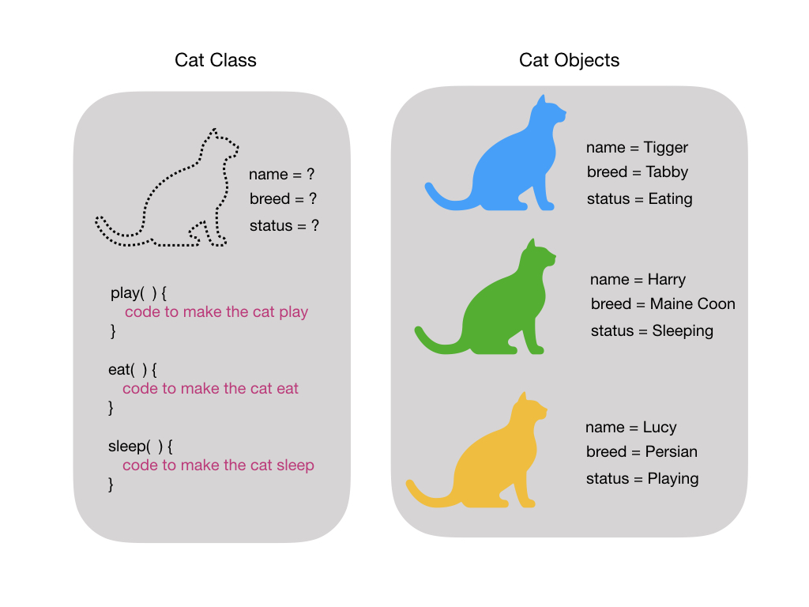
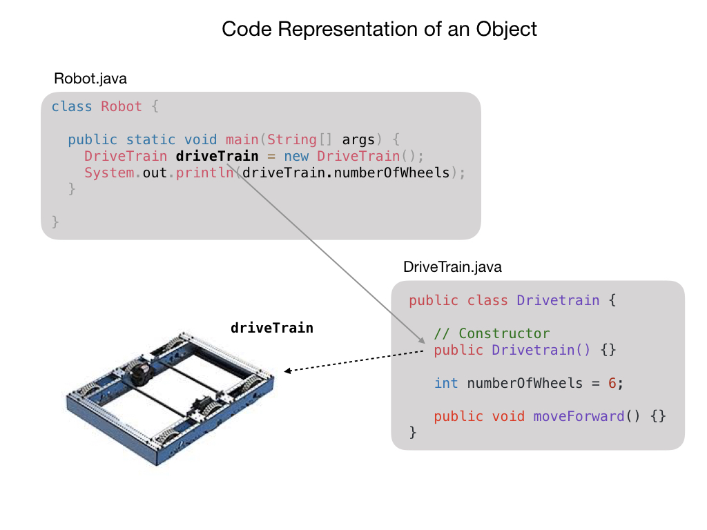

# Classes
A class is a representation of an object, idea, or concept in the real world.  

- It's a blueprint for creating objects.

      Provides a template or blueprint for defining the nature of new objects.  Each object is a specific instance of a class.

- Consists of data attributes and member functions.

      Attributes describe the objects, whereas functions define possible behaviors or operations that can be carried out by an object.

- A class is a user defined data type.

      A class is just another type such as the programming language types String and float. For example, a float is an approximation of the mathematical concept of a real number. 

- Public members provide a interface.

      An interface describes the operations that can be performed by the class.  It does not say anything about how that operation is carried out or implemented.

- Private members provide implementation details.

      The private member functions contain the code that define the behavior of that objects.

- The contructor is used to initialize objects and has the same name as the class.

      A constructor is a special method that is used to initialize the values for the object's attributes. The constructor is called when an object of a class is created.  It's important that you initialize all of an object's attributes otherwise the object in left in a partially undefined state.

<h3>
<a href="intro.md">Home</a>

<a href="../intro.md">Next</a></h3>