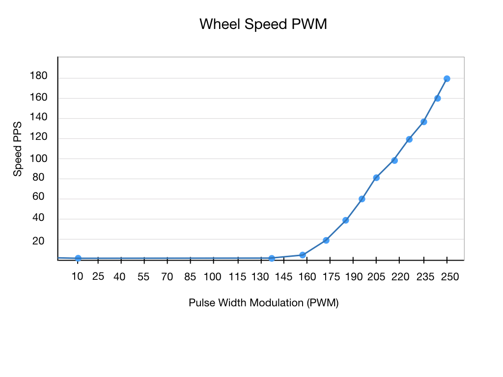

## Classes
A class is a representation of an object, idea, or concept in the real world.  A class is just another type such as the programming language types integer and float. For example, a float is an approximation of the mathematical concept of a real number.  

Examples of classes:

<h3>
<a href="intro.md">Home</a>

<a href="../intro.md">Next</a></h3>