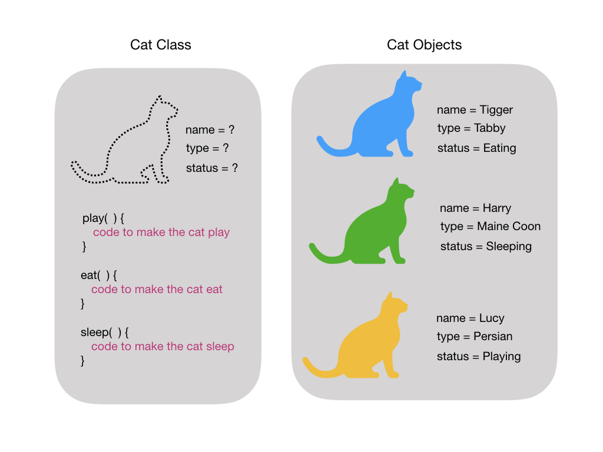
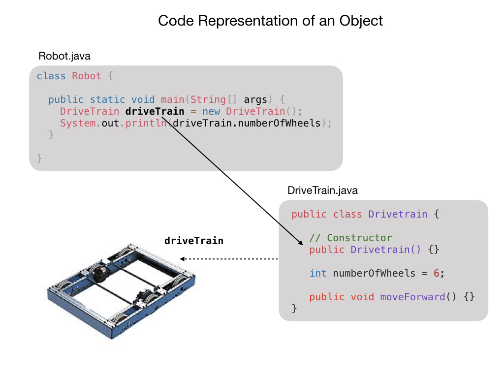
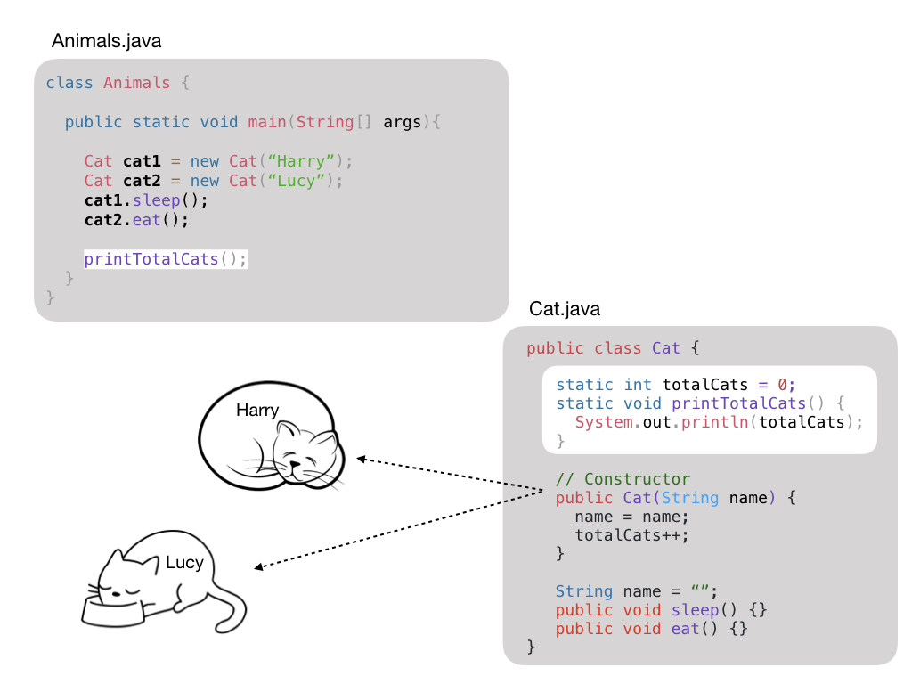
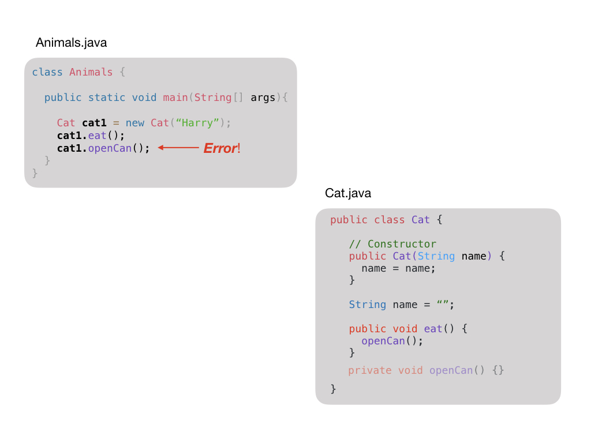
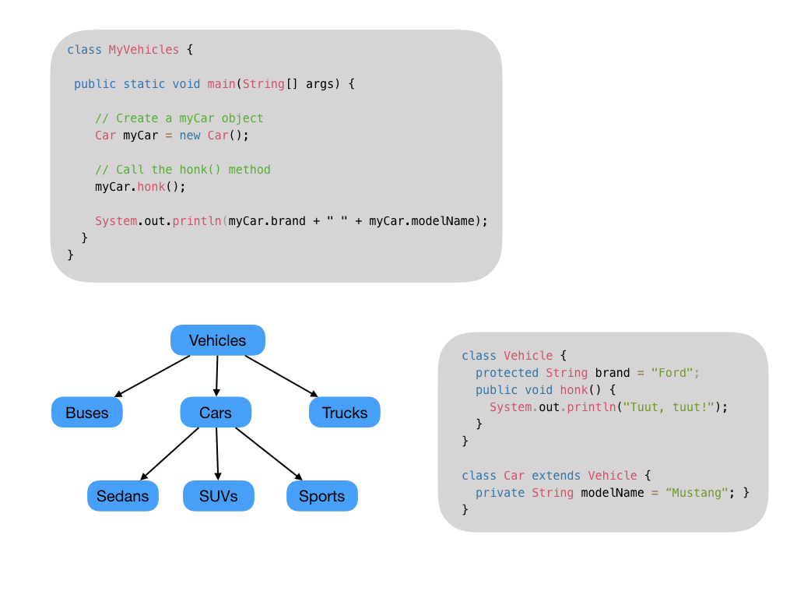

# Classes
A class is a representation of an object, idea, or concept in the real world. It is a good idea to write classes that creates objects for things in the real world. Think about what you want the objects to do or to tell you. It's a powerful technique when it comes to modelling real systems in a computer program. 

- A class is a blueprint for creating objects.

      Each object is a specific instance of a class and inherits all the attributes (variables) and methods (functions) from the class.

- Consists of data attributes and member functions.

      Attributes describe the objects, whereas functions define possible behaviors or operations that can be carried out by an object.

- A class is a user defined data type.

      A class is just another type such as the programming language types String and float. For example, a float is an approximation of the mathematical concept of a real number. 

- Public members provide an interface.

      An interface describes the operations that can be performed by the class.  It does not say anything about how that operation is carried out or implemented.

- Private members provide implementation details.

      The private member functions contain the code that define the behavior of that objects.

## Constructors
The contructor is used to initialize objects and has the same name as the class.  A constructor is a special method that is used to initialize the values for the object's attributes. The constructor is called when an object of a class is created.  It's important that you initialize all of an object's attributes otherwise the object in left in a partially undefined state. All classes have constructors by default. If you do not create a class constructor yourself then one will be created for you.

## Static Methods
A class can have static methods and variables that can be used without having to create an object.  You would use a static method if there is some functionality that involved all objects of a class. For instance, if you wanted to know how many cats there were then you would implement a static method to count the number of cats since no one cat object would know that information.

## Encapsulation
It's often a good idea to hide parts of a classes' implementation by making methods and attributes `private`.  This allows you to change the way the code is written without effecting other parts of the program that use that class.  For instance, you may discover a more efficient way of coding one part of the program. It also protects variables that you don't want other parts of the program to have access to.  Within an object there is often relationships between attributes that must be kept in sync.  Having users of the class change the value of an attribute without know the internal workings of the object can make that object invalid. 

## Inheritance
Different kinds of objects often have a certain amount in common with each other. Mountain bikes, road bikes, and tandem bikes, for example, all share the characteristics of bicycles (current speed, current pedal cadence, current gear). Yet each also defines additional features that make them different: tandem bicycles have two seats and two sets of handlebars; road bikes have drop handlebars, etc.

When a class derives from another class. The child class will inherit all the `public` and `protected` properties and methods from the parent class. In addition, it can have its own properties and methods. An inherited class is defined by using the extends keyword. We often use the terms <i>sub-class</i> and <i>superclass</i> when we talk about inheritance.

When a property or class has the `protected` modifier it means that a sub-class may access the variable but it is still `private` to the superclass.  Therefore, the variable <i>brand</i> is only accessible from the class <i>Car</i>.

## References

- W3Schools -  [Java Classes and Objects](https://www.w3schools.com/java/java_classes.asp)

<h3>
<a href="intro.md">Home</a>

<a href="../intro.md">Next</a></h3>