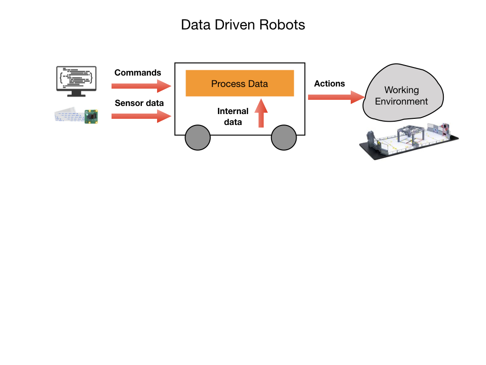

# Data Structures

Robots are driven by data.  They receive data from external sensors like cameras, internal sensors such as encoders, and from commands sent to it by a controller.  Once they receive the data the robot processes it and may carry out actions based on that data.  Data can be organized in several ways, which we call data structures.  You can think of data structures as containers for storing data.  We'll go over some of the most important data structures using examples in Java.  These examples are from the [Java Tutorial](https://www.w3schools.com/java/default.asp) on the W3 Schools Website.

## Primitive Data Types
The most basic type of data is a single value such as the number 42. This can be stored in a location of memory that is pointed to by a named variable such as `age`. The number 42 is an integer but a number can also have decimal places such as 3.14, which we call a floating point number. All of the primitive data types and the way that they are created in Java are explained on the W3 Schools Website under [Java Variables](https://www.w3schools.com/java/java_variables.asp) and [Java Data Types](https://www.w3schools.com/java/java_data_types.asp).

Most of the primitive data types can be operated on by [Java Operators](https://www.w3schools.com/java/java_operators.asp), which allow you to perform arithmatic operations and comparisons.  There are also functions to carry out common [Math](https://www.w3schools.com/java/java_math.asp).

There's a special data type called a [Boolean](https://www.w3schools.com/java/java_booleans.asp) that takes only two values either `true` or `false`.

## Arrays
Arrays are used to store multiple values that are pointed to by a single variable, instead of declaring separate variables for each value.  They use an index to point to each member (value) of the array.  Here's more information about [Arrays](https://www.w3schools.com/java/java_arrays.asp) in Java.

When you create an array it will have a fixed length.  If you want the array to change size as you execute your program then you'll need to use an [ArrayList](https://www.w3schools.com/java/java_arraylist.asp).

## Strings
Strings are variables that contain a collection of characters surrounded by double quotes.  A string is just an array of characters.  A String in Java is actually an object, which contain methods that can perform certain operations on strings. For example, the length of a string can be found with the `length()` method.  Here's more information about [Strings](https://www.w3schools.com/java/java_strings.asp) in Java.

## Mutable and Immutable Data
Most of the data structures that you create will have values that can change during the execution of your program.  These data structures are referred to as **Mutable**.  Because most values will change during the course of a program the default mode of a variable will be Mutable.

If you know that a value of a variable will not change, such as the value of **Pi**, then you can store it in an **Immutable** variable.  Values held in program variables whose content never changes are known as **Constants** to differentiate them from variables that could be altered during execution.  With most languages you'll need to explicitly declare a variable as constant if you don't want it to change.

## Enums
An Enum is a special data type that represents a group of predefined constants. The variable must be equal to one of the values that have been predefined for it. Common examples include compass directions (values of NORTH, SOUTH, EAST, and WEST) and the days of the week.  Here are some examples of how [Enums](https://www.w3schools.com/java/java_enums.asp) are used.

## References

Java Tutorial on [W3Schools](https://www.w3schools.com/java/default.asp)

<h3>
<a href="introProgramming">Home</a>

<a href="procedures">Next</a></h3>