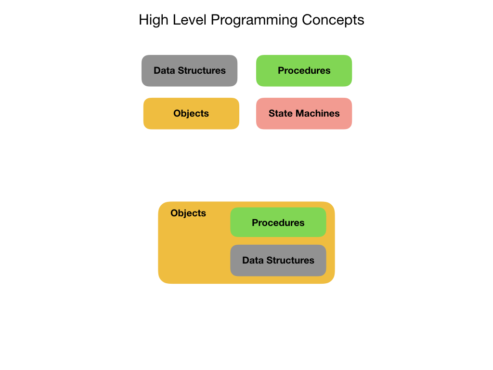
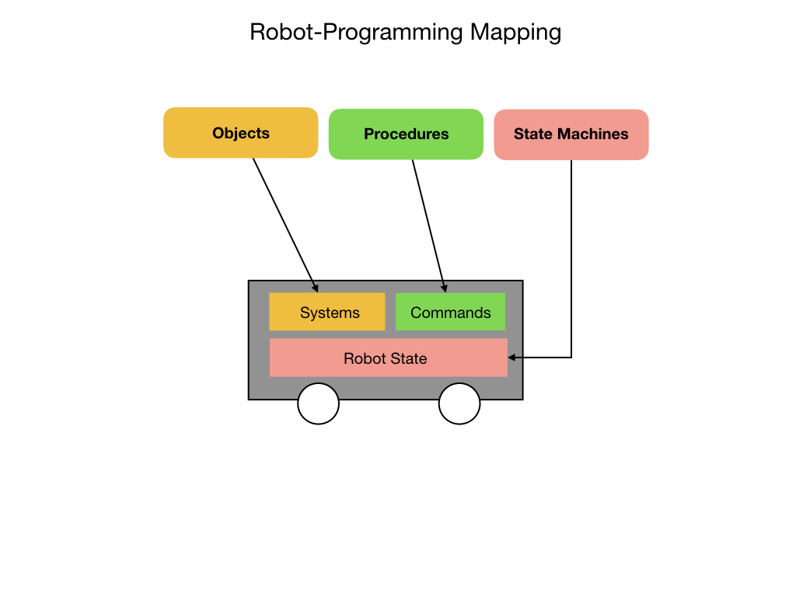

## Introduction to Programming
This is a general introduction to programming.  It covers concepts that apply to almost all [Object Oriented Languages(OLL)](https://en.wikipedia.org/wiki/Object-oriented_programming) although it will use some Java examples to illustrate some concepts.  The goal is to understand programming at a higher conceptual level, especially in the context of programming robots.

When programming in most modern languages you can break it down into four main categories; **Data Structures, Procedures, Objects,** and **State Machines**.  Objects are created to represent physical things or ideas in the real world.  Objects encapsulate the procedures and data structures to describe its attributes and the tasks that it can perform.  State Machines represent the state of a system at any point in time.  

Let's go over each of these categories in detail. 

- [Data Structures](dataStructures)
- [Procedures](procedures)
- [Objects](objects)
- [State Machines](stateMachines)

These four programming categories map quite well, although not exactly, to the mechanisms that are required to control a robot.  We'll examine these mechanisms in more detail in the tutorial on [Robot Systems](../../Concepts/RobotSystem/intro).  

<h3>
<a href="../index">Home</a>

<a href="dataStructures">Next</a></h3>
<!-- [Home](../index)     [Next](dataStructures) -->
