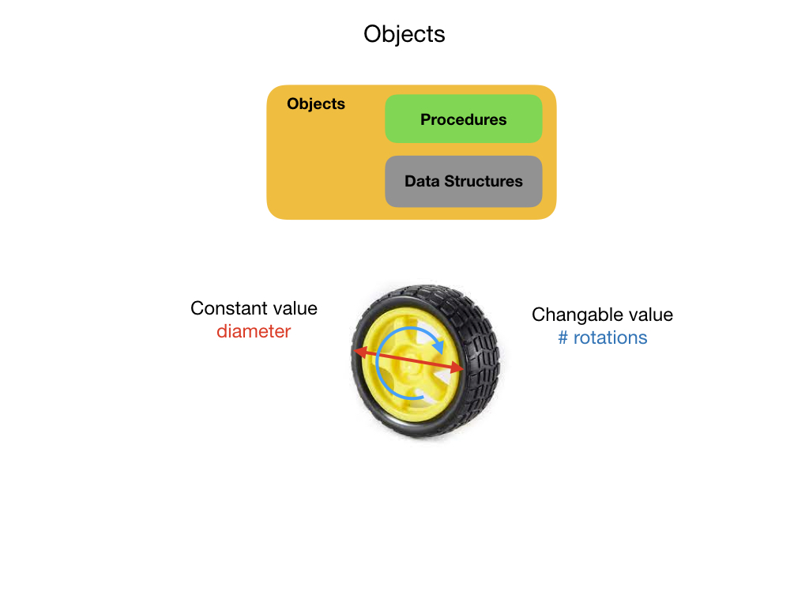

# Objects
Objects are programming constructs that are used to represent physical objects and ideas in the real world.  They are made up of [Data Structures](dataStructures) and [Procedures](prodedures) that define the object's attributes and the tasks that it can perform.  Attributes are pieces of data that describe an object's physical appearance and maintain its current state.  An example might be the diameter of a wheel and its number of rotations.  The first is and example of a Constant data type since the diameter of a wheel does not change.  The latter is a variable, or mutable, data type since the number of times that a wheel has rotated may change thoughout the execution of the program. In [Object Oriented Programming(OPP)](https://en.wikipedia.org/wiki/Object-oriented_programming) **Procedures** are referred to as **Methods**.

All Objects are derived from [Classes](./classes) that provide a common template for their creation.  The W3 Schools Java Tutorial has an introduction to [Object Oriented Programming (OOP)](https://www.w3schools.com/java/java_oop.asp).  The tutorial also explains [Attributes](https://www.w3schools.com/java/java_class_attributes.asp) and [Methods](https://www.w3schools.com/java/java_class_methods.asp), OOP name for **Procedures**. 

## References

- W3Schools -  [Java Classes and Objects](https://www.w3schools.com/java/java_classes.asp)

- Wikipedia - [Object Oriented Programming(OPP)](https://en.wikipedia.org/wiki/Object-oriented_programming)

<h3>
<a href="procedures">Previous</a>

<a href="stateMachines">Next</a></h3>