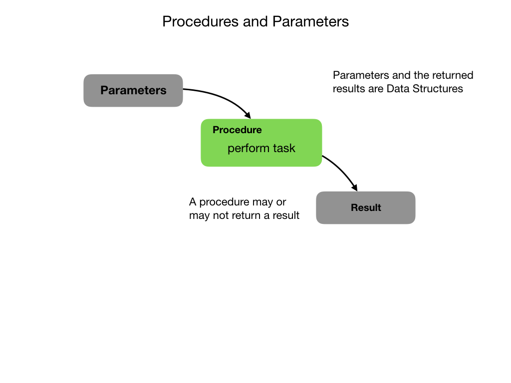

# Procedures
In most programs there are tasks that you will need to perform multiple times.  This is done using **Procedures** which are blocks of code that perform specific tasks whenever they are called.  An example of a task that a mobile robot may perform is "Drive forward 10 meters".  If a procedure is part of an Object then it's called a [Method](https://www.w3schools.com/java/java_methods.asp).  Don't let this confuse you, a Method is simply a Procedure in the context of Object Oriented Programming.  We'll look at [Objects](objects) in the next section.

You may notice that the task of driving forward 10 meters is very specific.  What if you wanted to go forward 5 meters, or drive backwards.  In order to make the procedure more useful it can be parameterized.  That way, you can move whatever distance you want either forward or backward.  The ability to pass in [Parameters](https://www.w3schools.com/java/java_methods_param.asp), or data, is a key feature of Procedures that make them so useful.

Not only can you pass data into a Procedure, you can also get data out.  Once the data has been process you can pass back a result of that processing.  This is done using a `return` statement in the code.  Procedures that return data are sometimes referred to as **Functions**.  

## References
- W3 Schools - [Java Methods](https://www.w3schools.com/java/java_methods.asp)

- W3 Schools - [Java Method Parameters](https://www.w3schools.com/java/java_methods_param.asp)

- Crash Course Computer Science [Statements & Functions](https://www.youtube.com/watch?v=l26oaHV7D40)

<h3>
<a href="dataStructures">Previous</a>

<a href="objects">Next</a></h3>