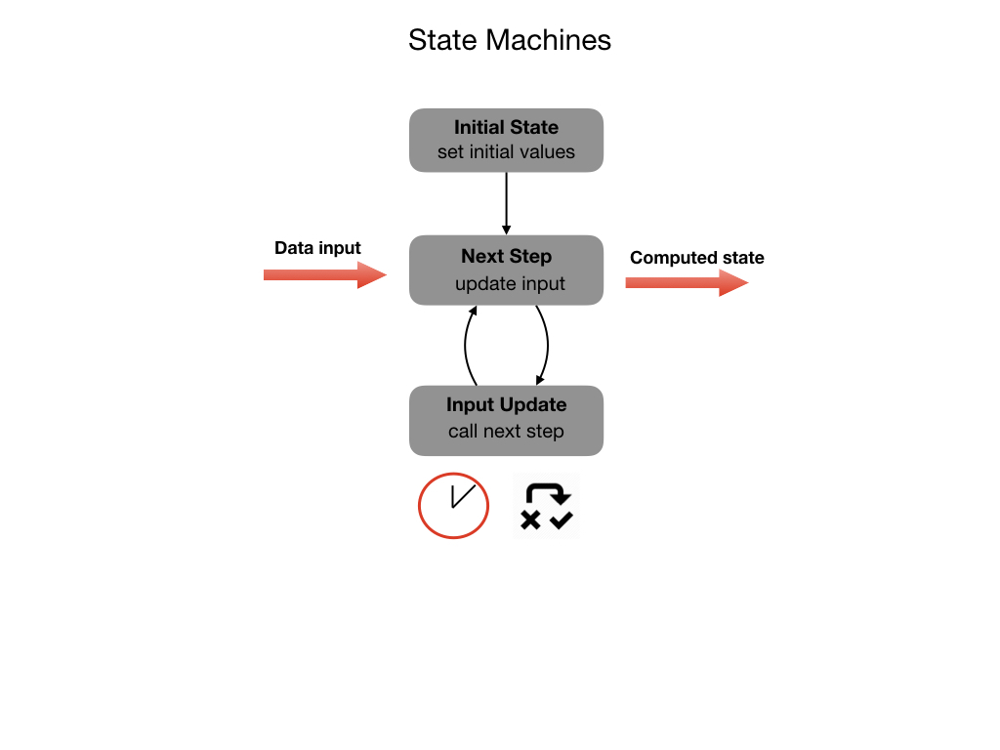

# State Machines

1. Initial State

2. Next Step (receive and process new input)

3. Measurement Update (transduce, make repeated calls to Step)

Let's look at code from the Romi reference program to see an example of a State Machine.

    // Called when the command is initially scheduled.
      public void initialize() {
        m_drive.arcadeDrive(0, 0);
        m_drive.resetEncoders();
      }

    // Called every time the scheduler runs while the command is scheduled.
    public void execute() {
      m_drive.arcadeDrive(m_speed, 0);
    }

    // Called once the command ends or is interrupted.
    public void end(boolean interrupted) {
      m_drive.arcadeDrive(0, 0);
    }

    // Returns true when the command should end.
    public boolean isFinished() {
      // Compare distance travelled from start to desired distance
      return Math.abs(m_drive.getAverageDistanceInch()) >= m_distance;
    }

<h3>
<a href="objects">Previous</a>

<a href="../../index">Home</a></h3>