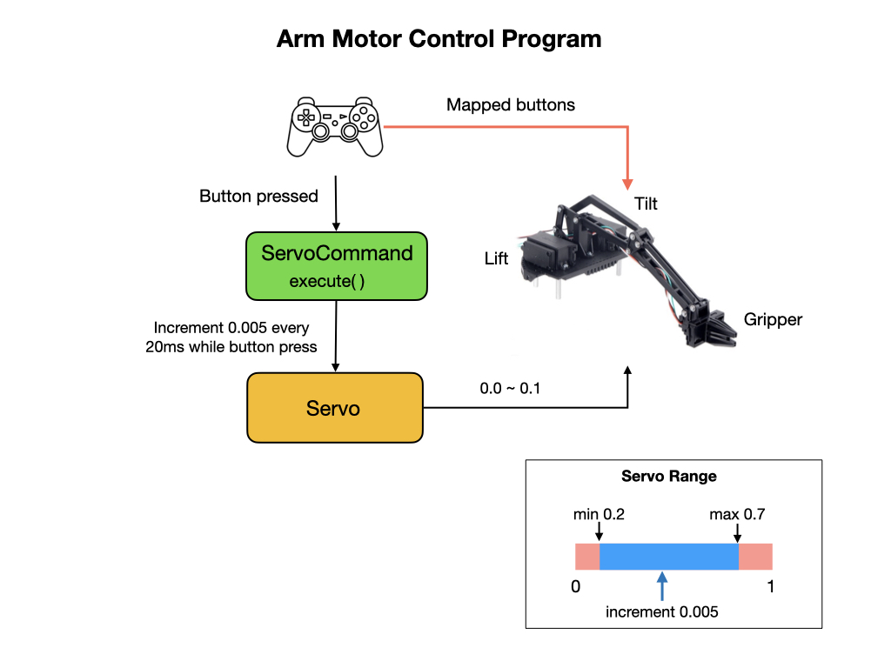

# Romi Robot Arm
In this module we'll be creating code to control the [Robot Arm kit for Romi](https://www.pololu.com/product/3550) from Pololu. This program will be called [BasicArm](https://github.com/mjwhite8119/romi-examples/tree/main/BasicArm) which will include the following updates to the **RomiReference** project.

Before reading this section please review the [SimpleArm documentation](https://github.com/bb-frc-workshops/romi-examples/tree/main/simpleArm) on the BB FRC Workshops site.

## Controlling the Robot Arm
This is how the software stack works together to operate the robot arm.

A button is attached to each of the three arm components Lift, Tilt, and Gripper.  Every time a button is pressed the related arm component is moved.  This is done incrementally.  There are min and max limits to the range of motion of the arm.  The range of the servo is 0 to 180 degrees but that is too large a range for the arm.

The `Constants` file needs to be updated to include `Joystick` and `Arm` values.

## Robot Arm Startup and Shutdown
There's an issue with the robot arm when its attached to the Romi with the FRC software stack installed.  The microcontroller will initiate prior to you starting your java program, and it will activate the arm servos outside of their recommended operating ranges.  To prevent this, follow this startup procedure.

1. Make sure that the power to the arm servos is disconnected when you switch on the Romi.    

2. Start your java program and put it into teleop mode. 

3. Move the Tilt and Lift buttons.

4. Connect the power to the servos.  

Prior to ending your java program switch off the power to the servos.

## Adding an Arm Position Command
The JoystickArmCommand incrementally moves the robot arm components as you press buttons on the joystick.  It would be useful to have a command that move the arm to the fully up or down position with a single button press. 

Create a new command called **ArmPosition**.  In the VSCode file menu right click on the **commands** folder and select "Create a new class/command".  Enter the name **ArmPosition** in the box.  This will give you a template for creating your new command, which will include the class constructor and the **initialize(), execute(), end(),** and **isFinished()** methods.  

Before filling out these methods with code let's think about what subsystems and components we'll need to create this command.  We'll certainly need the Arm subsystem.  The Arm will move in response to a button pressed on the Joystick so we'll also need to get a reference to that.

Import the Arm and Joystick command at the top of the file and create a private variable to each of them inside of the class.  

Example...

Pass the Arm and Joysick into the constructor and set the Arm as a requirement.  Also assign the private arm and joystick variables to the parameters that you just passed in.

Example...

Now let's figure out what we're going to do with these. 

## Testing the Arm Command
We can test the Arm command either by using the joystick or from Shuffleboard.  We'll setup our program to use both methods.  
To use the joystick

To use Shuffleboard add the following code to the `RobotContainer` class.

## References
[Robot Arm kit for Romi](https://www.pololu.com/product/3550)

[Romi Arm example - github](https://github.com/Pearadox/Romi/tree/master/src/main/java/frc/robot)

<h3>
<a href="romiCode7">Previous</a>

<a href="colorSensor">Next</a></h3>