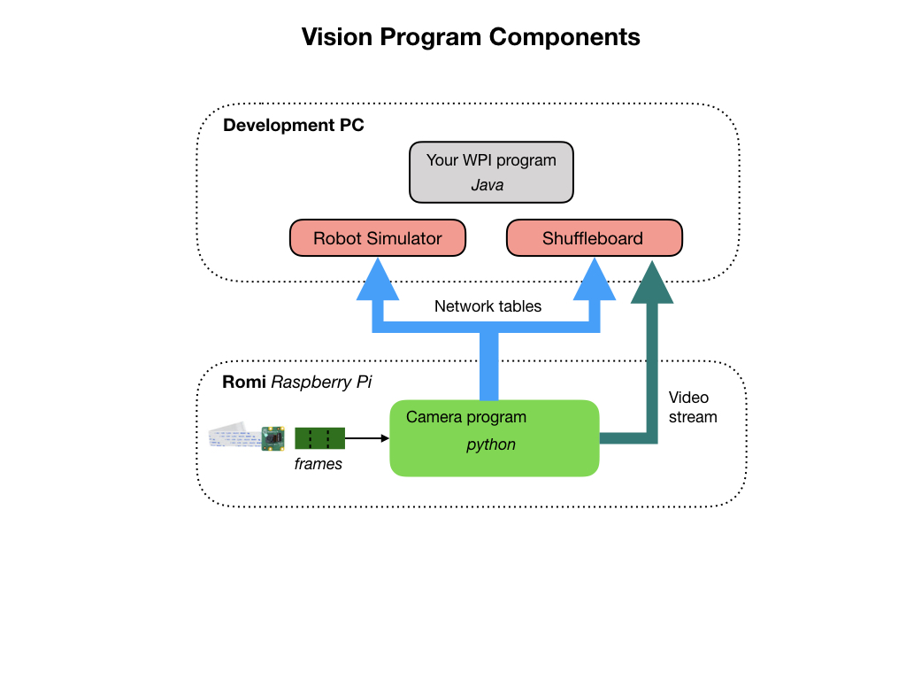
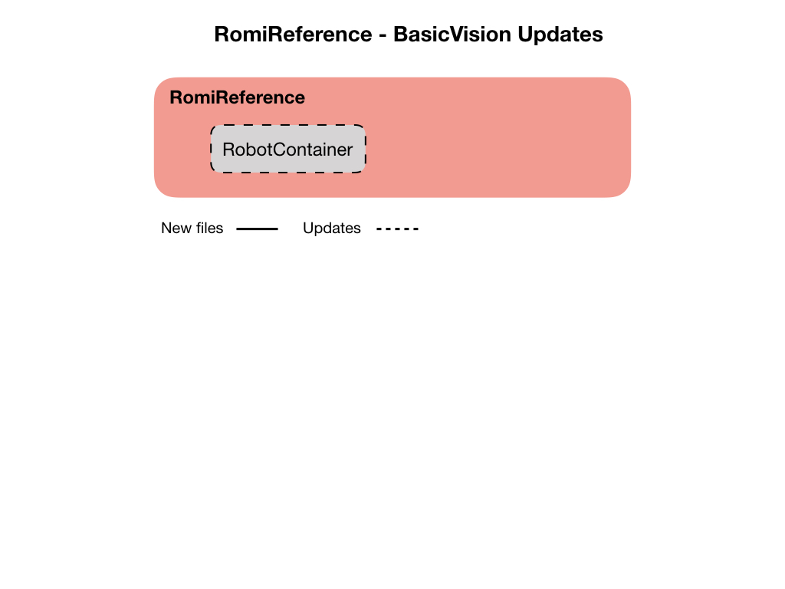
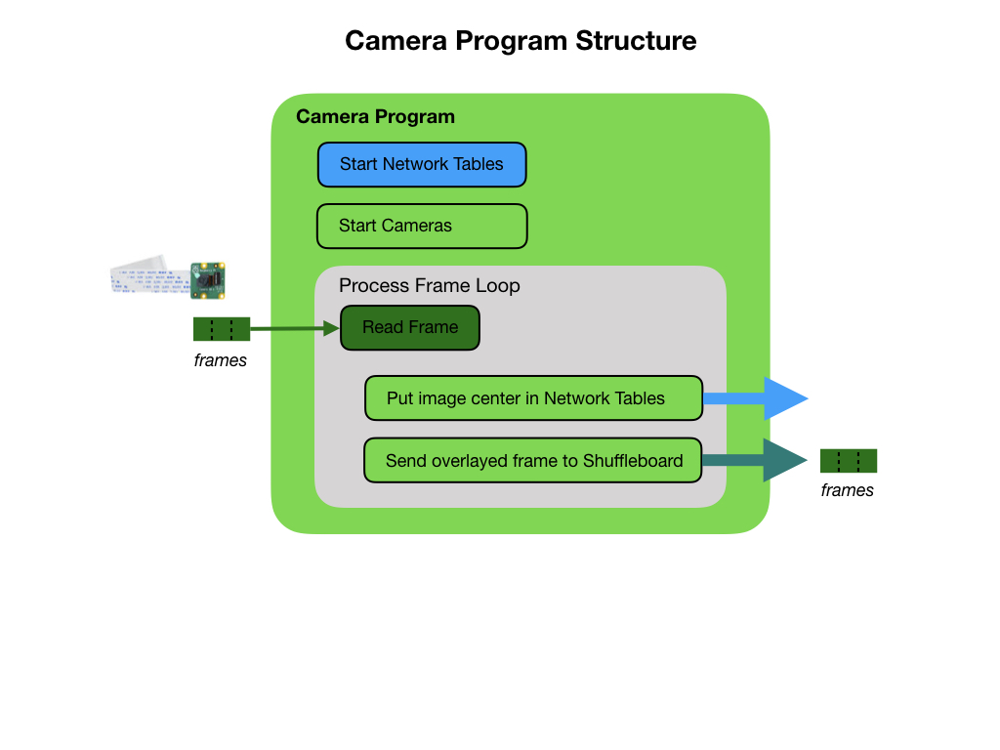
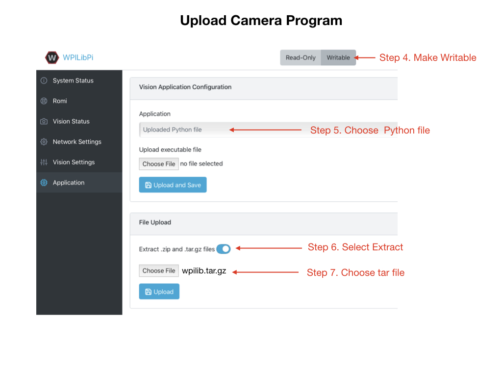
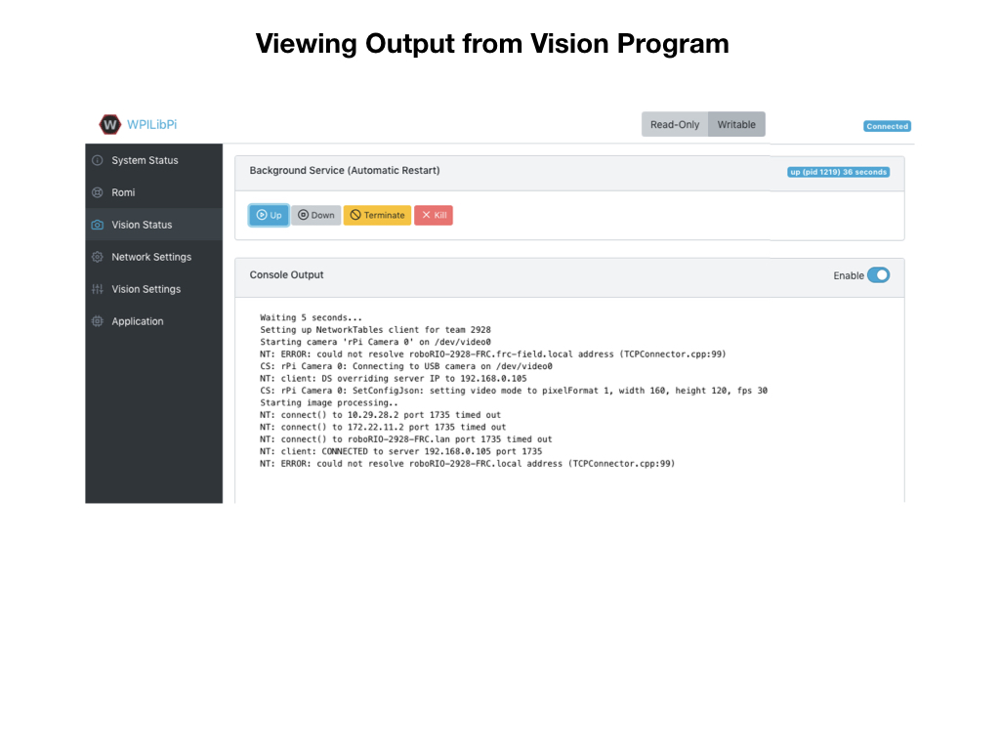
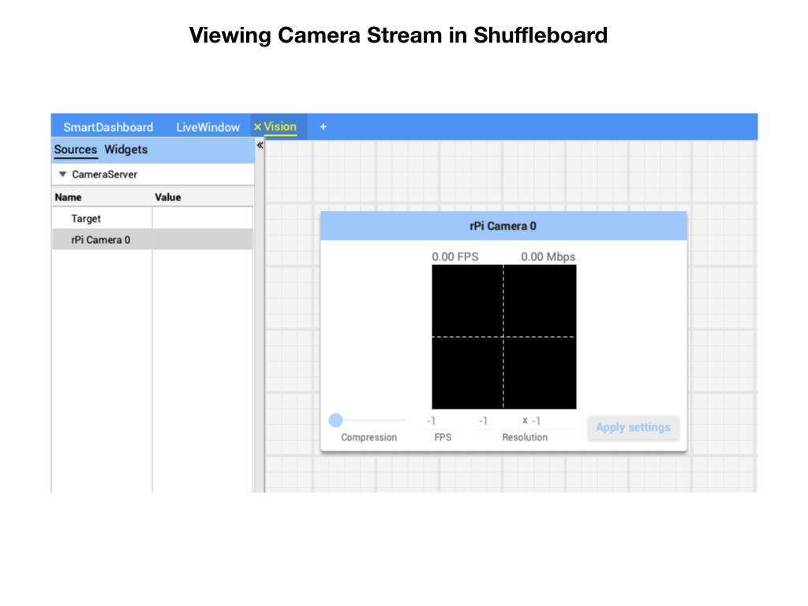

# Vision Programming
In this module we'll learn how to use the Raspberry Pi camera that's attached to the Romi.  We'll get it to stream camera images to [Shuffleboard](https://docs.wpilib.org/en/latest/docs/software/dashboards/shuffleboard/index.html), and use the Robotpy [Network Tables](https://robotpy.readthedocs.io/en/stable/guide/nt.html#networktables-guide) to send data to the [Simulator](https://docs.wpilib.org/en/latest/docs/software/wpilib-tools/robot-simulation/index.html) and to your robot program.  Lastly, we'll learn how to overlay a cross on the image to identify its center.  This will be a useful technique in subsequent learning modules to track image features that are captured by the camera.

The camera program uses the open source software called [OpenCV](https://opencv.org/) and can be written in Java, Python, or C++.  We're going to use the Python programming language since most of the OpenCV programming examples that you'll find online will use Python, so if you run into any problems with your program chances you'll find the solution in Python. The camera program uses the [CameraServer](cameraServer) libraries from Robotpy.

The following diagram shows the software components that we're going to use and how they're deployed between the Romi and your development PC. 

## Development Setup for Python
In order to use Python in VSCode you will need to install the **Python IntelliSence** plugin.

Install robotpy on you computer:

On Mac or Linux `pip3 install robotpy`

On Windows `py -3 -m pip install robotpy`

Install cscore library:

On Mac/Linux `pip3 install robotpy-cscore`
<!-- This errors out...  More investigation to be done. -->

## The Basic Vision Program
For this lesson we'll use the [BasicVision](https://github.com/mjwhite8119/romi-examples/tree/main/BasicVision) project.  Clone this project to VSCode.  The **BasicVision** project uses the WPI example project **RomiReference** to run and view the camera data in the Simulator and Shuffleboard.  The only change made to this code is to add a tab for Vision to Shuffleboard.  This is done in the *RobotContainer* class.

The python code for running the camera has been included in this project so as we have all of the software components in one place. This program is explained in the next section.  You'll upload the camera program to the Raspberry Pi on the Romi in a later step. 

## The Python Camera Server Program
Before we start programming lets look at the general structure of the camera program.  The main idea is to get an image frame from the camera and put data regarding the frame into the Network Tables.  Our program running on the laptop will simply display the data to Shuffleboard.

The camera program can also send the image frames over to Shuffleboard in the form of a video stream. Before sending the frames the camera program can overlay them with useful visual information such as a center line.

 
Explain how the program works...It makes use of the [Camera Server](https://docs.wpilib.org/en/stable/docs/software/vision-processing/introduction/cameraserver-class.html) class from the WPI Library. 

## Upload Python Program
You can't run the camera server code on your laptop since it's not currently supported.  You have to upload it to the Raspberry Pi to test it. In a terminal (Powershell):

1. `cd ~/Documents/romi-examples/BasicVision/Vision`.  If you opened up a terminal from VSCode then you should only need to `cd Vision`.
2. The python program has multiple files so you need to upload them all.  This is done with a zip file.  Run `python build.py` to build the zip file.  Depending on how Python is installed you may have to type `python3`.  The zip file will be called `wpilib.tar.gz`.
3. On the Romi WPILibPi.local webpage. Go to **Application**.
4. Put Raspberry Pi file system into *Writable* mode.
5. In the **Vision Application Configuration** section select "Uploaded Python File" from the dropdown menu.
6. Make sure that file **Extract** is selected.
7. In the **File Upload** section click the *Browse* button and select the file `wpilib.tar.gz` file that you created in step 2.  Click the **Upload** button.

To confirm that the vision program is running you can view the output from the **Vision Status** tab.  Make sure that you enable console output.

## Test your Program
1. Run the your java program from VSCode by pressing the F5 key. In the **Simulator** you will see the Network Tables showing the `targetData` coming in from the python camera server program.  In later modules you will use this data to control the robot, but for now it just shows the coordinates for the center of the image.

2. Start Shuffleboard and click on the Vision tab that was created from your java program. It should display the center position of the camera image.

3. Open the CameraServer dropdown.  Drag the *Target* camera stream onto the **Vision** tab.

4. Drive the Romi around to see the changing camera stream.

Note: Shuffleboard uses the Network Tables to display the camera data so your java program must be running in order to see the live camera stream.

An alternative way to view the overlayed camera stream is to bring it up in a browser.  The URL is `wpilibpi.local:1182/stream.mjpg`.  The port of the original stream is *1181*.

## Notes on Restarting the Romi
When you first turn the Romi it will restart with the program that you last uploaded.  So if that's what you require then there's no action neccesary. Dispite this, the **Vision Application Configuration** panel will default to the *Custom* application, even though the *Custom* application is not running. 

If you've switched the application to **Built-in multi-camera streaming** then you will have to upload your python program again, since it will try to call `uploaded.py` instead of your `multiCameraServer.py` program. The the `runCamera` file keeps getting overwritten so you cannot just upload a new `multiCameraServer.py` file from the **Vision Application Configuration** panel.  You have to upload your tar file from the **File Upload** panel.

## References
- [OpenCV](https://opencv.org/)

- [Robotpy cscore](https://robotpy.readthedocs.io/projects/cscore/en/stable/api.html)

- Robotpy - [Network Tables](https://robotpy.readthedocs.io/en/stable/guide/nt.html#networktables-guide)

- FRC Documentation - [Network Tables](https://docs.wpilib.org/en/latest/docs/software/networktables/index.html)

- FRC Documentation - [Camera Server](https://docs.wpilib.org/en/stable/docs/software/vision-processing/introduction/cameraserver-class.html)

- FRC Documentation - [Vision with WPILibPi](https://docs.wpilib.org/en/stable/docs/software/vision-processing/wpilibpi/index.html#)

- FRC Documentation - [GRIP documentation](https://docs.wpilib.org/en/latest/docs/software/vision-processing/grip/index.html)

- Robotpy - [Camera & Vision](https://robotpy.readthedocs.io/en/stable/vision/index.html)

- [Robotpy examples - github](https://github.com/robotpy/robotpy-cscore/tree/main/examples)

- Code Example - [BasicVision](https://github.com/mjwhite8119/romi-examples/tree/main/BasicVision)

<h3>
<a href="romi">Previous</a>

<a href="romiImageProcessing">Next</a></h3>