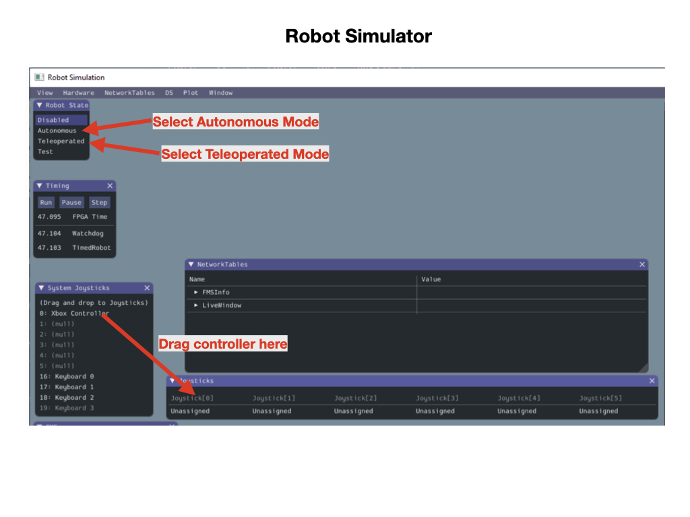

# Romi Example Code
We're going to start by loading the example code that comes with the WPI libraries.  The example code project will be the base of all of our training lessons and lets you drive the Romi around using a gamepad. To create a project using the example follow the [Programming the Romi](https://docs.wpilib.org/en/stable/docs/romi-robot/programming-romi.html) documentation.

The example code does not run on the Raspberry Pi.  It runs on your development laptop computer and uses the WPILib Simulation framework to communicate with the Romi robot.  The joystick controller will therefore have to connected to your laptop in order to work with the Romi. A joystick can be connected to your laptop via a USB port or Bluetooth.  We'll learn more later about how joysticks are used in our code.

To start the program press the **F5** key.  This will compile and run your program and start the Robot Simulator on your laptop.

## Robot Simulator
In order to communicate with the Romi we'll be using the [Robot Simulator](https://docs.wpilib.org/en/stable/docs/software/wpilib-tools/robot-simulation/introduction.html).  The Robot Simulator was developed to enable teams to test their code without having an actual robot available.  To remain consistent with that development process the WPI team also now uses it for the Romi training environment.

## Operating the Romi Robot.
Once the Robot Simulator comes up the first thing you'll need to do is drag the joystick controller from the **System Joysticks** panel over to the **Joysticks** panel. This associates it with a port so as your program can recognize it.

As is the case with the real robots that are used for competition, the Romi operates in two modes; **Autonomous** and **Teleoperated**.  You put the Romi in Autonomous mode by clicking the link in the **Robot State** panel.  Make sure that your robot is on the ground since this will start up the motors and the robot will move.  It'll move forward half a meter, turn 180 degrees and move back again. 

Next, place the robot in Teleoperated mode and drive it around using the joystick.

## References
- FRC Documentation - [Robot Simulator](https://docs.wpilib.org/en/stable/docs/software/wpilib-tools/robot-simulation/introduction.html)

<h3>
<a href="romiDev">Previous</a>

<a href="romiStructure">Next</a></h3>