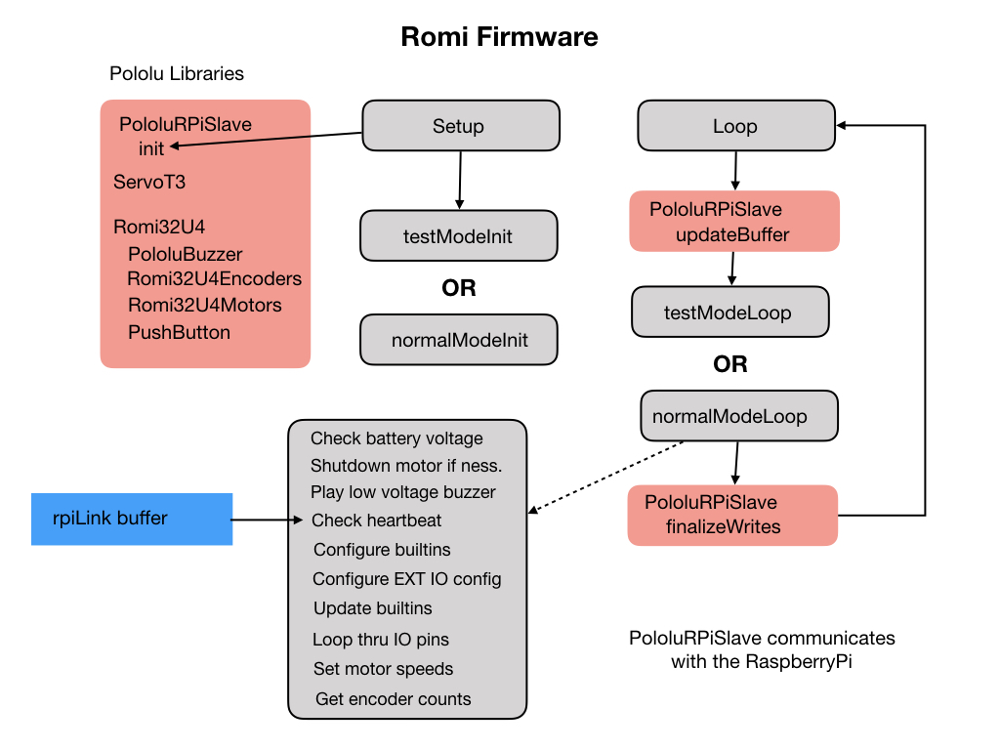

# Micro Controller Firmware
The micro controller firmware is run on an 32U4 development board, which is an embedded Arduino based microcontroller with built-in WiFi.  For the development environment (IDE) we'll be using VSCode.  This is the IDE most commonly used by <i>First Robotics</i> teams.  In order to install code onto the 32U4 microcontoller you have to install the PlatformIO plugin for VSCode. Information about the PlatformIO plugin can be found here:

[Getting Started with PlatformIO](https://dronebotworkshop.com/platformio/)

[How To Install PlatformIO ](https://www.youtube.com/watch?v=5edPOlQQKmo)

Once PlatformIO has been installed you can use the following steps to download the firmware and flash it to the 32U4 development board:

1. Open a Terminal.

2. Download the [Romi Firmware](https://github.com/wpilibsuite/wpilib-ws-robot-romi) using the following command:

    `git clone https://github.com/wpilibsuite/wpilib-ws-robot-romi.git`

3. Change into the `wpilib-ws-robot-rom` folder and drag the `Firmware` folder into VSCode.  

4. Compile the software by clicking the checkmark at the bottom left.

If button A or B is pressed during powerup then the 32U4 enters test mode.

## References 
[Romi Firmware - github](https://github.com/pololu/romi-32u4-arduino-library)
[Romi Firmware README - github](https://github.com/wpilibsuite/wpilib-ws-robot-romi/blob/main/firmware/README.md)

<h3>
<a href="romiPiSoftware">Previous</a>
<!-- 
<a href="romiVision">Next</a></h3> -->