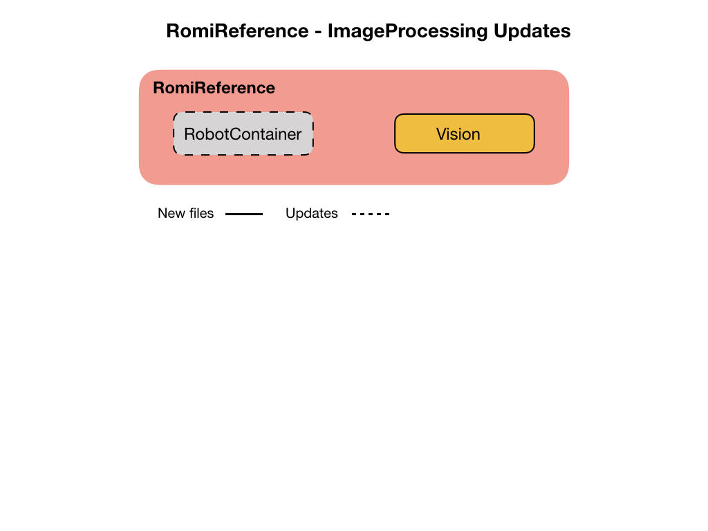
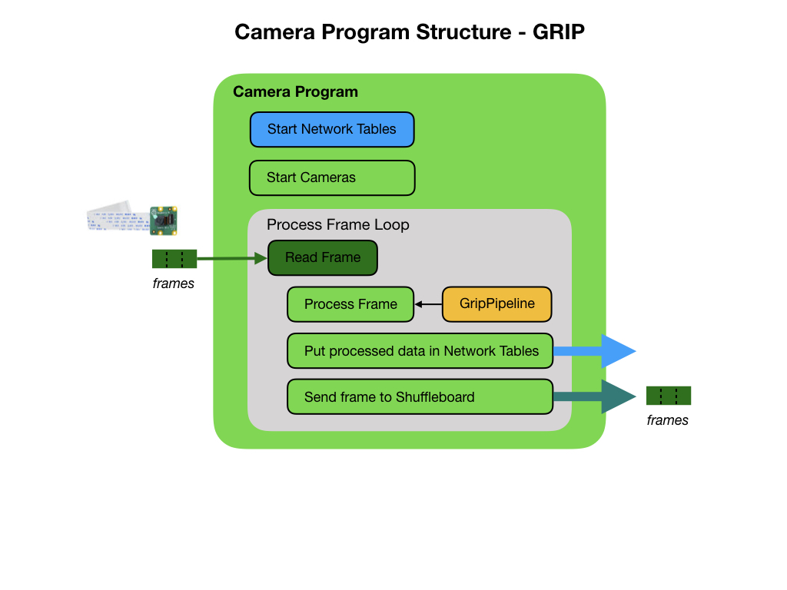
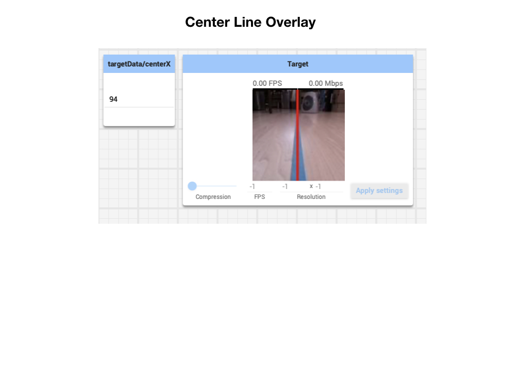

# Image Processing
In the previous module we got the camera streaming images to Shuffleboard and put image related data into the Network Tables for further processing.  In this module you'll learn how to process camera images to extract certain features.  For this module we'll extract a line that's marked on the floor.  The line should be a distinctive color that doesn't blend in with the surrounding colors.  During this lesson we'll decide on a color and tune the camera in to lock onto that color.  Once we've "locked on" to the color we'll draw a center line on the camera image so as we can follow the line. The camera server will use the Robotpy [Network Tables](https://robotpy.readthedocs.io/en/stable/guide/nt.html#networktables-guide) to send data to the [Simulator](https://docs.wpilib.org/en/latest/docs/software/wpilib-tools/robot-simulation/index.html) and [Shuffleboard](https://docs.wpilib.org/en/latest/docs/software/dashboards/shuffleboard/index.html). We'll also send data to the Network Tables on where the center of the line is. 

## The Image Processing Program
For this lesson we'll use the [ImageProcessing](https://github.com/mjwhite8119/romi-examples/tree/main/ImageProcessing) project.  Clone this project to VSCode.  The **ImageProcessing** project uses the WPI example project **RomiReference** to run and view the camera data in the Simulator and Shuffleboard.  We've added a Subsystem called *Vision* to this project in order to track the center line of the line that we've marked on the ground.  This Subsystem will be used in later modules to react to data that's generated by the camera.

The python code for running the camera has been included in this project so as we have all of the software components in one place. This program is explained in the next section.  You'll upload the camera program to the Raspberry Pi on the Romi in a later step.

## The Python Camera Server Program
The camera program will get a frame from the camera, process the frame to extract features of interest, and put data regarding those features into the Network Tables.  The java program running on the laptop will find useful things to do with that data.

The camera program can also send the data frames over to Shuffleboard in the form of a video stream. Before sending the frames the camera program will overlay the center line of our target feature.  In this case, a line marked on the ground.

## Using GRIP to Process Images
In the above diagram you can see the camera sending frames to a piece of code called **GripPipeline**.  This code is generated from the FRC tool called [GRIP](https://docs.wpilib.org/en/latest/docs/software/vision-processing/grip/index.html).  A major part of this lesson will be to learn the GRIP tool and create a pipeline to process images coming from the camera.

1. On Mac start from Applications->GRIP
2. Turn on the Romi
3. Add Source -> IP Camera.  Put the URL of the camera stream.  wpilibpi.local:1181/stream.mjpg
4. Follow [FRC GRIP documentation](https://docs.wpilib.org/en/latest/docs/software/vision-processing/grip/index.html) to create the filter.
The last filter should be `Find Contours`.
5. Generate the code Tools->Generate Code.  
6. Select Python as the output language.
7. Use `GripPipeline` as the class name.
8. Put it into the `Vision` directory of your project.
9. Name the module `grip`.

<!-- If you're generating the java pipeline version make sure the the "Implement WPILIB VisionPipeline" box is checked.  This will place the following code into the generated GRIP file: -->

    import edu.wpi.first.vision.VisionPipeline;

The class definition will look like this:

    public class GripPipeline implements VisionPipeline {

## Upload Python Program
You won't be able to run the camera server code on your laptop since it's not currently supported.  You have to upload it to the Raspberry Pi to test it. In a terminal or Powershell:

1. `cd ~/Documents/romi-examples/ImageProcessing/Vision`
2. The python program has multiple files so you need to upload them all.  This is done with a zip file.  Run `python3 build.py` to build the zip file.
3. On the Romi WPILibPi.local webpage. Go to **Application**.
4. Put Raspberry Pi file system into Writable mode.
5. In the **Vision Application Configuration** section select "Uploaded Python File" from the dropdown menu.
6. In the **File Upload** section select the file `wpilib.tar.gz` file for upload.  Make sure that file **Extract** is selected. Click the **Upload** button.

To confirm that the vision program is running you can view the output from the **Vision Status** tab.  Make sure that you enable console output.

## Test your Program
1. Run the your java program from VSCode by pressing the F5 key. In the **Simulator** you will see the Network Tables showing the `targetData` coming in from the python camera server program.  This data tracks the line that you have on the floor.

2. Start Shuffleboard and click on the Vision tab that was created from your java program. It should display the center position of the camera image.

3. Open the CameraServer dropdown.  Drag the *Target* camera stream onto the **Vision** tab. An alternative way to view the overlayed camera stream is to bring it up in a browser.  The URL is `wpilibpi.local:1182/stream.mjpg`.

Shuffleboard uses the Network Tables to display the camera data so your java program must be running in order to see the live camera stream.

## References
- [OpenCV](https://opencv.org/)

- [Robotpy cscore](https://robotpy.readthedocs.io/projects/cscore/en/stable/api.html)

- Robotpy - [Network Tables](https://robotpy.readthedocs.io/en/stable/guide/nt.html#networktables-guide)

- FRC Documentation - [Network Tables](https://docs.wpilib.org/en/latest/docs/software/networktables/index.html)

- FRC Documentation - [Camera Server](https://docs.wpilib.org/en/stable/docs/software/vision-processing/introduction/cameraserver-class.html)

- FRC Documentation - [Vision with WPILibPi](https://docs.wpilib.org/en/stable/docs/software/vision-processing/wpilibpi/index.html#)

- FRC Documentation - [GRIP documentation](https://docs.wpilib.org/en/latest/docs/software/vision-processing/grip/index.html)

- [GRIP Reference](https://github.com/WPIRoboticsProjects/GRIP/wiki/Operation-Reference-Table)

- Robotpy - [Camera & Vision](https://robotpy.readthedocs.io/en/stable/vision/index.html)

- [Robotpy examples - github](https://github.com/robotpy/robotpy-cscore/tree/main/examples)

- Code Example - [ImageProcessing](https://github.com/mjwhite8119/romi-examples/tree/main/ImageProcessing)

<h3>
<a href="romiVision">Previous</a>

<a href="romiLineFollow">Next</a></h3>