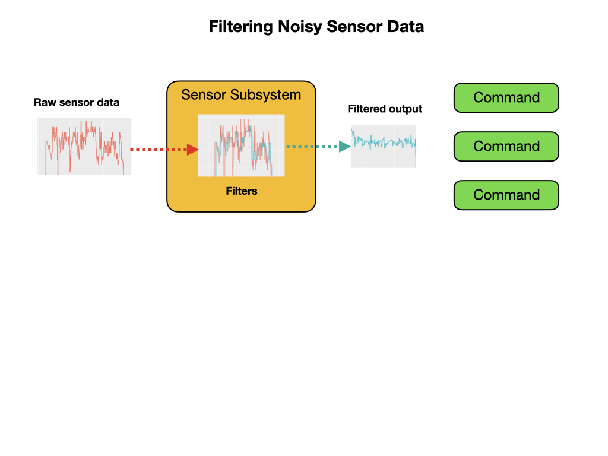

# PID and Line Following
In this module we'll make use of the previous [ImageProcessing](https://github.com/mjwhite8119/romi-examples/tree/main/ImageProcessing) project that recognizes a line drawn on the ground. The line is constantly tracked and its position within the image is sent over the Network Tables.

We'll use PID control to get the Romi to follow a line marked on the floor.  This program will be called [PIDLineFollow](https://github.com/mjwhite8119/romi-examples/tree/main/PIDLineFollow). First we'll code our own simple controller so as we can learn about the basics of PID.  Then we'll implement the PID controller supplied by WPILib.  Before completing this section you should have done the [Motion PID Control](romiPID) module.

Our PID command is going to look like the following diagram.  We'll set the **Proportional** part to be 0.015.  The center line is coming in from the camera and becomes our measurement source.  We need to keep the center line at x=75 so that's becomes the setpoint.  The output is the turn angle going to the left and right motors.  Every command must have a subsystem requirement and in this case it would be the drive train. 

Here are the changes that we'll make to the basic **RomiReference** program.  There will be new subsystem class and two new commands.

Before we add the `Vision` subsystem we'll need to make an update to the `Drivetrain` class.

Update `Drivetrain` Add `steer()` and `stop()` methods.

## Create the Vision Subsystem
Add Vision subsystem code...

Add `Vision` constants to `Constants` file.

Update `RobotContainer` add `Vision` class.

## Home Made PID Controller
As we have learned, the PID controller has three components.  However, we are only going to use the first one which is the **Proportional** part.  Create a new command called `PIDLineFollow`. We'll put our controller in the `execute()` method of our command.

Add `Joystick` constants to `Constants` file. 

Set Joystick and Shuffleboard to initiate the line follow commands.

## WPILib PID Controller

Create a new command called `LineFollowPIDCommand`.
In the RobotContainer class change the Drivetrain definition from `private final` to `public static final`.  Why...?
Use the WPILib `PIDCommand` to control the motors to follow the line.

## Upload Python Program
You won't be able to run the camera server code on your laptop since it's not currently supported.  You have to upload it to the Raspberry Pi to test it. In a terminal or Powershell:

1. `cd ~/Documents/romi-examples/BasicVision/Vision`
2. The python program has multiple files so you need to upload them all.  This is done with a zip file.  Run `python3 build.py` to build the zip file.
3. On the Romi WPILibPi.local webpage. Go to **Application**.
4. Put Raspberry Pi file system into Writable mode.
5. In the **Vision Application Configuration** section select "Uploaded Python File" from the dropdown menu.
6. In the **File Upload** section select the file `wpilib.tar.gz` file for upload.  Make sure that file **Extract** is selected. Click the **Upload** button.

To confirm that the vision program is running you can view the output from the **Vision Status** tab.  Make sure that you enable console output.

<!-- ## Upload Java Program
1. cd ~/Documents/romi-examples/java-multiCameraServer
2. run `./gradlew build` to build the jar file.  Make sure that the build is successful.
3. On the Romi WPILibPi.local webpage, click on **Application** in the left panel.
4. Put into Writable mode
5. Select "Uploaded Java jar" in the dropdown.
6. Click on **Choose File** file and upload the file `build/libs/java-multiCameraServer-all.jar`. -->

## Test your Program
Run the your java program from VSCode by pressing the F5 key. In the **Simulator** you will see the Network Tables showing the `targetData` coming in from the python camera server program.  You can use this data to control the robot.
1. Connect the Joystick and drag it from **System Joysticks** window to the **Joysticks** window.
2. Put the robot in **Teleoperated** mode.
3. Press the joystick START button to run your custom PID line following routine.
3. Press the joystick SELECT button to run the WPI `PIDCommand` line following routine.

Shuffleboard uses the Network Tables to display the camera data so your java program must be running in order to see the live camera stream.

## References
[FRC Documentation - PID Control](https://docs.wpilib.org/en/latest/docs/software/commandbased/pid-subsystems-commands.html)

[FRC Documentation - Controllers](https://docs.wpilib.org/en/latest/docs/software/advanced-controls/controllers/index.html)

[Testing Commands with Shuffleboard](https://docs.wpilib.org/en/stable/docs/software/wpilib-tools/robotbuilder/introduction/robotbuilder-testing-with-shuffleboard.html)

[Controls Engineering in FRC](https://file.tavsys.net/control/controls-engineering-in-frc.pdf)

- Code Example - [PIDLineFollow](https://github.com/mjwhite8119/romi-examples/tree/main/PIDLineFollow)

<h3>
<a href="romiImageProcessing">Previous</a>

<a href="romiServos">Next</a></h3>