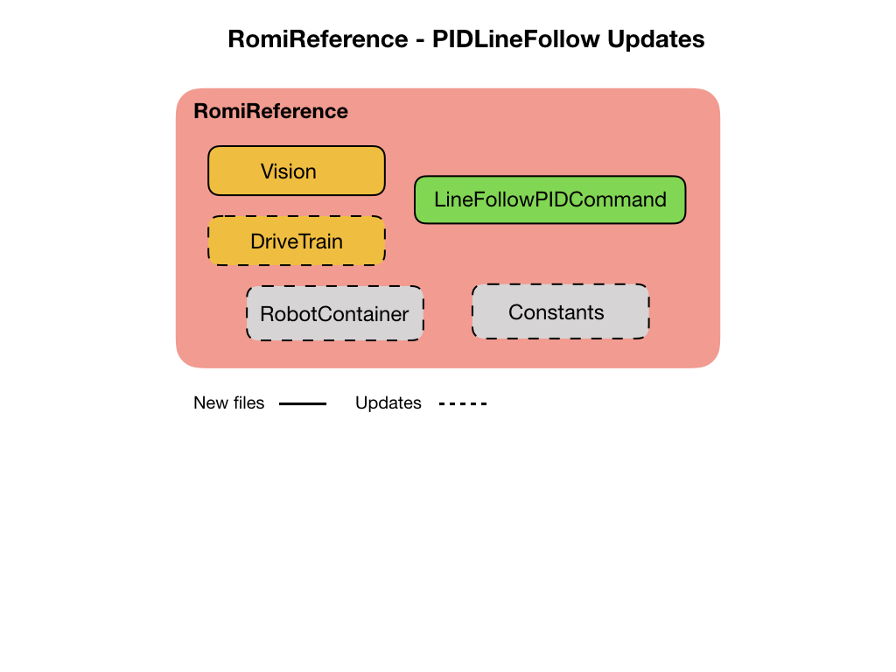
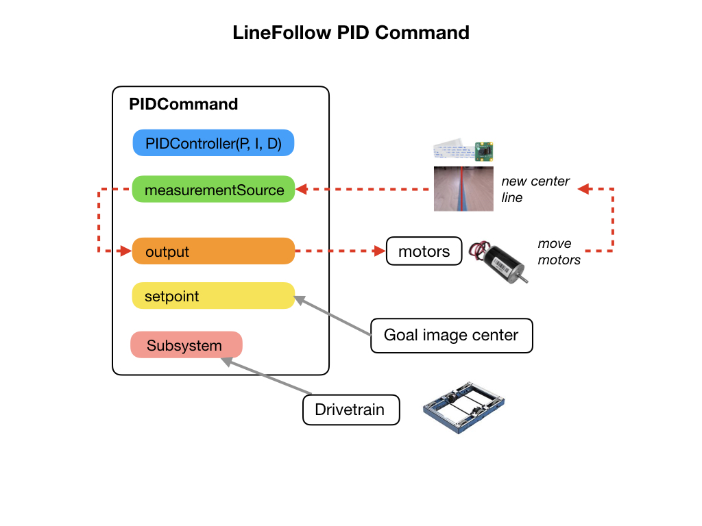

# PID and Line Following
In this module we'll make use of the previous [ImageProcessing](https://github.com/mjwhite8119/romi-examples/tree/main/ImageProcessing) project that recognizes a line drawn on the ground. The line is constantly being tracked and its position within the image is sent over the Network Tables.  The link to this program is [PIDLineFollow](https://github.com/mjwhite8119/romi-examples/tree/main/PIDLineFollow). 

## The Line Follow Program
We'll use *PID Control* to get the Romi to follow a line marked on the ground.  The program implements the PID controller supplied by WPILib.  Before completing this section you should have done the [Motion PID Control](romiPID) module.  This project makes the following updates to the basic *RomiReference* project.  The *Vision* subsystem is from the previous [Image Processing](romiImageProcessing) project. In this module we'll be adding the *LineFollowPIDCommand* and making a few updates to other classes.

Our PID command is going to look like the following diagram.  

- We'll use the WPILib *PIDCommand* to control the motors to follow the line.  We pass the PID values into a *PIDController*.

- The *measurementSource* is the centerX line from the camera that tracks the line marked on the ground.  

- We need to keep the tracking line at center of the image frame so that's becomes the *setpoint*. 

- The *output* is the turn angle going to the left and right motors.  Note that the output from the setpoint is in the wrong direction for the motors, so this is reversed before sending it to the Drivetrain.

- Our *Subsystem* requirement is the Drivetrain.

The Drivetrain class is updated to add the `steer()` and `stop()` methods that are called from the PID command. The RobotContainer class is updated to add the Line Following command to the autonomous command selection menu.

## The Python Camera Server Program
The python camera program is the same one used in the [Image Processing Project](romiImageProcessing.md#upload).  Follow the instructions in that project for uploading the program to the Romi.

## Testing the Program
1. Run the your java program from VSCode by pressing the F5 key. In the **Simulator** you will see the Network Tables showing the `targetData` coming in from the python camera server program.  This data tracks the line that you have marked on the floor.

2. Start Shuffleboard and click on the Vision tab that was created from your java program. It should display the center position of the camera image.

3. Open the CameraServer dropdown.  Drag the *Target* camera stream onto the **Vision** tab. An alternative way to view the overlayed camera stream is to bring it up in a browser.  The URL is `wpilibpi.local:1182/stream.mjpg`.

4. From the **SmartDashboard** tab select *PID Line Follow* option from the *SendableChooser* menu.

5. Put the Romi in **Autonomous** mode to follow the line.

Note: Shuffleboard uses the Network Tables to display the camera data so your java program must be running in order to see the live camera stream.

## References
- FRC Documentation [PID Control](https://docs.wpilib.org/en/latest/docs/software/commandbased/pid-subsystems-commands.html)

- FRC Documentation [Controllers](https://docs.wpilib.org/en/latest/docs/software/advanced-controls/controllers/index.html)

- FRC Documentation [Testing Commands with Shuffleboard](https://docs.wpilib.org/en/stable/docs/software/wpilib-tools/robotbuilder/introduction/robotbuilder-testing-with-shuffleboard.html)

- Tyler Veness [Controls Engineering in FRC](https://file.tavsys.net/control/controls-engineering-in-frc.pdf)

- Code Example - [PIDLineFollow](https://github.com/mjwhite8119/romi-examples/tree/main/PIDLineFollow)

<h3>
<a href="romiImageProcessing">Previous</a>

<a href="romiServos">Next</a></h3>