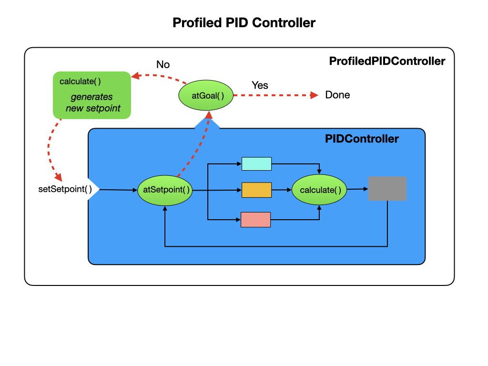

# Motion Control PID
In this lesson we're going to add a new commands that'll give us more control over how the robot moves.  We'll be using a *PID Controller* that enables the robot to constantly monitor its current state as it drives towards its goal. For a more in-depth explaination refer to [Classical Control](../Concepts/Control/classicalControl) module of this training guide.

In this module we'll create three new commands that we'll test from the *AutonomousDistance* group command.

- *DriveDistancePID* that will drive the robot in a straight line.

- *TurnDegreesPID* that will allow the robot to turn to a specified angle.  

After that, we'll create two commands to move the robot more smoothly to the desired setpoints, and is an example of a methodology called **Motion Profiling**.

- *DriveDistanceProfiled* that will use a Trapezoid Profile trajectory to drive the robot in a straight line.

## PID Controller
Before looking at the PID controller supplied by the WPI library, it would be useful to get an understanding of what PID control is by watching the [PID Introduction Video by WPI](https://docs.wpilib.org/en/stable/docs/software/advanced-controls/introduction/pid-video.html). A schematic of WPIlib PIDController is below with a detailed explaination found in the [Introduction to PID](https://docs.wpilib.org/en/stable/docs/software/advanced-controls/introduction/introduction-to-pid.html) section of the FRC® documentation.

## The DriveDistancePID Command
To create a *PIDCommand* in VSCode right click under the commands folder and select *Create a new class/command*.  Then select **PIDCommand (new)** from the drop down.

The first thing we need is the *PIDController* class that simply requires to know what the ***P**roportional*, ***I**ntegral*, and ***D**erivative* 
values are.  We're going to start with the **P** set to *2.0* and **I**, **D** set to zero.  Since these values are constants they should be put in the *Constants* file.  The *PIDController* class is where all of the work is done and was explained in the previous section.

We add the *Drivetrain* as a requirement and tell the command what distance we want to drive.  This distance becomes the *setpoint* for the PID controller.  These two parameters are passed in when the *DriveDistancePID* constructor is called and the Command object is created.

The *measurementSource* and *output* setup a looping arrangement which moves the robot towards the *setpoint*.  In our case, the measurement source are the encoders, that a measuring distance, and the output is sent to the motors in order to move the robot. Once the setpoint is reached the command will finish.

The full constructor for our **DriveDistancePID** command is listed below.

    public DriveDistancePID(double targetDistance, Drivetrain drive) {
        super(
            // The controller that the command will use
            new PIDController(DriveConstants.kDistanceP, 
                              DriveConstants.kDistanceI, 
                              DriveConstants.kDistanceD),

            // This should return the measurement
            drive::getAverageDistanceMeters,

            // This should return the setpoint (can also be a constant)
            targetDistance,

            // This uses the output
            output -> {
              // Use the output here
              arcadeDrive(output, 0);
            },
            drive);
        
        getController().setTolerance(DriveConstants.kDistanceToleranceInch,
                                    DriveConstants.kVelocityToleranceInchPerS);
      }

The `setTolerance()` method sets the position and velocity error which is considered tolerable for use with the setpoint. For more details on what we've just done read the [PID Control through PIDSubsystems and PIDCommands](https://docs.wpilib.org/en/latest/docs/software/commandbased/pid-subsystems-commands.html#) section of the FRC® documentation.

In the `execute()` method of the command the position error and whether the command is finished is output to the Simulator. When you run this command you may find that the command never finishes, which means that it never gets to the setpoint.  This is because with just the **P** parameter set the output value gets so small that it can no longer drive the motors.  In order to have it complete you would need to add a value to the **I** parameter.  Adding a value of *0.1* should be enough to get it to finish.  Making the **I** parameter non-zero is normally not recommended, we have a better solution called *Feedforward* that we'll look at later.

## Profiled PID Controller
A major difference between a standard *PIDController* and a *ProfiledPIDController* is that the actual setpoint of the control loop is not directly specified by the user. Rather, the user specifies a goal position or state, and the setpoint for the controller is computed automatically from the generated motion profile between the current state and the goal. 

The specified goal value is not necessarily the current setpoint of the loop - rather, it is the eventual setpoint once the generated profile terminates.

A common FRC® controls solution is to pair a [Trapezoid Motion Profile](../Concepts/Dynamics/pathsTrajectories#trapezoidProfile) with a PID controller for tracking the setpoint.

## The DriveDistanceProfiled Command
With the *DriveDistancePID* command there's no way of avoiding the sudden accelerations and changes in velocity at the beginning of the move, which makes it difficult to tune the PID controller to arrive at the setpoint.  It would be better if we can move more smoothly to the setpoint by gradually accelerating and decelerating at the beginning and end of the movement. To facilitate this, WPILib includes its own *ProfiledPIDController* class. Let's see if we can improve upon the results of the *DriveDistancePID* command.  

Instead of using the *PIDController* class we'll use the *ProfiledPIDController* that we just looked at.  This class specifies P, I, and D values together with velocity and acceleration constraints.  These constraints to 0.5 and 0.05 respectively, which was obtained during *Robot Characterization*.

We'll again add the *Drivetrain* and *targetDistance* parameters to the constructor.  However, this time the targetDistance will be passed into the ProfiledPIDController as a *TrapezoidProfile.state*.  We'll use the encoders as the measurement source as we did in the last command.

Here's the code:

    public DriveDistanceProfiled(double targetDistance, Drivetrain drive) {
        super(
            // The ProfiledPIDController used by the command
            new ProfiledPIDController(
                // The PID gains and motion profile constraints
                DriveConstants.kPDriveVel,
                DriveConstants.kIDriveVel,
                DriveConstants.kDDriveVel,
                new TrapezoidProfile.Constraints(Constants.DriveConstants.kMaxSpeedMetersPerSecond,
                                                Constants.DriveConstants.kMaxAccelMetersPerSecondSquared)),

            // The measurement coming from the sensors
            drive::getAverageDistanceMeters,

            // The goal (can also be a constant)
            () -> new TrapezoidProfile.State(targetDistance,0),

            // Use the calculated velocity at each setpoint
            (output, setpoint) -> {
              drive.steer(setpoint.velocity);
            },

            // Declare subsystem dependencies.
            drive);

        // Configure additional PID options by calling `getController` here.
        getController().setTolerance(DriveConstants.kDistanceToleranceMeters,
                                    DriveConstants.kVelocityToleranceMetersPerS);
    }

### Driving the Motors
One problem with this profiled motion command is that the robot more than likely doesn't drive straight.  Also, in the *DriveDistancePID* command we had to add a value to the **I** parameter in order to get the command to finish (reach its setpoint).  To fix these problems we'll create a new method in the *Drivetrain* class called `steerVelocity()` that calculates a voltage value for each wheel, which is then sent to the motors setVoltage() method.

### Tuning the PID Controller
To get the PID controller to perform properly it will will most likely need to be tuned.  The [Tuning a PID Controller](https://docs.wpilib.org/en/stable/docs/software/advanced-controls/introduction/tuning-pid-controller.html) documentation gives some information on the process.

Tuning the PID controller can be done in the Simulator or Shuffleboard. The PID Controller parameters *setpoint, P, I*, and *D* can be found under LiveWindow.  You can pull these onto the *Drive* tab if you wish.  We would want to change the PID values from Shuffleboard and see the results without restarting our program.  To do this we will add in the Network Tables instance and table to our program:

    private static NetworkTableInstance inst = NetworkTableInstance.getDefault();
    private static NetworkTable table = inst.getTable("Shuffleboard/Drivetrain");

Then override the PID command's `initialize()` method to update the *P* and *D* parameters:

    public void initialize() {
      super.initialize();
      // Override PID parameters from Shuffleboard
      getController().setP(table.getEntry("kP").getDouble(1.0));
      getController().setD(table.getEntry("kD").getDouble(0.0));
    }

You can also override the `execute()` method to add Shuffleboard diagnostics.

    public void execute() {
      super.execute();
      SmartDashboard.putNumber("Pos. Error", getController().getPositionError());
      SmartDashboard.putBoolean("atGoal", getController().atGoal());
    }

View [Testing and Tuning PID Loops](https://docs.wpilib.org/en/stable/docs/software/wpilib-tools/shuffleboard/advanced-usage/shuffleboard-tuning-pid.html) for more information.

## The TurnToAnglePID Command
We again need a **PID Controller** with the ***P**roportional*, ***I**ntegral*, and ***D**erivative* 
values.  For turning we'll start with the **P** set to *0.05* and **I**, **D** set to zero.  Since these values are constants they should be put in the *Constants* file.  

We add the *Drivetrain* as a requirement and tell the command what angle we want to rotate to.  This angle becomes the *setpoint* for the PID controller.  These two parameters are passed in when the *TurnToAngle* constructor is called and our command object is created.

The *measurementSource* and *output* setup a looping arrangement which moves the robot towards the *setpoint*.  In our case, the measurement source is a gyro and the output is sent to the motors in order to turn the robot. Once the setpoint is reached the command will finish.

The full constructor for our **TurnToAngle** command is listed below.

    public class TurnToAngle extends PIDCommand {
    
      public TurnToAngle(double targetAngleDegrees, Drivetrain drive) {
        super(
            // The controller that the command will use
            new PIDController(DriveConstants.kTurnP, DriveConstants.kTurnI, DriveConstants.kTurnD),
            // This should get the measurement
            drive::getHeading,
            // This should return the setpoint (can also be a constant)
            targetAngleDegrees,
            // This uses the output
            output -> {
              // Use the output here
              drive.arcadeDrive(0, output);
            },
            drive);
          
      getController().enableContinuousInput(-180, 180);
      getController().setTolerance(DriveConstants.kTurnToleranceDeg,
                                  DriveConstants.kTurnRateToleranceDegPerS);
  }

 `setTolerance()` sets the position and velocity error which is considered tolerable for use with the setpoint. For more details on what we've just done read the [PID Control through PIDSubsystems and PIDCommands](https://docs.wpilib.org/en/latest/docs/software/commandbased/pid-subsystems-commands.html#) section of the FRC® documentation.

The command tends to overshoot the target angle by about 10 degrees.  To improve that result you can try adding a very small amount to the **D** parameter.  Try a value of *0.005* to begin with.

### Setting up the Gyro    
We have already setup the getHeading() method in the [Subsystems](romiSubsystems#heading) module but there are a few of things we need to do in order to setup the gyro as a measurement source.  

- Ensure that the gyro is calibrated, which is done on the Romi Website.  Follow the [IMU Calibration](https://docs.wpilib.org/en/stable/docs/romi-robot/web-ui.html#imu-calibration) instructions.

- Set `enableContinuousInput(-180, 180)` Rather then using the max and min input range as constraints, it considers them to be the same point and automatically calculates the shortest route to the setpoint.

- Reset the gyro angles each time we start the program.  This is done in the Drivetrain constructor where is calls its own `resetGyro()` method.

## References

- FRC Documentation - [PID Basics](https://docs.wpilib.org/en/stable/docs/software/advanced-controls/introduction/index.html)

- FRC Documentation - [PID Control through PIDSubsystems and PIDCommands](https://docs.wpilib.org/en/latest/docs/software/commandbased/pid-subsystems-commands.html#)

- FRC Documentation - [Motion Profiling through TrapezoidProfileSubsystems and TrapezoidProfileCommands](https://docs.wpilib.org/en/latest/docs/software/commandbased/profile-subsystems-commands.html)

- FRC Documentation - [Combining Motion Profiling and PID in Command-Based](https://docs.wpilib.org/en/latest/docs/software/commandbased/profilepid-subsystems-commands.html)

- FRC  Documentation - [PID Control in WPILib](https://docs.wpilib.org/en/stable/docs/software/advanced-controls/controllers/pidcontroller.html)

- Code Example - [BasicPID](https://github.com/mjwhite8119/romi-examples/tree/main/BasicPID)

<h3>
<a href="romiShuffleboard">Previous</a>

<a href="romiPathPlanning">Next</a></h3>