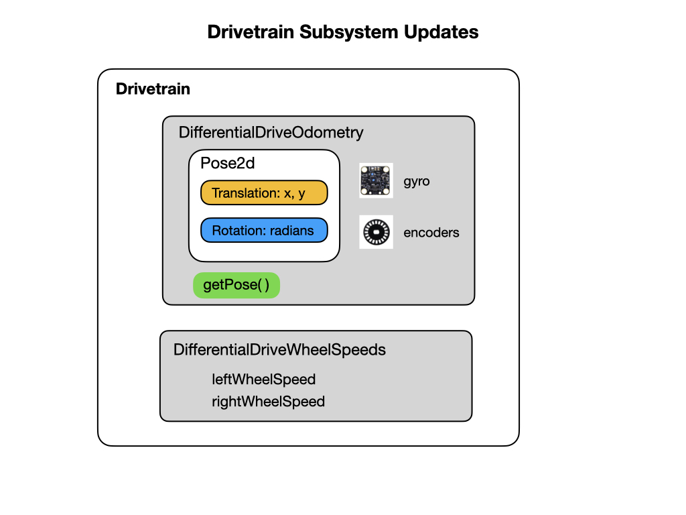
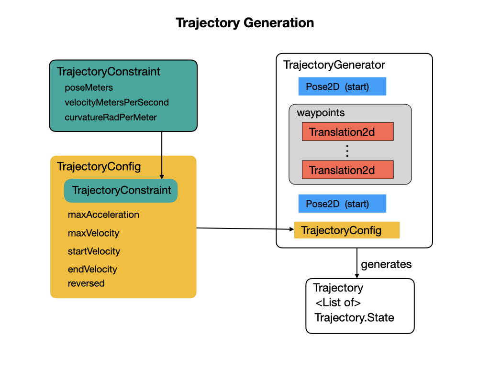
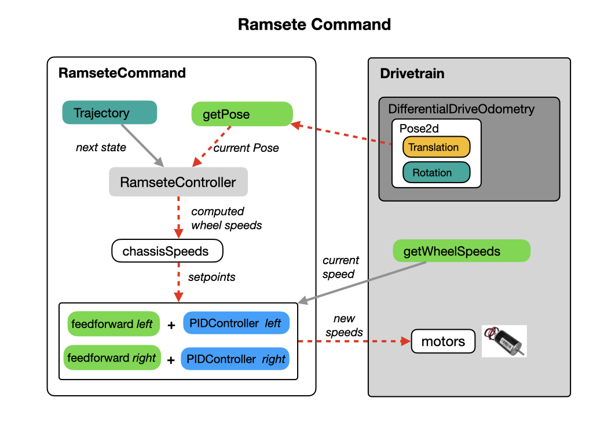

# Path Planning and Trajectory Following
Up until this point we've been doing straight line paths and point turns to get to our destination.  Ideally, we would want to follow a smooth curved path, which is more direct and efficient.  The methods used to do this is expained in this section.  View the first part of the video [Paths & Trajectories](https://robotacademy.net.au/masterclass/paths-and-trajectories/?lesson=109) to understand the difference between a Path and a Trajectory. The [Trajectory Tutorial](https://docs.wpilib.org/en/latest/docs/software/pathplanning/trajectory-tutorial/index.html) FRC documentation provides the outline for this module.

## Setting up the Drivetrain Subsystem
There are two additions that need to be made to the Drivetrain class in order to implement trajectory following.  The Drivetrain needs to keep track of the current Pose of the robot.  This is done in the *DifferentialDriveOdometry* class that continuously updates the current Pose via the Drivetrain's `periodic()` loop.  The odometry must be initiated with a starting Pose.  Look at [Differential Drive Odometry](https://docs.wpilib.org/en/stable/docs/software/kinematics-and-odometry/differential-drive-odometry.html#differential-drive-odometry) for more information.  

 

Odometry update in Drivetrain's  `periodic()` method.  We can also view the odometry data in the Simulator or Shuffleboard by using the [Field2d Widget](https://docs.wpilib.org/en/stable/docs/software/wpilib-tools/glass/field2d-widget.html).

    public void periodic() {
      // Update the odometry in the periodic block
      m_odometry.update(m_gyro.getRotation2d(), m_leftEncoder.getDistance(), m_rightEncoder.getDistance());
      
      // Also update the Field2D object (so that we can visualize this in sim)
      m_field2d.setRobotPose(getPose());
    }

The second class is *DifferentialDriveWheelSpeeds* that implements the `getWheelSpeeds()` method to return the current speed of each wheel.  This will be needed for the measurement input to our trajectory controller. More information can be found in [Setting up the Drive System](https://docs.wpilib.org/en/latest/docs/software/pathplanning/trajectory-tutorial/creating-drive-subsystem.html) FRC documentation.

## Creating the Trajectory
The next step is to create a trajectory for the robot to follow.  This is done using the *TrajectoryGenerator* that takes in an initial and final Pose and outputs a smooth curve with velocities and accelerations at each point along the curve connecting two endpoints. Read the [Trajectory Generation](https://docs.wpilib.org/en/latest/docs/software/advanced-controls/trajectories/trajectory-generation.html) section of the FRC documentation for more details.

 

## Adding Constraints
In order to compute the Poses that make up the trajectory the *TrajectoryGenerator* needs to know about the characteristics of the robot.  This is done by passing in the robot's [Trajectory Constraints](https://docs.wpilib.org/en/latest/docs/software/advanced-controls/trajectories/constraints.html).  

 

## Create the Ramsete Command
The *RamseteCommand* pulls in all of the components needed to create a trajectory. It uses the *RamseteController* that takes in the current robot Pose and compares it to the next Pose required to carry out the trajectory. The outputs from the controller are **chassis speeds** that the robot should follow to complete the next step of the trajectory. 

 

The chassis speeds become the next setpoint for the PID controllers that get their measurement input from the `getWheelSpeeds()` method of the Drivetrain. There's a PID controller for each wheel.  Note that the PID controller is tracking on wheel **velocity** in this case, not position as in our previous encounters with PID control.  See [Create the Ramsete Command](https://docs.wpilib.org/en/latest/docs/software/pathplanning/trajectory-tutorial/creating-following-trajectory.html#creating-the-ramsetecommand) FRC documentation for more information. 

## References

- FRC Documentation - [A Video Walkthrough of Model Based Validation of Autonomous in FRC](https://docs.wpilib.org/en/stable/docs/software/advanced-controls/video-walkthrough.html)

- FRC Documentation - [Path Planning](https://docs.wpilib.org/en/latest/docs/software/pathplanning/index.html)

- FRC Documentation - [Trajectory Following](https://docs.wpilib.org/en/latest/docs/software/advanced-controls/trajectories/index.html)

- FRC Documentation - [Robot Characterization](https://docs.wpilib.org/en/stable/docs/software/wpilib-tools/robot-characterization/index.html)

- FRC Documentation - [PathWeaver](https://docs.wpilib.org/en/stable/docs/software/wpilib-tools/pathweaver/index.html)

- Github - [Romi Trajectory Follower](https://github.com/bb-frc-workshops/romi-examples/tree/main/romi-trajectory-ramsete)

- [Controls Engineering in the FIRST Robotics Competition](https://file.tavsys.net/control/controls-engineering-in-frc.pdf)

- QUT Robot Academy [Paths & Trajectories](https://robotacademy.net.au/masterclass/paths-and-trajectories/)

<h3>
<a href="romiPID">Previous</a>

<a href="romiNetworkTables">Next</a></h3>