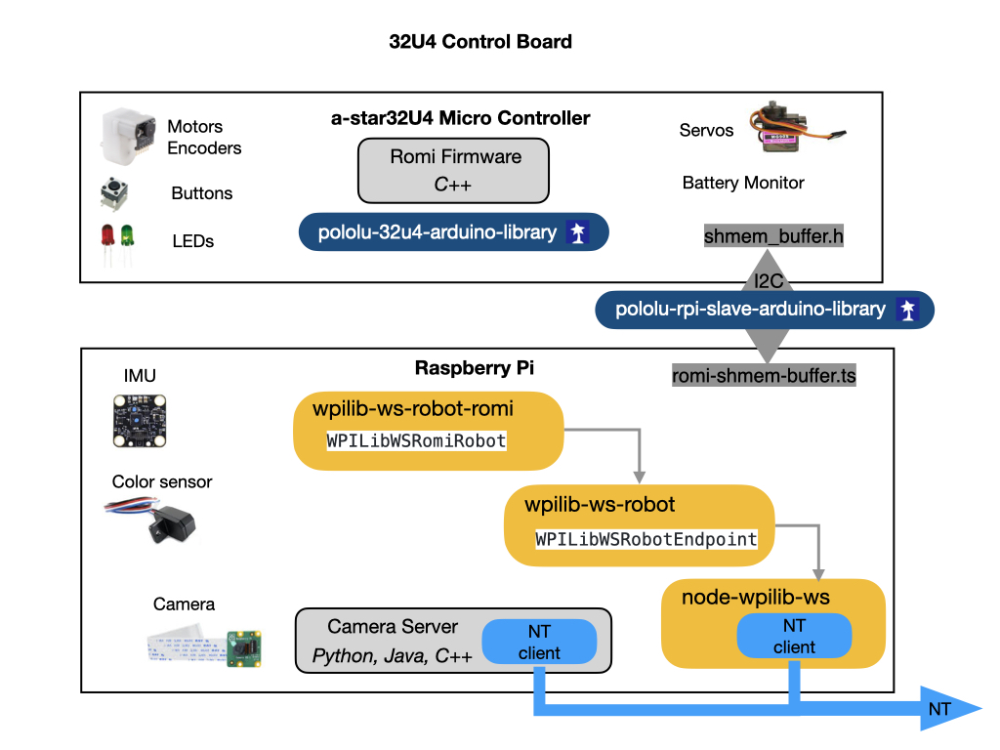

# Romi Raspberry Pi Software
The following diagram and describes how the software is structured on the Romi.  The Romi uses a Raspberry Pi and an Arduino based 32U4 microcontroller.  The Raspberry Pi and Romi 32U4 boards are connected via the 40-pin connector, and communicate over I2C. The Romi firmware uses the [Pololu Raspberry Pi interface library for Arduino](https://github.com/pololu/pololu-rpi-slave-arduino-library) to facilitate board-to-board communication. Communication takes place over a [shared memory buffer](https://github.com/wpilibsuite/wpilib-ws-robot-romi/blob/main/sharedmem.json) which both boards use to read and write to. 

The package [wpilib-ws-robot-romi](https://github.com/wpilibsuite/wpilib-ws-robot-romi) contains the main entry point for the application, which is [src/index.ts](https://github.com/wpilibsuite/wpilib-ws-robot-romi/blob/main/src/index.ts). The file is fairly small and serves as a binding layer for the *WPILibWSRomiRobot* class (which is defined in [src/robot/romi-robot.ts](https://github.com/wpilibsuite/wpilib-ws-robot-romi/blob/main/src/robot/romi-robot.ts)) and the *WPILibWSRobotEndpoint* class (which is defined in the [wpilib-ws-robot](https://github.com/wpilibsuite/wpilib-ws-robot-romi/blob/main/src/robot/romi-robot.ts) NPM package).

The [wpilib-ws-robot](https://github.com/wpilibsuite/wpilib-ws-robot) package provides a wrapper around the guts of the WPILib WebSocket protocol, and allows developers to easily interface with other kinds of robots, simply by extending from the *WPILibWSRobotBase* class (also exposed by wpilib-ws-robot).

In the [romi-robot.ts](https://github.com/wpilibsuite/wpilib-ws-robot-romi/blob/main/src/robot/romi-robot.ts) file, you can see how the defined class interacts with the Romi firmware over I2C.

The [wpilib-ws-robot-romi](https://github.com/wpilibsuite/wpilib-ws-robot-romi) package depends on [wpilib-ws-robot](https://github.com/wpilibsuite/wpilib-ws-robot), which in turn depends on [node-wpilib-ws](https://github.com/wpilibsuite/node-wpilib-ws). The `node-wpilib-ws` package contains the core classes that implement the WPILib WebSocket protocol.

## References 
[Romi Raspberry Pi - github](https://github.com/wpilibsuite/WPILibPi)

[Romi WPILib Suite - github](https://github.com/wpilibsuite/wpilib-ws-robot-romi)

[RaspberryPi/Arduino Interface - github](https://github.com/pololu/pololu-rpi-slave-arduino-library)

<h3>
<a href="romi">Previous</a>

<a href="romiFirmware">Next</a></h3>