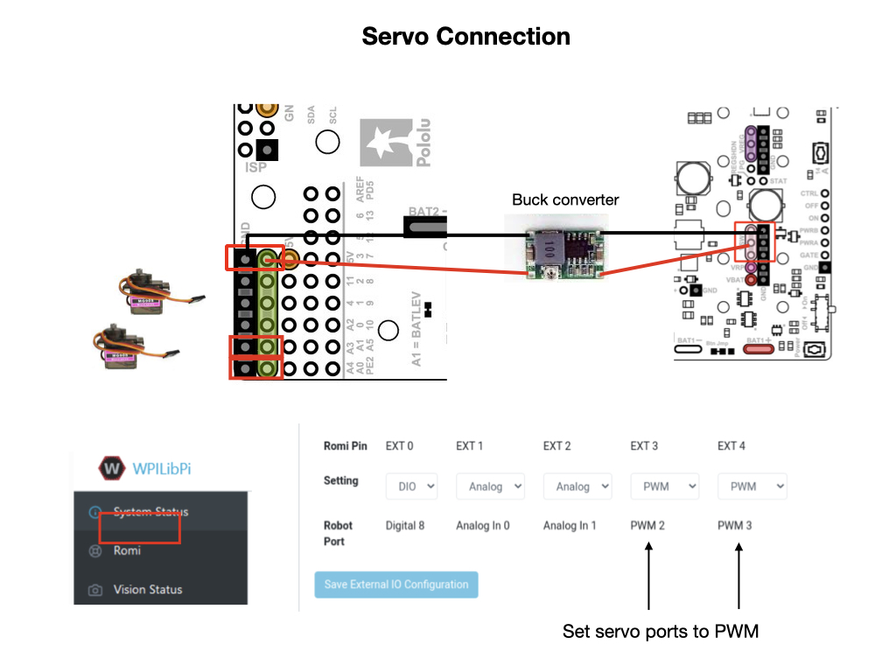
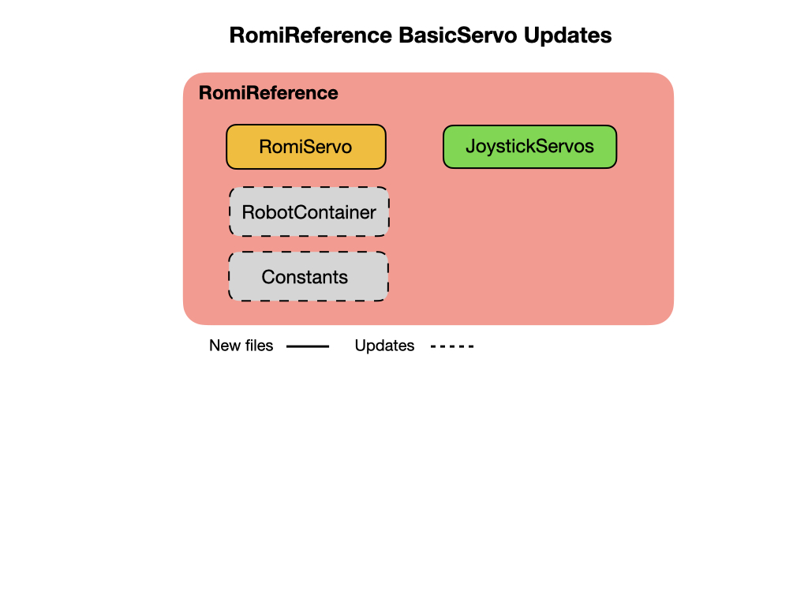

# Programming Servos
In this lesson we'll create a program to control servos that are attached to the Romi.  The program called [BasicServo](https://github.com/mjwhite8119/romi-examples/tree/main/BasicServo)

## How Servos Work
Servos work using a Pulse Width Modulation (PWM) signal that is passed to the servo every 20 milliseconds.  The pulse width is between 1 and 2 m/s where 1 m/s moves the servo to the 0 degree position and 2 m/s moves it a full 180 degrees.  Values in between those two time values move it to degrees in between 0 and 180 degrees.  

## Servo Connection
The following diagram shows how to connect the power and where to connect the servos to the Romi's GPIO pins. In order to supply enough power for the servos you will need to connect to the VSW pin on the Romi board.  For this you'll need a buck converter to drop the battery voltage down from ~7.5V to ~6V.  

Connect the servos to EXT3 and EXT4 as shown in the diagram.  The ground wire (black or brown) goes towards the outside of the board. Then go to the **Romi** section of the Romi Web UI and ensure that the ports are set to PWM.

The servos are controlled via buttons on the gamepad.  Your WPI based program runs on the laptop and launches the Robot Simulator tool.  The simulator communicates with the NodeJS application that runs on the Raspberry Pi. This application passes requests onto the microcontroller to control the GPIO ports that the servos are connected to.

## Controlling the Servos

The following sections explain the how to create the java classes that your WPI program needs to control the servos.

## Create the RomiServo Subsystem
This class will use the Servo base class provided by the WPI library.

    import edu.wpi.first.wpilibj.Servo;

Create a method to reset the servo position.

    // Reset position to resting state
      public void reset() {
        m_liftPos = 0.5;
        m_tiltPos = 0.5;
        
        m_lift.set(m_liftPos);
        m_tilt.set(m_tiltPos);
      }

Implement tilt motor position

    /** 
      * Increment tilt motor position
      * 
      * @param delta Amount to change motor position
      */
      public void incrementTilt(double delta) {
        m_tiltPos = saturateLimit(m_tiltPos + delta, Constants.Servo.TILT_MIN, Constants.Servo.TILT_MAX);
        m_tilt.set(m_tiltPos);
      }

## Create ServoCommand
This command will use a joystick to control the RomiServo subsystem. 

    import frc.robot.subsystems.RomiServo;
    import edu.wpi.first.wpilibj.Joystick;

Add joystick constants to the `Contants` file.

As always, the subsystem is added as a command requirement.

    public ServoCommand(RomiServo romi_servo, Joystick joystick) {
    m_servo = romi_servo;
    m_joystick = joystick;

    addRequirements(romi_servo);
  }

Code used to move the servos using the joystick.

    public void execute() {

    if(m_joystick.getRawButton(Constants.Joystick.TOPLEFT)) {
      m_servo.incrementLift(-Constants.Servo.SERVO_INCREMENT);
      System.out.println("Lift -" );
    }
    if(m_joystick.getRawButton(Constants.Joystick.TOPRIGHT)) {
      m_servo.incrementLift(Constants.Servo.SERVO_INCREMENT);
      System.out.println("Lift +" );
    }
    if(m_joystick.getRawButton(Constants.Joystick.BOTTOMLEFT)) {
      m_servo.incrementTilt(Constants.Servo.SERVO_INCREMENT);
      System.out.println("Tilt +" );
    }
    if(m_joystick.getRawButton(Constants.Joystick.BOTTOMRIGHT)) {
      m_servo.incrementTilt(-Constants.Servo.SERVO_INCREMENT);
      System.out.println("Tilt -" );
    }
  }

## Add Servo to the RobotContainer.
Now that we have a Servo subsystem and command we need to add it to the robot structure via the **RobotContainer** class.  We first need to import it, so open the RobotContainer.java file and the import near the top.

    import frc.robot.subsystems.RomiServo;

Create a varible to point to the RomiServo class.

    private final RomiServo m_servo = new RomiServo();

Inside the **configureButtonBindings()** method create a default command for the servo.  Remember that the default command is run whenever there is no other command using the subsystem.  The joystick will be used to control the servo so that also needs to passed to the **ServoCommand**.

    m_servo.setDefaultCommand( new ServoCommand(m_servo, m_controller));

## References
[Servos and Feedback](https://learn.adafruit.com/analog-feedback-servos)

<h3>
<a href="romiPID">Previous</a>

<a href="romiArm">Next</a></h3>
