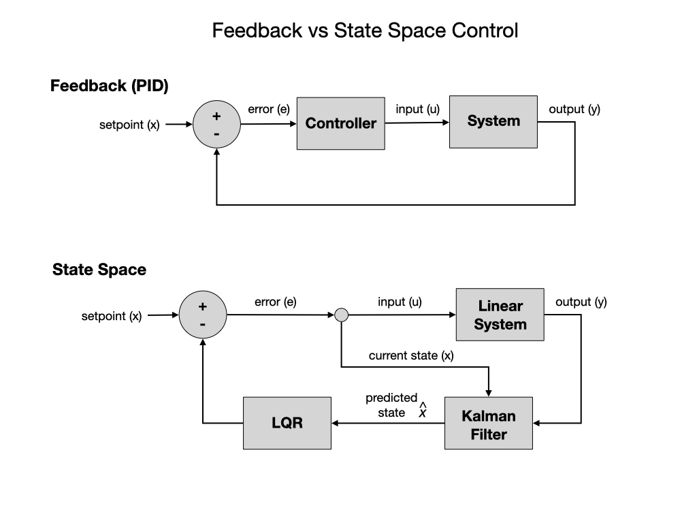
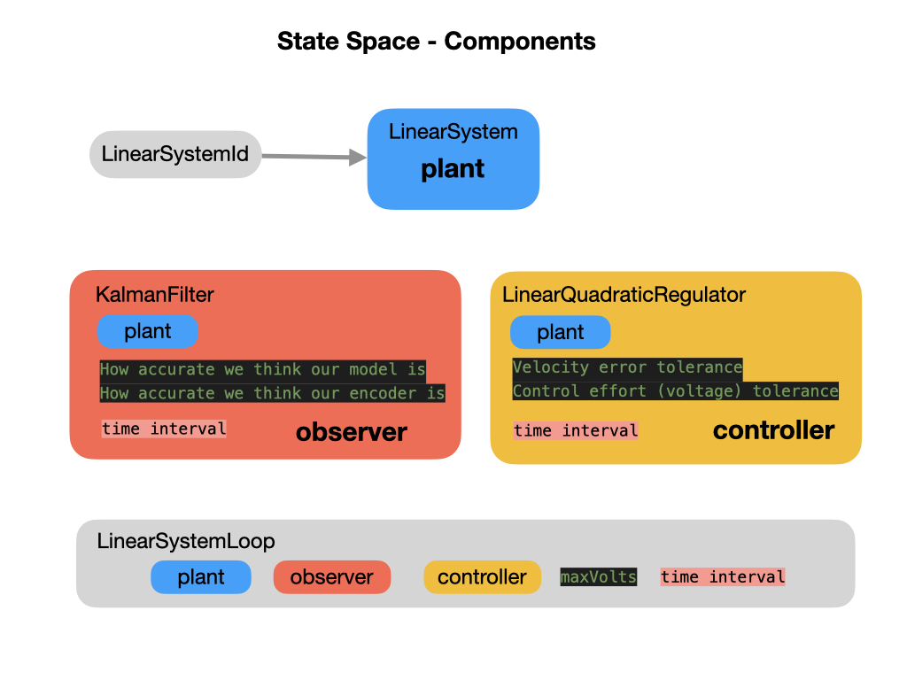
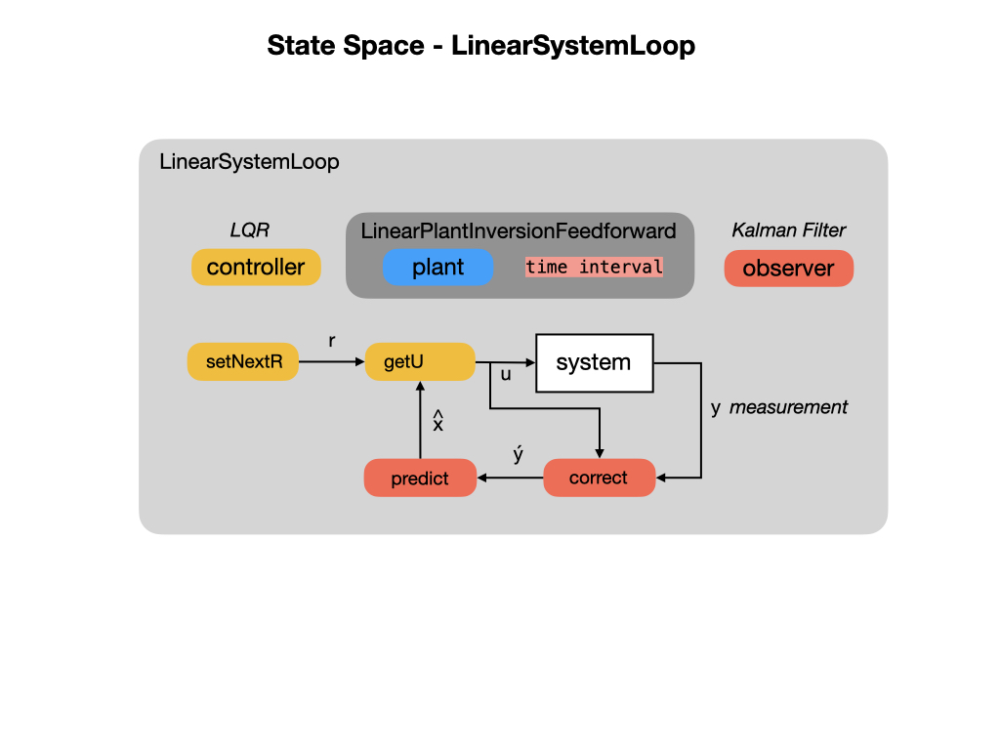

# State Space Controllers
So far we have been using classical control theory and methods, such as PID, that are based on a simple input-output description of the system. These methods do not use any knowledge of the internal physics of the system and therefore allows only limited control of the closed-loop behavior when feedback control is used.  These are called single-input single-output (SISO) systems.  **State Space** control is an alternative to PID control.  State Space control is based on the idea that if you know the internal physics of the system and can predict how it’ll react to a given input then you can tune the system in a way that’s similar to tuning PID controllers.  State Space control is more flexible than PID control. 

In this module we'll use State Space Control to drive the Romi at a specified velocity for a short period of time.  Rather than use an arbitrary *Proportional* gain derived through testing, we'll first try to develop an accurate physical model of the system and then use it to help us pick gains for the feedback controller.  This allows us not only to predict ahead of time how a system will react, but also test our controllers without a physical robot.

The code libraries used for this project is described in the [State Space Controllers](https://docs.wpilib.org/en/stable/docs/software/advanced-controls/state-space/state-space-intro.html) section of the FRC documentation. A more detailed description of State Space Control can be found in the [State Space Control](../Concepts/Control/stateSpaceControl) section of this training guide.  As you can see from the above diagram, there are three main components for creating a State Space controlled system with WPILib, a *Linear System*, a *Kalman Filter*, and a *Linear Quadratic Regulator* LQR.  These components are placed in a *Linear System Loop* to drive the robot.

## The LinearSystem Class
The system that you're modelling is called a *Plant*.  To setup a Plant with WPILib you create a *LinearSystem*.

## Kalman Filter
After creating a model of our Linear System we'll need to create a Kalman Filter.  There are entire books written on these filters but an overview of their use and function can be found in the [Kalman Filters](../Concepts/OptimalEstimation/kalmanFilters) section of this training guide.

## Linear Quadratic Regulator (LQR)
Linear Quadratic Regulators work by finding trade-off that drives our system to its desired setpoint while using the minumum control effort. For example, a spaceship might want to minimize the fuel it expends to reach a given reference, while a high-speed robotic arm might need to react quickly to disturbances and reach the setpoint quickly.  To get a better overview of Linear Quadratic Regulators read the [LQR](../Concepts/Control/LQR) section of this training guide.

## Linear System Loop

## References
- FRC Documentation [State Space Controllers](https://docs.wpilib.org/en/stable/docs/software/advanced-controls/state-space/state-space-intro.html)

<h3>
<a href="romiLineFollow">Previous</a>

<a href="romiServos">Next</a></h3>