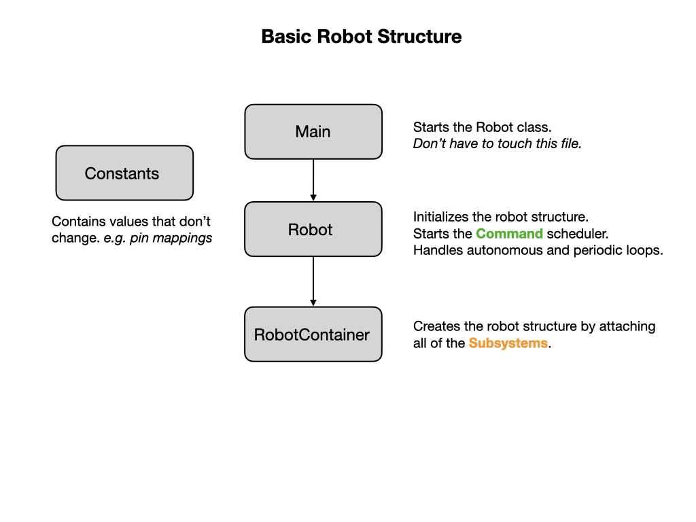

# Basic Robot Structure
By this point you should have your development environment setup and have ensured that you can communicate with the Romi robot by running the [example program](romiExample).  It's now time to get down the serious work of learning how to program the robot.  We're going to start with an [Introduction to Programming](../Programming/introProgramming) where you'll get a high level overview of programming concepts.  Then we'll learn a little bit about [Robot Systems](../Concepts/RobotSystem/intro) so as you can understand what it is that you're programming. This will prepare you to understand how the code of an FRC robot is constructed.  

Programs based on the WPILib library are organized around two fundamental concepts: **Subsystems** and **Commands**. Subsystems and Commands run within the context of an FRC Robot program that is built using four basic components.  Each component is kept in separate java files called `Main.java, Robot.java, RobotContainer.java`, and `Constants.java`.  

## The Main Class
The `Main.java` file is the starting point for the entire program and calls the Robot class to start building the robot. To learn more about the `Main` class refer to the [W3 Schools](https://www.w3schools.com/java/java_syntax.asp) tutorial.  In our code you should never need to change this file.

## Robot Class
The `Robot.java` file defines the Robot class and its purpose is to maintain the overall state of the robot.  It is implemented as a **State Machine** that represents the state of the robot at various points in time.  We touched on State Machines in [Introduction to Programming](../Programming/introProgramming) but we'll learn a lot more about them later.

During a competition a robot will first **Initialize** and then go into **Autonomous** mode (state) for the first 15 seconds.  In this mode it will run **Autonomous Commands** which tell it what to do during this time period.  We'll be looking at Autonomous Commands in a later turorial.  After 15 seconds, the robot will switch into **Teleoperated** mode.  During this time the driver will operate the robot using a joystick controller.  At the end of the competition the robot will go into **Disabled** mode.  During each of these modes a [Command Scheduler](https://docs.wpilib.org/en/latest/docs/software/commandbased/command-scheduler.html) will run that is responsible for running commands.

## RobotContainer Class

The `RobotContainer.java` file is where the main structure of the robot is built.  It defines Subsystems and their Default Commands.  It sets up Autonomous Commands that are run during the Autonomous mode of the competition.  The RobotContainer is also where mappings between the Joystick and various Commands are defined.  In our Romi example project this class will also define Shuffleboard options that allow you to control what happens during the Autonomous mode of the competition.  We'll learn a lot more about Shuffleboard later.

## The Constants File

The `Constants.java` file provides a central location for defining constants.  Constants are values assigned to variables that do not change throughout the execution of the program.  

## Lab - Robot Structure.
There are a few values in the *romiReference* program that really should be in the Constants file.  Move the two constants `kWheelDiameterInch` and `kCountsPerRevolution` that are in the DriveTrain class into the Constants.java file. 

### Quiz

[Solution](solutionRobotStructure)

## References
- FRC Documentation - [Structuring a Command-Based Robot Project](https://docs.wpilib.org/en/latest/docs/software/commandbased/structuring-command-based-project.html?highlight=RobotContainer)

- FRC Documentation - [Shuffleboard](https://docs.wpilib.org/en/stable/docs/software/wpilib-tools/shuffleboard/index.html)

- Code Example - [RomiReference](https://github.com/mjwhite8119/romi-examples/tree/main/RomiReference)

<h3>
<a href="romiExample">Previous</a>

<a href="romiJoysticks">Next</a></h3>
