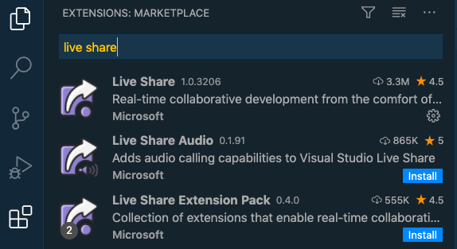
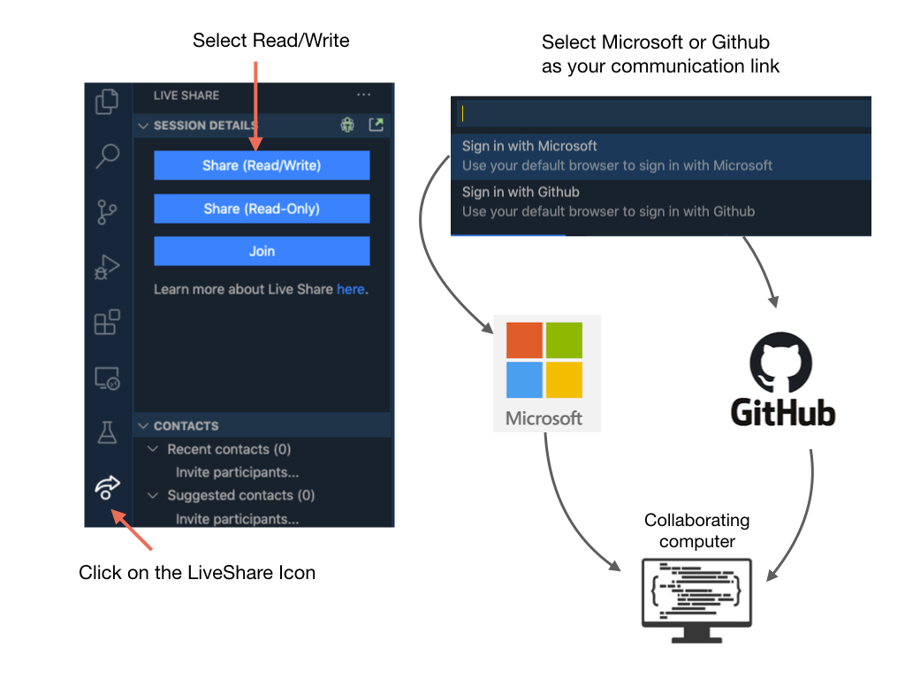
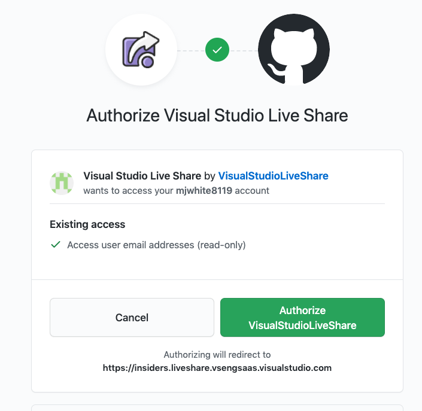
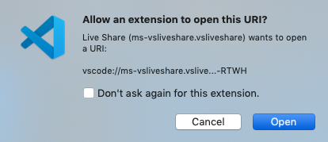
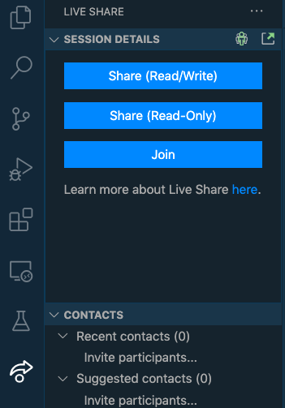
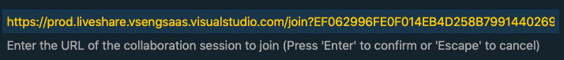
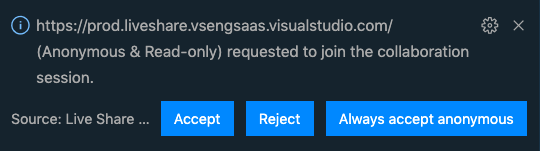
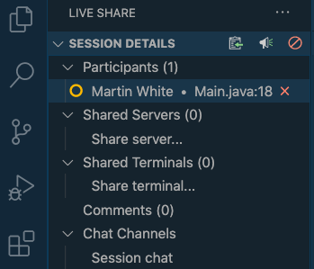

# Visual Studio Code
An Integrated Development Environment (IDE) is a piece of software that is used to make writing code easier. Some of the main things IDEs will help with include: 

- Check the syntax of your code to ensure you don’t have any errors.
- Organize your files and give you a convenient way to view them.
- Allow you to navigate through your code easily.
- Applies colour schemes to your code so it’s easier to interpret.
- Some will have code completion, which will actually fill in some code for you. 

Visual Studio Code is the supported IDE for programming an FRC robot. If you don't have VSCode installed on your computer the best way of doing this is to follow the instructions on the [FRC Documentation Website](https://docs.wpilib.org/en/latest/docs/getting-started/getting-started-frc-control-system/wpilib-setup.html). These instructions will also install the WPI Library which is used for programming the FRC robot. Additional information is also found at [FRC Documentation VSCode Overview](https://docs.wpilib.org/en/latest/docs/software/vscode-overview/index.html).

## Using Live Share
Live Share enables you to quickly collaborate with a friend, classmate, or professor on the same code without the need to sync code or to configure the same development tools, settings, or environment.

#### Step 1. Install the Live Share Extention

#### Step 2. Start a Live Share Session

You will be asked to share your Visual Studio screen via either a Microsoft or GitHub account. If you have one of these accounts then pick it.  Otherwise you will need to create an account with one of these organizations.  Github is also owned by Microsoft.

#### Step 3. Verify your Account

If you are using Live Share via Github you will be asked to authorize sharing.  Click on <i>Authorize VisualStudioLiveShare</i>.  You will only need to do this the first time that you use Live Share.

Then click on <i>Open Visual Studio Code</i>.  A URL will automatically get saved in you clip board. You will need this to send to the person you are sharing with.

Allow the extension to open the URL.

#### Step 4. Start Shared Session on Remote Computer
Once you have received the URL for the shared session, click on the Live Share Icon and select <i>Join</i>

A box will pop up for you to enter in the URL that you have received from your classmate or mentor. Paste in the URL and press enter.  You will be given the choice to join Anonymously or through your Microsoft/Github account.  If you join Anonymously, you won't be able to edit the other person's code.

The person sharing their session will receive the following message.  Click <i>Accept</i> to share your screen.

#### Step 5. End Live Share Session
To end a Live Share session click on the **X** next to the participants name.

## References

- FRC Documentation - [VSCode Overview](https://docs.wpilib.org/en/latest/docs/software/vscode-overview/index.html)

Here are some videos that give you a good introduction to VSCode:

[Install and Use Visual Studio Code on Windows 10](https://www.youtube.com/watch?v=MlIzFUI1QGA)

[How to Install Visual Studio Code on Mac](https://www.youtube.com/watch?v=tCfbi5PF1y0)

[VSCode Crash Course](https://www.youtube.com/watch?v=WPqXP_kLzpo)

<h3>
<a href="../index">Home</a>