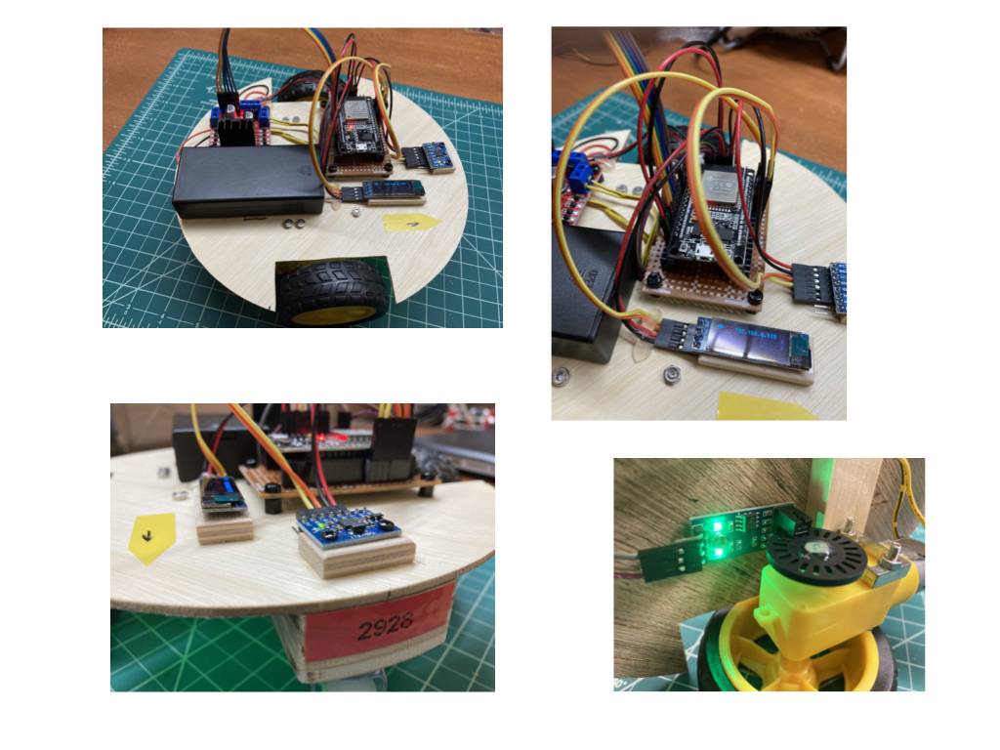

# Robot Hardware Components
The links in this BOM will show multiple pieces for most products.  It's assumed that teams will want to build more than one robot and this will reduce the cost per unit. Single pieces are available but at a higher cost per item.  Most items come with the screws and wires. Some additional hardware items maybe required.
- [ESP32 ESP-32S WiFi Development Board NodeMCU-32S](https://www.amazon.com/dp/B086MGH7JV/?coliid=I25TTO5GWWP44Q&colid=18A3P3KX2X6RJ&psc=1&ref_=lv_ov_lig_dp_it)
- [L298N Motor Drive Controller Board](https://www.amazon.com/gp/product/B07PDDZM9L/ref=ppx_yo_dt_b_asin_title_o02_s00?ie=UTF8&psc=1)
- [DC Motor Wheel Kit](https://www.amazon.com/dp/B081W176PL/?coliid=I2H12T7AI2ENJS&colid=18A3P3KX2X6RJ&psc=1&ref_=lv_ov_lig_dp_it)
- [Optical Encoder Sensor for Motor Speed Detection](https://www.amazon.com/dp/B081W4KMHC/?coliid=I1OIKZCDSA96CD&colid=18A3P3KX2X6RJ&psc=1&ref_=lv_ov_lig_dp_it)
- [6DOF MPU6050 Module 3 Axis Gyroscope + Accelerometer Module](https://www.amazon.com/dp/B06XW9ZSC8/?coliid=I33S53IKDA4YTC&colid=18A3P3KX2X6RJ&psc=1&ref_=lv_ov_lig_dp_it)
- [I2C Display Module 0.91 Inch](https://www.amazon.com/dp/B08CDN5PSJ/?coliid=IPPZF5KYF3ZDQ&colid=18A3P3KX2X6RJ&psc=1&ref_=lv_ov_lig_dp_it)
- [18650 Battery Holder with ON/Off Switch](https://www.amazon.com/gp/product/B071DF4ZFG/ref=ppx_yo_dt_b_asin_title_o04_s00?ie=UTF8&psc=1)
- [Samsung 25R 18650 2500mAh 20A Battery](https://www.18650batterystore.com/18650-p/samsung-25r-18650.htm?gclid=CjwKCAjwkoz7BRBPEiwAeKw3q0UdWyndKWW0d0Z4SdPLWF9pgRI892BRPVXSbqOe6H6sriTIbdVDzhoC-gMQAvD_BwE)
- [18650 Battery Charger](https://www.amazon.com/EBL-Universal-Battery-Rechargeable-Batteries/dp/B07PRJRHHB/ref=sr_1_4?crid=3Q8MO89GSELLD&dchild=1&keywords=18650+charger&qid=1602111457&sprefix=18650+%2Caps%2C208&sr=8-4)
- [1" Caster Wheels Single Wheel Swivel Casters](https://www.amazon.com/gp/product/B07TXP54KG/ref=ppx_yo_dt_b_asin_title_o00_s00?ie=UTF8&psc=1)

## Prototype

## ESP32 Microcontroller

[Getting started with ESP32](https://dronebotworkshop.com/esp32-intro/)

## Motor Controller

[Controlling DC Motors with the L298N Dual H-Bridge](https://dronebotworkshop.com/dc-motors-l298n-h-bridge/)

## Encoders

[Robot car with speed sensors](https://dronebotworkshop.com/robot-car-with-speed-sensors/)

## Gyroscope

[MPU6050 Explained](https://mjwhite8119.github.io/Robots/mpu6050)

## OLED Display

[Using OLED Displays](https://dronebotworkshop.com/oled-arduino/)

<h3>
<a href="ide">Previous</a>

<a href="build">Next</a></h3>