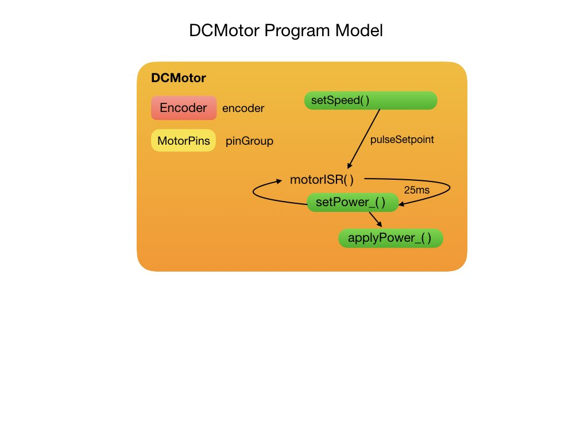

# Lesson 1 - Basic Robot Structure
The first lesson can be installed from branch <i>[FRCRobot-lesson-1](https://github.com/mjwhite8119/FRCRobot/tree/FRCRobot-lesson-1)</i> of the <i>FRCRobot</i> repository. This code branch implements the  basic structure and functionality of the robot that will be used in all subsequent lessons. You can move the robot forward and backward, and have it turn left or right. Because two motors are never the same the robot will most likely not move in a straight line.  This can only be solved by using wheel encoders and a PID loop, which will be implemented in a later lesson.

A diagram of the major code components for <i>FRCRobot-lesson-1</i> is shown below. The main program unit calls utility functions to connect to WiFi and display the IP address on the OLED.  The <i>Controller</i> class brings up a Web Server on this IP address. The Web Server acts like a game controller and is used to interact with the robot. The <i>Controller</i> passes commands to the <i>Command</i> class for processing. 

The main program creates a <i>Robot</i> class that is composed of a <i>DriveTrain</i> with a left and right <i>Wheel</i>.  Each wheel has it's own <i>DCMotor</i>.  This sets up a differential drive configuration for the robot.

## Robot Controller
In order to control the training robot we get the ESP32 microcontroller to display a WebSite on it's IP address. This is done in the <i>Controller</i> class.  For the first lesson we just display some buttons to move the robot in each direction for either 1, 2, or 3 seconds. The <i>Controller</i> class schedules the new command.

## Commands
The <i>Command</i> class accepts a direction and a duration to move (1, 2, or 3 seconds). This class is responsible for processing the command and will move through four stages as diagramed below.  The first stage is completed by the <i>Controller</i> class where it schedules the command using the `schedule()` function. The command is then `initialized()`, which in our case sends power to the motors to start moving. The `execute()` function does any processing while the command is running.  In this case, it just waits for the duration period to timeout. The `end()` function does command cleanup tasks. 

<h3>
<a href="trainingRobot">Previous</a>

<a href="code2">Next</a></h3>
