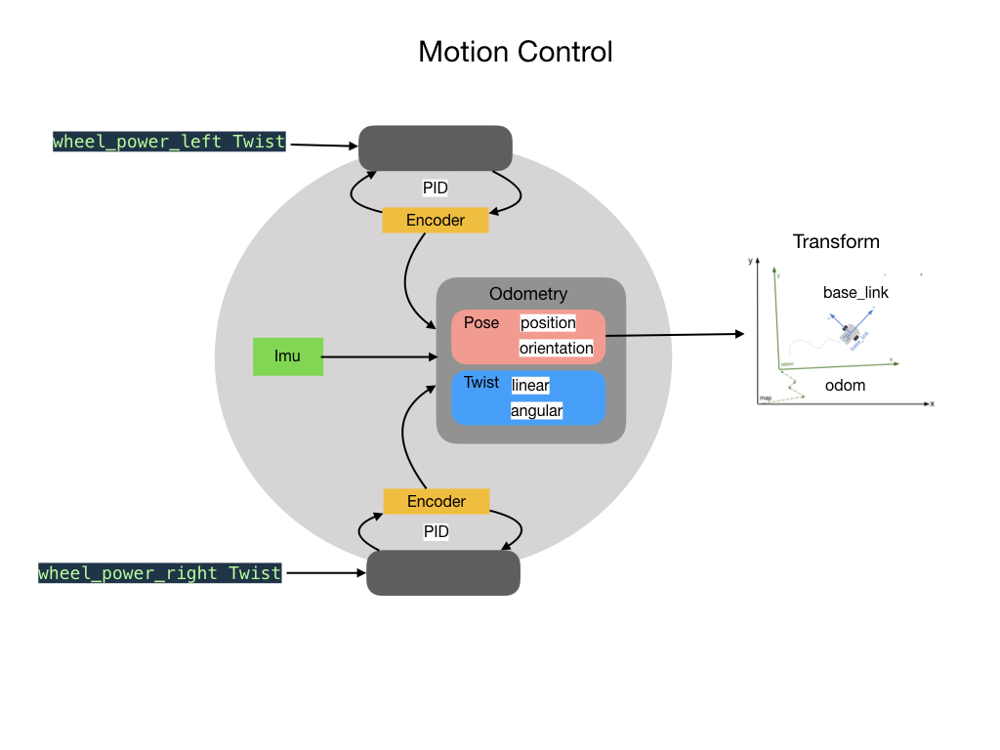
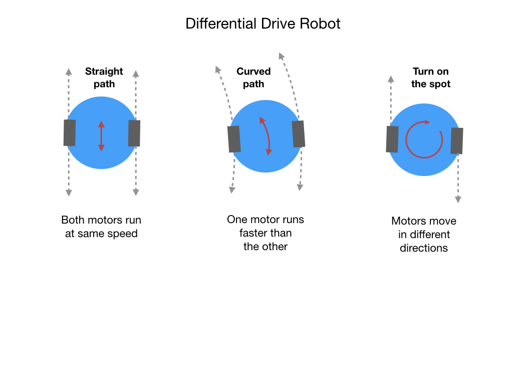

# Lesson 2 - Controlling the Motor PWM
So there was a lot to go over in the first lesson.  We needed to put all of the code structure in place for our project. This is how software is built. It's similar to a house where we first build the outer structure and then add in the plumbing, electical, and everything else.  Sometimes, we'll build an addition. In the software world that's called a new feature.

The first lesson moves the robot at a set speed for a specified period of time. What we what to do in <i>[FRCRobot-lesson-2](https://github.com/mjwhite8119/FRCRobot/tree/FRCRobot-lesson-2)</i> is to be able to control the speed of the robot. To do that we are going to use <i>Pulse Width Modulation</i> (PWM) signals to power the motor. 

## Pulse Width Modulation (PWM)
Pulse width modulation speed control works by driving the motor with a series of “ON-OFF” pulses and varying the duty cycle, the fraction of time that the output voltage is “ON” compared to when it is “OFF”, of the pulses while keeping the frequency constant.

The power applied to the motor can be controlled by varying the width of these applied pulses and thereby varying the average DC voltage applied to the motors terminals. By changing or modulating the timing of these pulses the speed of the motor can be controlled, ie, the longer the pulse is “ON”, the faster the motor will rotate and likewise, the shorter the pulse is “ON” the slower the motor will rotate.

In other words, the wider the pulse width, the more average voltage applied to the motor terminals, the stronger the magnetic flux inside the armature windings and the faster the motor will rotate and this is shown below.

## Controlling the Robot
The BabyBot has two wheels each connected to a motor.  The wheels are aligned on a common axis.  When both motors rotate forward or backward at the same speed then the robot will move in a straight line.  If one motor rotates faster than the other then the robot will take a curved path. One very useful feature of our robot is its ability to rotate on the spot which enables it to move in tight spaces.  This is acheived by rotating each motor in a different direction.

For this lesson we'll only need the forward and backward controls.  We'll be able to control each wheel separately, so turning is still possible.  We just won't need a separate button for it.  Here's what our new controller will look like:

The controls will still allow you to move forward or backward for 1, 2, or 3 seconds, but there are also slider controls to adjust the speed of each motor independently.  This opens up a lot more possibilities to control the robot. You can do a very wide or very tight turn depending on how you set the value of each wheel. You can still go straight forward and backwards (kind of) as long as you set the value of each wheel the same.

One thing that you'll immediately notice is that you'll need to set the PWM value to at least 160 before the robot starts to move. This is to overcome inertia of the motor and the weight of the robot. Once you get passed that value the speed starts to pick up quickly. If you set it to the maximum value and let it go for 3 seconds you're going to need a lot of runway. Please don't run over any sleeping pets!

## Additional References
The following two videos give a good explaination of PWM signals.
- [Pulse Width Modulation (PWM) - Electronics Basics 23](https://www.youtube.com/watch?v=GQLED3gmONg)
- [Arduino Tutorial 8: Understanding Pulse Width Modulation (PWM)](https://www.youtube.com/watch?v=YfV-vYT3yfQ)

<h3>
<a href="code1">Previous</a>

<a href="code3">Next</a></h3>