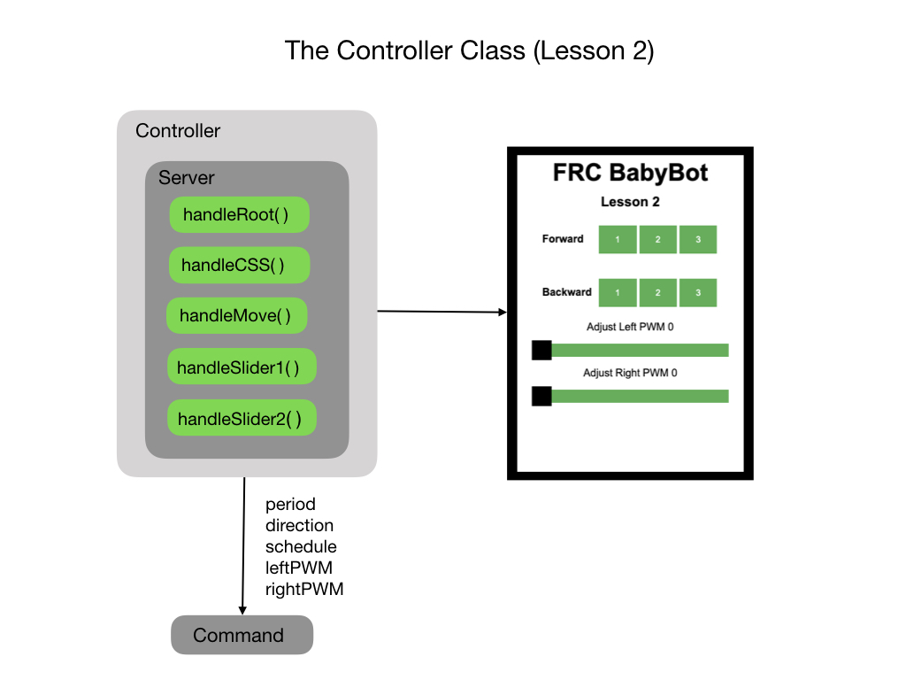

# Lesson 2 - Controlling the Motor PWM
So there was a lot to go over in the first lesson.  We needed to put all of the code structure in place for our project. This is how software is built. It's similar to a house where we first build the outer structure and then add in the plumbing, electical, and everything else.  Sometimes, we'll build an addition. In the software world that's called a new feature.

The first lesson moves the robot at a set speed for a specified period of time. What we what to do in <i>[FRCRobot-lesson-2](https://github.com/mjwhite8119/FRCRobot/tree/FRCRobot-lesson-2)</i> is to be able to control the speed of the robot. To do that we are going to use <i>Pulse Width Modulation</i> (PWM) signals to power the motor . The following two videos give a good explaination of PWM signals.
- [Pulse Width Modulation (PWM) - Electronics Basics 23](https://www.youtube.com/watch?v=GQLED3gmONg)
- [Arduino Tutorial 8: Understanding Pulse Width Modulation (PWM)](https://www.youtube.com/watch?v=YfV-vYT3yfQ)

For this lesson we'll only need the forward and backward controls.  We'll be able to control each wheel separately, so turning is still possible.  We just won't need a separate button for it.  Here's what our new controller will look like:

The controls will still allow you to move forward or backward for 1, 2, or 3 seconds, but there are also slider controls to adjust the speed of each motor independently.  This opens up a lot more possibilities to control the robot. You can do a very wide or very tight turn depending on how you set the value of each wheel. You can still go straight forward and backwards (kind of) as long as you set the value of each wheel the same.

One thing that you'll immediately notice is that you'll need to set the PWM value to at least 160 before the robot starts to move. This is to overcome inertia of the motor and the weight of the robot. Once you get passed that value the speed starts to pick up quickly. If you set it to the maximum value and let it go for 3 seconds you're going to need a lot of runway. Please don't run over any sleeping pets!

<h3>
<a href="code1">Previous</a>

<a href="code3">Next</a></h3>