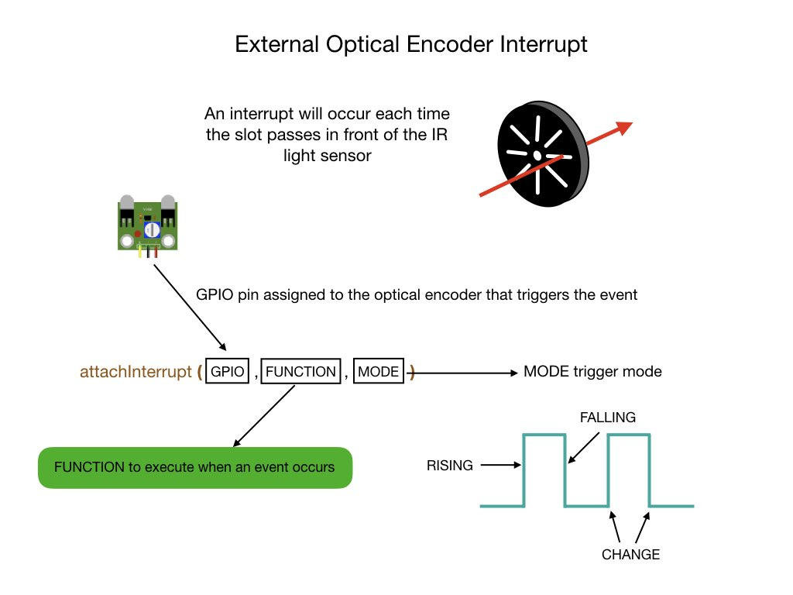

# Lesson 3 - Adding Wheel Encoders
In <i>[FRCRobot-lesson-3](https://github.com/mjwhite8119/FRCRobot/tree/FRCRobot-lesson-3)</i> we'll learn about two major topics in robotics and FRC programming, <i>encoders</i> and <i>interrupts</i>. This lesson adds wheel encoders to the project.  Wheel encoders allow us to measure how fast the wheels are turning. This can be used to calculate the distance that the robot moves. Encoders rely heavily on the use of interrupts, which are explained in the following section.  An encoder is attached to each motor, which extends the structure of our robot as shown in the following diagram.

## External Interrupts
In order to use the wheel encoders we'll need to learn about interrupts. Most processors have interrupts. Interrupts let you respond to "external" events while doing something else. For example, if you are cooking dinner you may put the potatoes on to cook for 20 minutes. Rather than staring at the clock for 20 minutes you might set a timer, and then go watch TV. When the timer rings you "interrupt" your TV viewing to do something with the potatoes.

For our project we're going to set up an interrupt to fire each time a slot in encoder wheel passes in front of the infra-red (IR) light sensor (see the diagram below). As you can imagine, this is going happen many times per second.  There are 20 slots in our encoders and at top speed the motor can spin at around 10 revolutions per second, so the processor will get interrupted about 200 times per second.  This may seem like a lot but consider that the ESP32 can process 500,000 interrupts per second, so the processor can get a lot of work done between each interrupt. 

To setup an interrupt we have to designate a GPIO pin and tell the processor what code we want to run each time an interrupt is received.  This is accomplished in the following code line:

`attachInterrupt (motorPinGroup[1].encoder, encoderISR1, RISING);`

The first parameter is the GPIO pin that the will detect the interrupt.  This is called an <i>external</i> interrupt since it's coming from an external event.  In our case, the external event is a slot in the encoder wheel passing in front of the IR sensor.  The second parameter specifies the code block, referred to as the <i>Interrupt Service Routine (ISR)</i>, that will run every time the interrupt occurs.  The final parameter tells the microprocessor which mode to use for firing the interrupt.  In our case, we'll be firing on the `RISING` edge.

The main thing to consider when coding an ISR is to keep the routine short.  The routine code block must complete before the next interrupt fires.  This means that you cannot have a `delay()` in the routine since that will most likely still be active when the next interrupt fires.  Another piece of code that takes a long time to run is a serial print.  Serial prints need to write out to the terminal which takes a long time.    

A detailed explaination of interrupts can be found on [Nick Gammons] site (http://gammon.com.au/interrupts)

The following diagram of the <i>Encoder</i> class shows the encoder IR sensor attached via the GPIO pin to the ISR.  The ISR calls the code block `encoderFired()` to be executed. This code block increments or decrements the `pulses` variable.  The `pulses` variable is declared as `volatile` since it is referenced outside of the ISR and may be changed during the course of an interrupt. This tells the compiler that such variables might change at any time, and thus the compiler must reload the variable whenever you reference it, rather than relying upon a copy it might have in a processor register.

Interrupt service routines must be declared to be executed in instruction RAM (IRAM). The execution of a function called by an interrupt is blocking, meaning that it is necessary to wait for the end of its execution before any other code can continue.  Usually the code is executed directly in the flash memory of the microcontroller. It is possible to move the function to the internal RAM of the ESP32 which is much faster. This is done by placing the `IRAM_ATTR` attribute just before the name of the function like so:

`void IRAM_ATTR encoderFired_()`

If any other functions are called by a function that has been placed in instruction RAM, then they too must have the `IRAM_ATTR` attribute.

## Timer Interrupts
In the previous lessons we used a `delay()` command to run the motors for the requested number of seconds. Using this command sends the controller to sleep during which time no other processing can be performed.  This is not ideal since there are plenty of things we could be doing while the motors are running, such as read the encoders and take action based on what they say.  Therefore, we're going to replace the `delay()` command with a <i>timer interrupt</i>. The timer interrupt will be placed in the <i>DCMotor</i> class.

A timer interrupt is internal to the microcontroller and makes use of its internal clock. The interrupt will occur after a specified period of time. Similar to the external interrupt that we setup for the encoder, the timer interrupt requires an interrupt service routine (ISR) to run each time an interrupt occurs. To specify the ISR the following code statement is used:

`const esp_timer_create_args_t periodic_timer_args = {.callback = &motorISR1};`

In this example we're referencing the routine `motorISR1` as our ISR.  The next step is to create the timer like so:

`esp_timer_create(&periodic_timer_args, &motorTimer1);`

And finally start the timer running, telling it how long to run for. In our case, we have it set to run for 50 micro seconds.

`esp_timer_start_periodic(motorTimer1, speedCtrlPeriodMicros);` 

Notice the word <i>periodic</i> in the timer setup.  This tells us that the timer will reset itself to zero after the timeout period and start counting up to the timeout period again. Therefore, our ISR will execute every 50 micro seconds.

<h3>
<a href="code2">Previous</a>

<a href="code4">Next</a></h3>