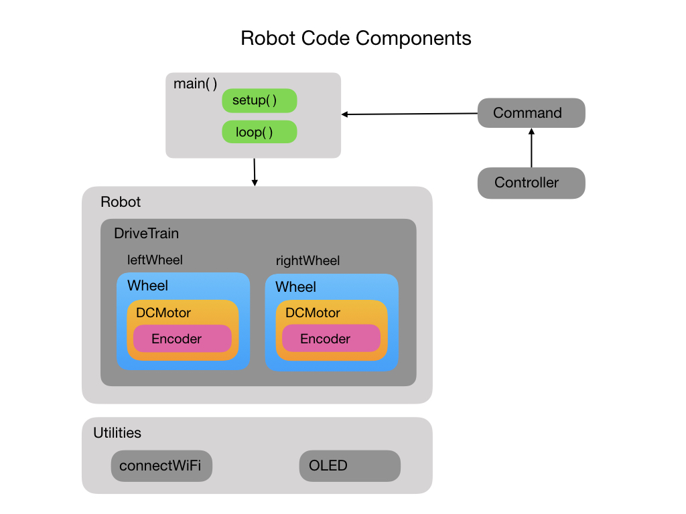
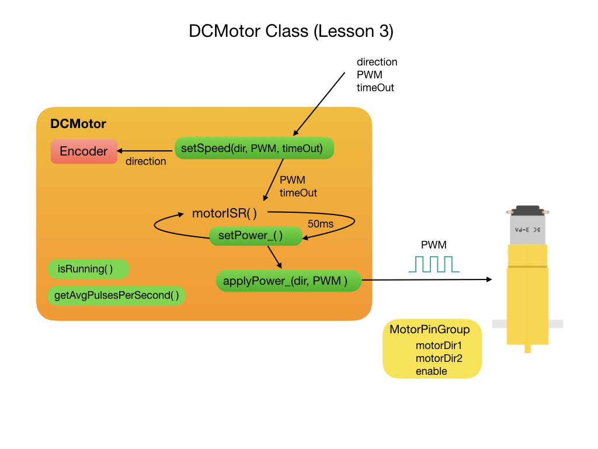

# Lesson 3 - Adding Wheel Encoders
In <i>[FRCRobot-lesson-3](https://github.com/mjwhite8119/FRCRobot/tree/FRCRobot-lesson-3)</i> we will learn about two major topics in robotics programming, encoders and interrupts. This version adds wheel encoders to the project. In order to do this we'll need to use both external interrupts and timer interrupts.

An explaination of wheel encoders can be found in these videos:
- Video1
- Video2

Encoders allow us to measure how fast the wheels are turning. This can be used to calculate the distance that the robot moves. An encoder is attached to each motor.  This extends the structure of our robot as shown in the following diagram.

Explaination of external interrupts.

Diagram of <i>Encoder</i> class:

Explaination of timer interrupts.

Diagram of <i>DCMotor</i> class:

<h3>
<a href="code2">Previous</a>

<a href="code4">Next</a></h3>