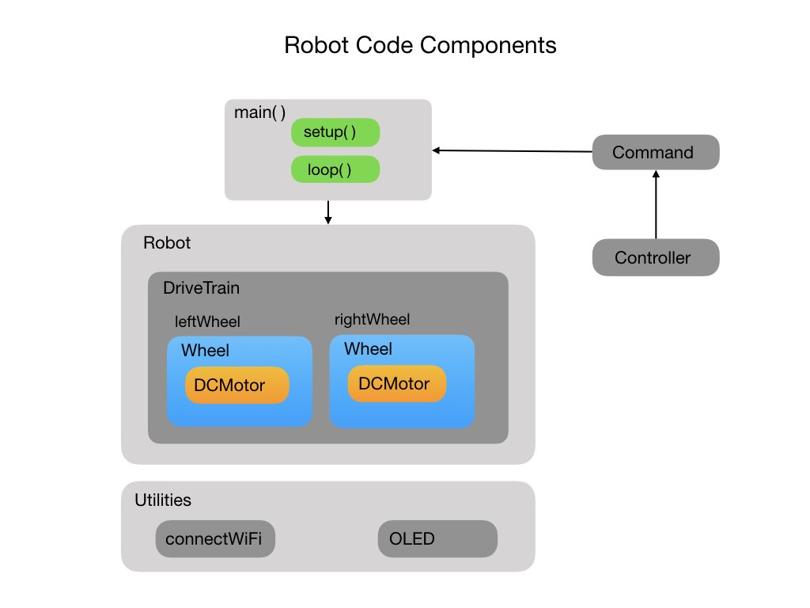

# Lesson 4 - Open Loop Motor Control
Up to this point we have been using PWM signals to directly power the motors. To simplify our motion control commands it would be better to send a signal between -1 and +1, where -1 is full speed backwards and +1 is full speed forward. This gives us a smooth transition of speed values which are easy to understand and hides the messy details of the PWM signals. 

Explain Open Loop Control...

<!--  -->

<h3>
<a href="code3">Previous</a>

<a href="code5">Next</a></h3>