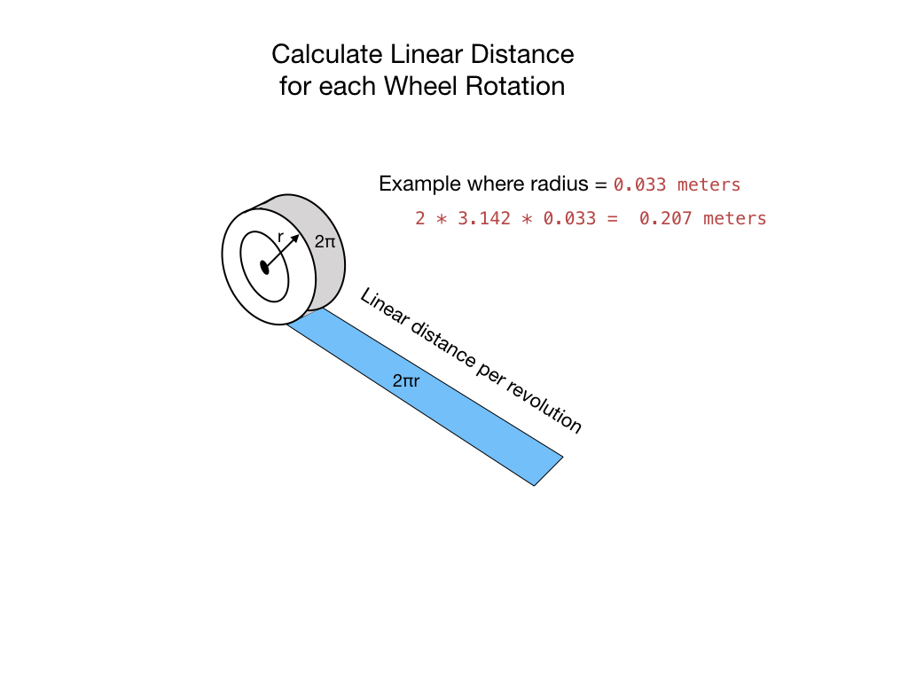
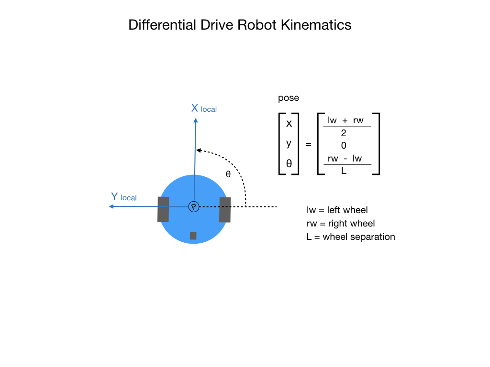

# Lesson 4 - Velocity Control & Kinematics
Up to this point we have been using PWM signals to directly power the motors. To simplify our motion control commands it would be better to send a velocity value between -1 and +1, where -1 is full speed backwards and +1 is full speed forward. This gives us a smooth transition of velocity values which are easy to understand and hides the messy details of the PWM signals. 

The other main topic is the <i>Kinematics</i> of the <i>Differential Drive</i> robot.  Kinematics is the study of the geometry of motion. Kinematics is the branch of classical mechanics that describes various aspects of motion such as velocity, acceleration, displacement, time, and trajectory.  The word “kinematics” comes from a Greek word “kinesis” meaning motion, and is related to other English words such as “cinema” (movies) and “kinesiology” (the study of human motion).

## Wheel Velocity Proportional Values
So instead of sending a PWM signal to the motors we just want to send a value between -1 and +1.  Where +1 is full speed forward and -1 is full speed backward. From the perspective of the controller that will look like this:

As you can see, we no longer need the <i>Backward</i> buttons since we can set the speed to a negative value. In fact, we need fewer and fewer buttons for each lesson.  Why is this important?  We have reduced our control input to a single velocity command <i>Move</i>, and we can get the robot to go wherever we want by feeding it a continuous stream of these velocity command values for each wheel. 

The <i>DCMotor</i> model is very similar to that of lesson 3.  The difference is that we pass in the velocity value instead of the PWM. The motor still wants PWM signals so the velocity value has to be converted to a PWM value, this is done in the `setSpeed()` function. 

## Calculating Velocity

Instead of outputting the number of pulses per second to the OLED, we're now going to display the speed of our robot in meters per/second.  To do this we'll need to get the diameter of our wheels so that we can calculate the linear distance travelled for each wheel rotation.  This process is shown in the following diagram.

Once we know the distance for each wheel rotation we can figure out how the robot travels for each encoder pulse.  We can then then multiple this value by the number of encoder pulses per second to get the average velocity per second of the robot.  This is summarized in the following illustration.

## Differential Drive Kinematics

Since the BabyBot is a <i>Differential Drive</i> robot we need to understand its kinematics. An explanation of the math is described in the <a href="../Concepts/Kinematics/intro">Kinematics & Odometry</a> section of this training guide, but the main idea is that we take the speed of each of the two wheels in order to figure out the overall speed of the chassis.  We'll calculate the linear velocity of the robot in the **X** direction together with its angular velocity. The angular velocity is the movement around the robots' **Z** axis.  See the section on <a href="../Concepts/Geometry/intro">Robot Geometry</a> for more information to how to determine a robots' position and orientation.  Notice that there is no movement in the **Y** direction.  This is because the robot cannot move instantaneously sideways.

To implement all of this, the <i>DriveTrain</i> class has been updated to include its kinematics.  Two new classes have been introduced to hold the required data.  The <i>DifferentialDriveWheelSpeeds</i> class simply groups the left and right wheel speeds into a single data structure. This structure is returned from the `getWheelSpeeds()` function and is passed to the `toChassisSpeeds()` function to calculate the overall linear and angular velocity of the robot. The resulting data is held in the <i>ChassisSpeeds</i> data structure. 

## Drivetrain Characterization

Finally, there is one thing that needs to be taken into consideration while doing the conversion from a speed value to PWM.  The motor won't start to turn until a minimum PWM value has been reached. Therefore, we'll need to add this value before we apportion our speed control values....

<h3>
<a href="code3">Previous</a>

<a href="code5">Next</a></h3>