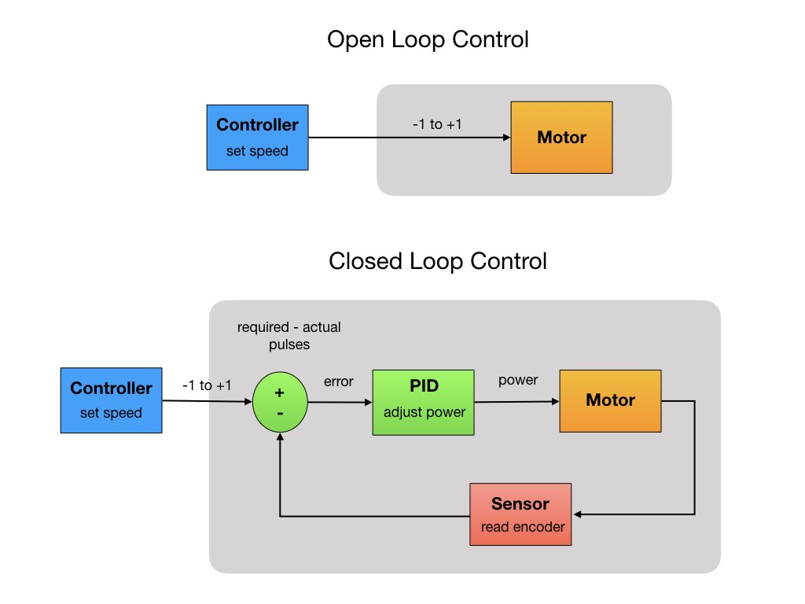

# Lesson 5 - Closed Loop PID Control
Introduce the PID loop to control the speed of each motor....

Another lesson objective is to begin to understand <i>Control Systems</i>.  Control systems are used extensively in robotics.

## Open Loop vs Closed Loop Control
There are two main control system mechanisms, <i>Open Loop</i> and <i>Closed Loop</i>.  For an open loop system you just set an input control signal and let it go. There's no adjustment along the way. The system doesn't self correct itself.  The only way to change the signal is through manual input. This is the system that we've been using so far to control our robot. We set a PWM value for the motor and that same PWM value remains until the system times out.  We'll continue to use the open loop system in this lesson.  

An <i>Open Loop</i> verses <i>Closed Loop</i> system is shown below.  The closed loop system takes input from it's sensors and uses that information to adjust the control signal to the motor.  In the next lesson we'll switch to a closed loop system. 

## Closed Loop Control

diagram...

## PID Loop

<h3>
<a href="code4">Previous</a>

<a href="code6">Next</a></h3>