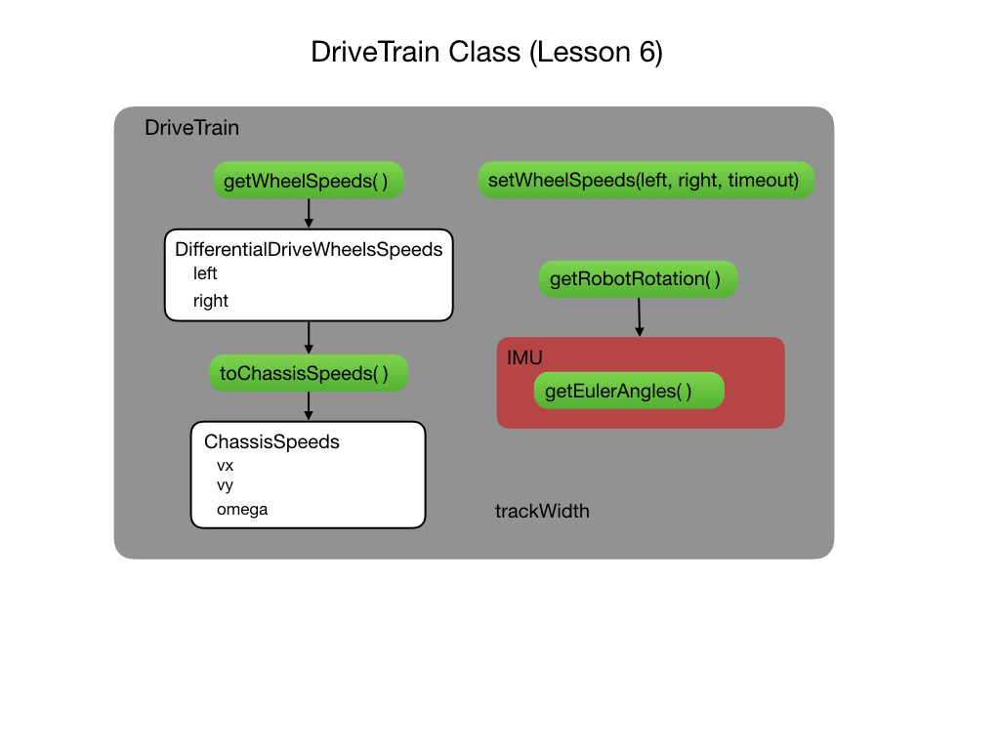
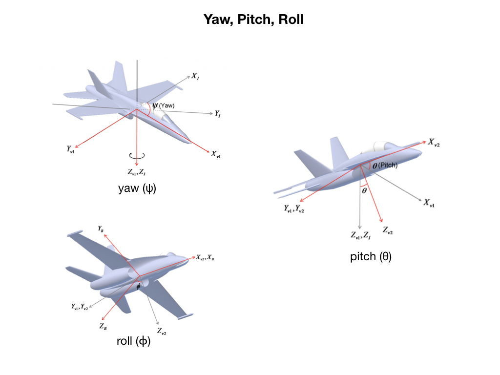

# Lesson 6 - Gyroscope and Angular Motion
In this lesson we're going to add code to implement a gyroscope on our robot. The gyro is provided by an MPU6050 <i>Inertial Measurement Unit (IMU)</i> that combines a MEMS gyroscope and accelerometer.  The webpage [MPU6050 Explained](https://mjwhite8119.github.io/Robots/mpu6050) gives a detailed explaination of the functioning of this device.

The IMU is added to the <i>DriveTrain</i> class.  The main function of interest in the IMU class is `getEulerAngles()` that pulls data from the device to determine the heading of the robot. 

## Euler Angles
The Euler angles are three angles introduced by Leonhard Euler to describe the orientation of an object with respect to a fixed coordinate system.  The scheme uses the notion of <i>Yaw, Pitch, Roll</i> that you may be familiar with from the way that an aeroplane moves.  A detailed discussion of this can be found in the section on <a href="../Concepts/Geometry/intro">Robot Geometry</a>. For the purposes of this lesson we're only interested in how the robot moves within a 2D plane.  Therefore, we only need to keep track of the <i>Yaw</i> angle from Eulers' method.

The function `getRobotRotation()` has been added to the <i>DriveTrain</i> class.  This function gets the latest data from the IMU and extracts out the heading information.  This information is displayed to the OLED by the <i>Command</i> `execute()` method.

## The Rotation2d Class
Since we're on the subject of geometry it's time to bring in the geometry classes that exist in the <i>WPI Library</i>. The <i>Rotation2d</i> class keeps track of how our robot is rotated within the reference frame of the FRC field.  That's a complicated way of saying "what's its heading".

<h3>
<a href="code5">Previous</a>

<a href="code7">Next</a></h3>