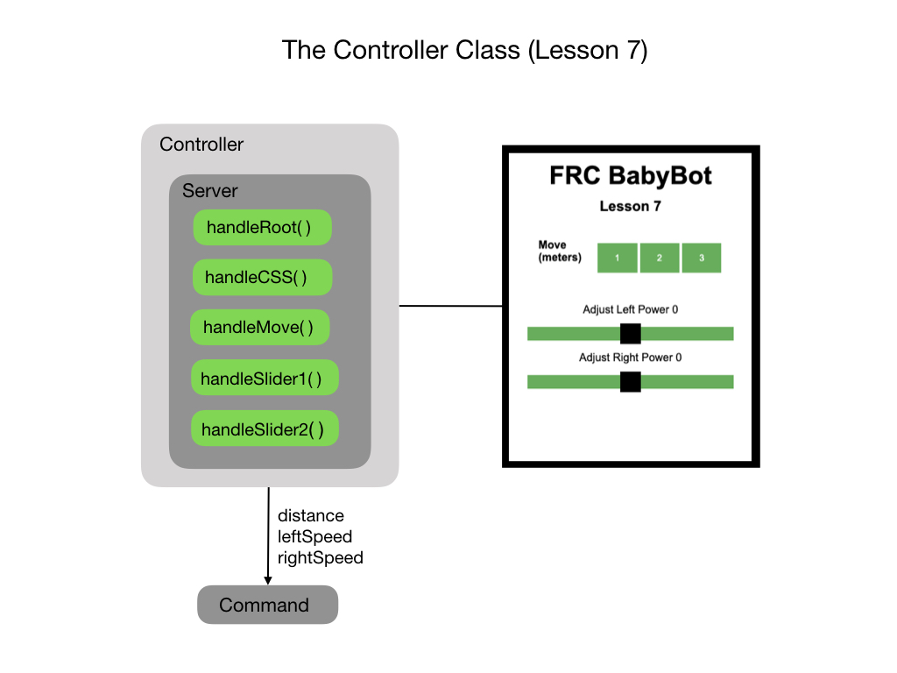

# Lesson 7 - Odometry
In this lesson we're going to fully implement our odometry system.  Odometry involves using sensors on the robot to create an estimate of the position of the robot on the field. In FRC, these sensors are typically encoders and a gyroscope. For a more detailed discussion of odometry see the section on <a href="../Concepts/Odometry/intro">Odometry</a>.  

## Robot Geometry
Introduce the concept of a <i>Pose</i>

<h3>
<a href="code6">Previous</a>

<a href="code8">Next</a></h3>