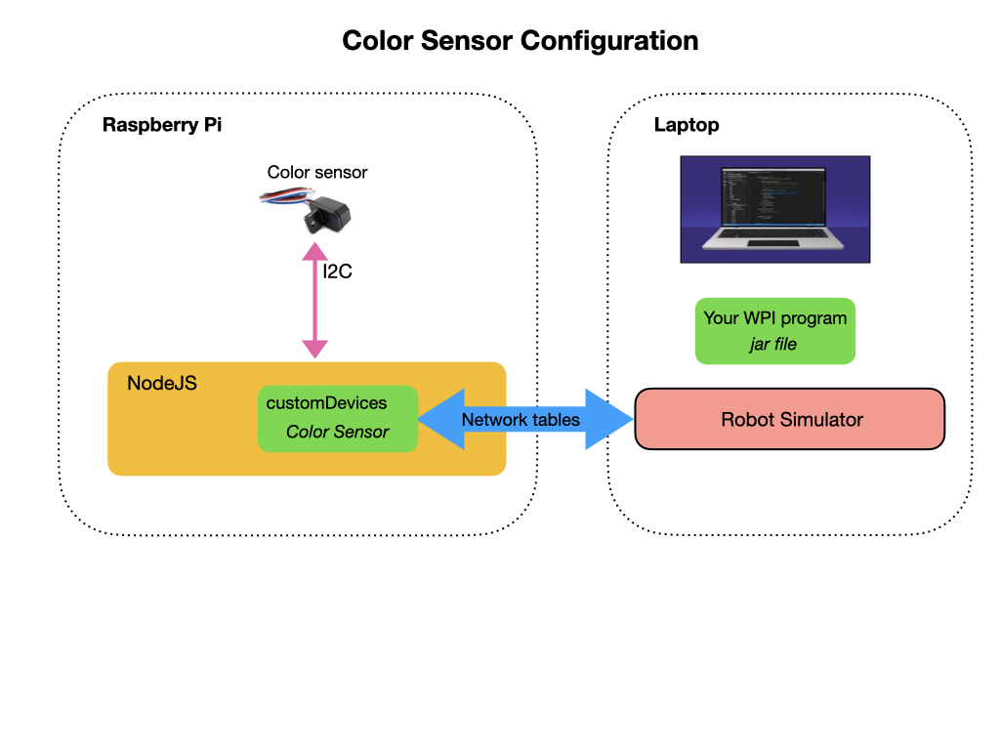

# Color Sensor

The color sensor is attached to the I2C ports of the Romi. 

You have to ssh into the Raspberry Pi and add a parameter to the NodeJS Web applications' configuration file.  The parameter is added to the **/boot/romi.json** file that resides on the Raspberry Pi.  Make sure that the Raspberry Pi files are **Writable** which is set in the Romi Web UI.

    "customDevices": [
        {
            "type": "rev-color-sensor",
            "config": {}
        }
    ]

## Create the Color Sensor Subsystem
The color sensor subsystems' primary purpose is to interpret and return the color that's detected by the sensor.  This is done in the method **getMatchedColor()**.  The example shows a very simple way of doing this, which can be much improved.  But it illustrates the use of the color sensor.

    public MatchedColor getMatchedColor() {
        
        NetworkTableEntry blueEntry = m_colorData.getEntry("Blue");
        NetworkTableEntry greenEntry = m_colorData.getEntry("Green");
        NetworkTableEntry redEntry = m_colorData.getEntry("Red");

        if (redEntry.getDouble(0.0) > 8000.0) {
          return MatchedColor.RED;
        } 
        else if (greenEntry.getDouble(0.0) > 8000.0) {
          return MatchedColor.YELLOW;
        } 
        else if (blueEntry.getDouble(0.0) > 4300.0 & greenEntry.getDouble(0.0) > 4900.0) {
          return MatchedColor.BLUE;
        } 
        return MatchedColor.UNKNOWN;
    }

## Create the Color Sensor Command
One or more commands can be created to use the color sensor.  The task is to read the sensor and take some action based on the color returned.  This is done within the commands' **execute()** method and may look something like the following. In this example, the speed is changed based on the color detected by the sensor.

    public void execute() {
      MatchedColor m_match = m_colorSensor.getMatchedColor();
      
      switch (m_match) {
        case RED:
          System.out.print("Red");
          m_speed = 0.0;
          break;

        case YELLOW:
          System.out.print("Yellow");
          m_speed = 0.6;
          break;

        case BLUE:
          System.out.print("Blue");
          m_speed = 0.8; 
          break;

        default:  
          System.out.print("No color match");  
          break;
      }
      m_drive.arcadeDrive(m_speed, 0);
    }

## Using the Color Sensor
The color sensor can be used as part of an autonomous routine or during the teleop phase.  The following diagram shows how this might work.  A different command is created to execute in each phase.  

Import the **ColorSensor** class into the **RobotContainer.java** file.

    import frc.robot.sensors.ColorSensor;

In the **RobotContainer** class define the Network tables and **ColorSensor**. 

    public NetworkTable m_colorData;
    private NetworkTableInstance m_nTableInstance = NetworkTableInstance.getDefault();

    public ColorSensor m_colorSensor;

Inside of the constructor a pointer to the color sensors' Network Table is created and passed to the **ColorSensor**s' constructor.

    public RobotContainer() {

      // Open the network tables
      m_colorData = m_nTableInstance.getTable("Romi/CustomDevice/REV-ColorSensorV3");

      m_colorSensor = new ColorSensor(m_colorData);

      ...
  }

## Update the ArcadeDrive class

Update **ArcadeDrive** subsystem to use the data coming from the color sensor.  This can be placed in the **execute()** method which will run every 50 ms by the **CommandScheduler**.  In this example the Romi is slowed down if it crosses a red color marker.

    public void execute() {
      // Get the matched color
      MatchedColor m_match = m_colorSensor.getMatchedColor();

      // Do something if the color matches
      if (m_match == MatchedColor.RED) {
        m_drivetrain.arcadeDrive(0.2,0.2);
      } else {
        m_drivetrain.arcadeDrive(m_xaxisSpeedSupplier.get(), m_zaxisRotateSupplier.get());
      }   
    }

<h3>
<a href="romi">Previous</a>

<a href="romiFirmware">Next</a></h3>