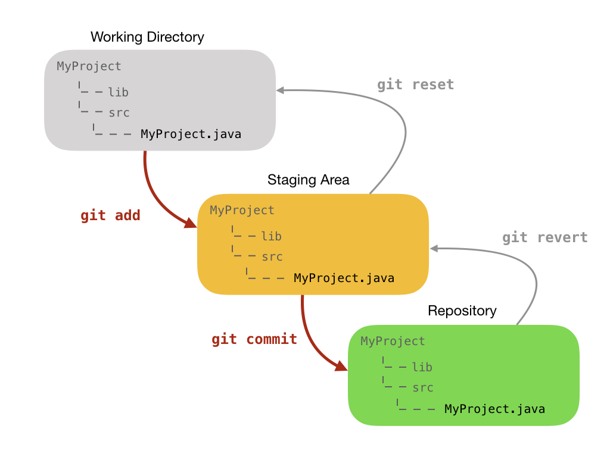
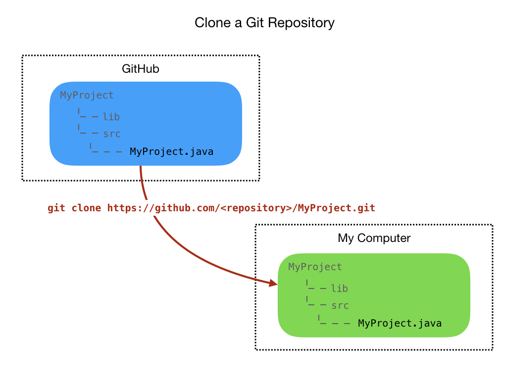

# The Git Repository and GitHub
Git is a <i>Version Control System (VCS)</i> for keeping track of changes in files.  

- You can take snapshots, or versions, of your files at any time by creating a commit.

- File changes can be reverted back to previous versions.

- It's a distributed system meaning that that the repository exists on multiple computers. You can therefore have both local and remote versions of your files.  

- Other users can clone the repository, which gives them a local version of it that they can work on independently.  Therefore, you can have an entire development team working on the same project.

## Initializing the Repository
Let's start a new project at the command line:

`$ mkdir MyProject`
`$ cd MyProject`
`$ mkdir lib src`
`$ cd src`

Create your first project file using a command line editor and enter the following lines:

`$ vi MyProject.java`

      class MyProject {
        public static void main(String[] args) { 
          System.out.println("Hello from MyProject");
        }
      }

We now want to initialize it for use with git:

`$ git init`

      Initialized empty Git repository in /Users/martinwhite/Documents/FRCProjects/MyProject/.git/

You will see a new directory under the project folder.

## Configuring Git
Before continuing with Git you’ll want to do a few things to customize your Git environment. You should only have to do these things only once on any given computer. You can also change them at any time by running through the commands again.

Git comes with a tool called `git config` that lets you get and set configuration variables that control all aspects of how Git looks and operates. 

The first thing you should do when you install Git is to set your user name and email address. This is important because every Git commit uses this information, and it’s immutably baked into the commits you start creating:

`$ git config --global user.name 'Martin White'` 
`$ git config --global user.email johndoe@example.com`

To view your configuration you can use:

`git config --list`

These configuration variables are stored in the `.gitconfig` file that can be found in your HOME directory.

## Staging and Committing
Now that we have initialized and configured the repository we can now stage and commit our files.  We're going to move our files to a staging area in preparation for a commit to the repository.

First, let's get a status from Git by typing the following command and reviewing the output:
`$ get status`

      On branch master

      No commits yet

      Untracked files:
        (use "git add <file>..." to include in what will be committed)

        src/

      nothing added to commit but untracked files present (use "git add" to track)

The output is telling use that we are on the master branch, we'll look at branches later, and that there have been no commits. It also lists the untracked files.  These are files that have not yet been added to Gits' staging area. Let's do that now:

`$ get add .`

      On branch master

      No commits yet

      Changes to be committed:
        (use "git rm --cached <file>..." to unstage)

        new file:   src/MyProject.java

Our files are now in the staging area and are ready to be committed to the repository:

`$ git commit -m "Initial commit"`

        [master (root-commit) 8877fba] Initial commit
        1 file changed, 5 insertions(+)
        create mode 100644 src/MyProject.java

The output tells us that this is the initial commit to the repository and lists the files that have been committed.  The value `8877fba` is the last few characters of a unique commit tag.

We can always see what status the Git repository is in by typing:
`$ git status`

      On branch master
      nothing to commit, working tree clean

We now have no new files to commit. It's telling us that our working directory is clean.      

## Pushing to the Remote Repository
Before we can push our code to GitHub we need to go there and create a repository.

Enter the repository name and a description.  Select a Public repository.

Leave the add README and .gitignore unchecked.  We'll add these later.

We now have to connect our local Git repository with the remote GitHub repository.

`$ git remote add origin https://github.com/mjwhite8119/MyProject.git`

And now we can push our code to the remote GitHub repository:

`$ git push -u origin master`

      Enumerating objects: 4, done.
      Counting objects: 100% (4/4), done.
      Delta compression using up to 8 threads
      Compressing objects: 100% (2/2), done.
      Writing objects: 100% (4/4), 383 bytes | 383.00 KiB/s, done.
      Total 4 (delta 0), reused 0 (delta 0)
      To https://github.com/mjwhite8119/MyProject.git
      * [new branch]      master -> master
      Branch 'master' set up to track remote branch 'master' from 'origin'.

## Cloning a Repository
The primary reason for creating repositories is so that other people can view and edit your code.  The way we do that is to `clone` the repository.  You first need to get the URL of the repository that you want to clone. 

Then create a local directory in which to store the repository and change into that directory:

`$ mkdir MyClonedProject`
`$ cd MyClonedProject/`

Clone the repository:

`$ git clone https://github.com/mjwhite8119/MyProject.git`

      Cloning into 'MyProject'...
      remote: Enumerating objects: 6, done.
      remote: Counting objects: 100% (6/6), done.
      remote: Compressing objects: 100% (3/3), done.
      remote: Total 6 (delta 0), reused 6 (delta 0), pack-reused 0
      Unpacking objects: 100% (6/6), done.

The output will tell you how many file objects have been downloaded.  Conceptually, this looks like the following:    

## The README.md File

## The `.gitignore` File

## Branching

## Merging

<h3>
<a href="../index">Home</a>